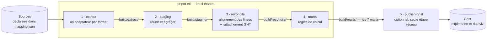

# data-analyzer — ETL « part des trajets via les plateformes »

data-analyzer calcule la part des trajets sanitaires réalisés via les plateformes : au
numérateur les trajets qu'elles déclarent, au dénominateur le référentiel national de
remboursement. Le résultat est ventilé par établissement ou GHT, par année, par type de
transport et par enveloppe, et sort en sept marts CSV. Un pipeline de cinq étapes les
produit à partir des fichiers déclarés dans `mapping.json`, la dernière les publiant dans
Grist pour la dataviz. Tout le métier (description des livrables, limites d'interprétation,
règles de gestion assumées) vit dans [`spec/`](spec/) ; ce README ne traite que de
l'exécution.

> **Code public, données et fournisseurs privés.** Le code de l'ETL est générique : il ne
> connaît que des rôles (`plateforme`, `referentiel-national`, `referentiel-ght`) et des
> formats de fichier, jamais l'identité d'un fournisseur ni la moindre donnée.
> L'association entre les fichiers réels, avec leurs fournisseurs, et ces formats et rôles
> vit dans `mapping.json`, qui n'est pas versionné. Voir
> [Confidentialité](#confidentialité).



Les quatre premières étapes sont locales et déterministes ; la cinquième, optionnelle,
publie les marts dans [Grist](#publication-dataviz).

| Document | Ce qu'il porte |
|---|---|
| [`spec/livrables.md`](spec/livrables.md) | Les sept marts : grain, colonnes, ce que chacun sait et ne sait pas dire. |
| [`spec/points-attention-metier.md`](spec/points-attention-metier.md) | Les dix propriétés de la donnée et règles de gestion à connaître avant de citer un chiffre. |
| [`docs/specs/etl-part-plateformes.md`](../../docs/specs/etl-part-plateformes.md) | La spec de cadrage d'origine. |

---

## Lancer

```bash
pnpm install           # installe les trois apps du dépôt, où qu'on le lance
cp mapping.example.json mapping.json   # puis renseigner vos fichiers (voir ci-dessous)
pnpm etl               # enchaîne les 4 étapes ; régénère build/
# ou étape par étape :
pnpm extract && pnpm staging && pnpm reconcile && pnpm marts
pnpm test              # tests unitaires (vitest)
pnpm publish-grist     # optionnel : publie les marts dans Grist (voir Publication)
```

Node 24 exécute le TypeScript nativement, il n'y a aucun build. SheetJS lit les `.xlsx`. Il
n'y a aucune étape réseau : tous les référentiels publics sont versionnés dans `ref/`.
`pnpm fetch-ght` ne sert qu'à rafraîchir le référentiel GHT commité dans `ref/ght/`, et
n'est pas nécessaire au fonctionnement.

## Configuration des entrées — `mapping.json`

`mapping.json`, qui n'est pas versionné et dont le gabarit est `mapping.example.json`,
déclare chaque fichier d'entrée : son emplacement, son rôle et son format. L'ETL se
comporte de manière générique quels que soient les fichiers fournis.

```json
[
  {
    "role": "referentiel-national",
    "format": "referentiel-remboursement-xlsx",
    "location": "data/reference-nationale.xlsx",
    "label": "reference-1"
  },
  {
    "role": "plateforme",
    "format": "plateforme-finess-tsv",
    "location": "data/plateforme-a.csv",
    "label": "plateforme-a",
    "plateforme": "Plateforme A",
    "options": { "colFinessJuridique": 1, "colFinessGeographique": 0 }
  }
]
```

| Champ | Requis | Rôle |
|---|---|---|
| `role` | oui | `referentiel-national` pour le dénominateur hors article 80, `plateforme` pour le numérateur, `referentiel-ght` pour le rattachement finess vers GHT en open data, cf. [Référentiels](#référentiels-ref) |
| `format` | oui | nomme un adaptateur enregistré dans `src/01-extract/adapteurs/registry.ts`, cf. le tableau des formats ci-dessous |
| `location` | oui | chemin du fichier, absolu ou relatif à la racine de l'app |
| `label` | oui | identifiant neutre et unique, qui nomme les artefacts de traçabilité |
| `plateforme` | non | nom affiché dans la colonne `plateforme` des marts. N'a de sens que pour le rôle `plateforme` et **n'existe nulle part dans le code versionné** : c'est ici, dans un fichier non versionné, que le nom d'un fournisseur est autorisé. Absent, la colonne retombe sur le `label` |
| `options` | non | paramètres propres au format, par exemple les index de colonnes finess pour le TSV. C'est ce qui permet à plusieurs fichiers de partager un adaptateur |

Une entrée invalide, à laquelle il manque le rôle, le format, la location ou le label, ou
dont le format est inconnu, fait échouer l'ETL avec un message explicite.

| `format` | Ce qu'il lit |
|---|---|
| `referentiel-remboursement-xlsx` | le référentiel national de remboursement, xlsx à double en-tête : une bande de colonnes véhicule par période. Ne couvre que le hors article 80 |
| `plateforme-finess-tsv` | un CSV UTF-16 tabulé au grain établissement. Les colonnes finess variant d'un fichier à l'autre, elles sont passées en `options` : `colFinessJuridique`, `colFinessGeographique` |
| `plateforme-finess-xlsx` | un xlsx au grain établissement, en-têtes multi-niveaux et une colonne par année, portant l'article 80 en total et le hors article 80 en détail partiel, taxi, VSL et ambulance. Le reliquat, la différence entre le total et le détail, est imputé à `Autre` pour boucler le total annoncé |
| `plateforme-ght-xlsx` | un xlsx **hiérarchique** : une ligne fille, reconnue à son préfixe `« - »`, porte son finess juridique en fin de libellé ; une ligne parente porte un libellé libre. Un parent qui a des filles est ignoré, sauf pour son détail véhicule quand aucune de ses filles n'en porte. Cf. le [point 6](spec/points-attention-metier.md#6-plateforme-hiérarchique--une-couverture-au-finess-partielle) |
| `ght-fhir-datagouv` | les bundles FHIR du jeu open data `etablissements-de-sante-par-ght`, dont la `location` est le dossier `ref/ght/`. Sortie : une dimension finess juridique vers GHT, aucun trajet |

## Pipeline & artefacts

Une étape correspond à une source de complexité. Toute la connaissance propre à une
source, son format, ses colonnes et son vocabulaire véhicule, est encapsulée dans son
adaptateur. Les étapes suivantes sont entièrement génériques et ne raisonnent que sur les
rôles.

| Étape | Responsabilité | Entrée → sortie |
|---|---|---|
| `extract`   | appliquer à chaque fichier l'**adaptateur de son format** → lignes normalisées (rôle + nomenclature canonique), puis **rétablir le zéro de tête** des finess tronqués | `mapping.json`, sources → `build/extract/` |
| `staging`   | **réunir** les sources et **agréger** au grain canonique | `build/extract/trajets/` → `build/staging/trajets.csv` |
| `reconcile` | poser les **clés** : dimension établissements ; **alignement des finess** des trajets sur le référentiel, qui fait autorité ; rattachement au GHT | `build/extract/`, `build/staging/` → `build/reconcile/` |
| `marts`     | appliquer les **règles de calcul** (part / volumes), à chaque grain | `build/reconcile/` → `build/marts/` |

| Artefact | Étape | Description | Colonnes |
|---|---|---|---|
| `build/extract/trajets/<label>.csv` | extract | Trajets d'une source, décodés et normalisés. | `role, source, finess_juridique, finess_geographique, ght_libelle, enveloppe, annee, vehicule_canonique, nb_trajets` |
| `build/extract/etablissements.csv` | extract | Identité des établissements (émise par les référentiels), un par site. | `finess_juridique, finess_geographique, nom, ville, departement, categorie, score` |
| `build/extract/ght.csv` | extract | Rattachement finess juridique → GHT, dérivé des bundles `ref/ght/`. | `finess_juridique, ght_code, ght_libelle, region, raison_sociale` |
| `build/staging/trajets.csv` | staging | Toutes les sources réunies et agrégées au grain canonique. | idem `trajets/<label>.csv` |
| `build/reconcile/etablissements.csv` | reconcile | Libellé représentatif de chaque établissement, pour habiller les marts. | `finess_juridique, nom, ville, departement, categorie` |
| `build/reconcile/trajets.csv` | reconcile | Trajets aux **finess alignés sur le référentiel** et **rattachés au GHT**. Base commune des marts. | idem staging + `ght_code` |
| `build/marts/mart_*.csv` | marts | Les **7 [livrables](spec/livrables.md)** (dont les deux rollups annuels, dérivés de `mart_ght` et de `mart_juridique`). | selon le mart |

## Publication (dataviz)

C'est une étape optionnelle, hors des 4 étapes de l'ETL, et la seule étape réseau, en
écriture. Elle pousse les marts dans Grist pour les explorer et bâtir la dataviz. Ce que
chaque table donne à lire, et à quel grain, est décrit dans
[`spec/livrables.md`](spec/livrables.md).

```bash
pnpm publish-grist            # tous les marts publiables
pnpm publish-grist ght_2024   # un seul (par son nom court)
```

La configuration passe par l'environnement. Un `.env` est lu automatiquement s'il existe,
sinon on prend les variables du shell.

| Variable | Rôle |
|---|---|
| `GRIST_DOC_URL` | Base API du doc **dédié dataviz** (≠ doc d'identification), ex. `https://…/api/docs/<docId>` |
| `GRIST_API_KEY` | Clé API Grist |

Chaque mart publiable déclare sa table et ses colonnes dans `marts()`
(`src/05-publish/publish.ts`) : ajouter un mart revient à ajouter une entrée. Pour chacun,
la publication garantit la table, en la créant avec ses colonnes si elle est absente et en
complétant les colonnes manquantes, puis remplace tout son contenu, en le vidant et en
réinsérant. La sémantique est celle d'un snapshot : idempotente, sans lignes périmées, et
relançable après chaque `pnpm marts`.

La publication ne touche pas à l'arborescence des pages : Grist crée une page à la racine
pour chaque table nouvelle, et elle y reste. Ranger la barre latérale, si le besoin s'en
fait sentir, se fait à la main dans Grist.

| Mart | Table Grist |
|---|---|
| `mart_ght.csv` (`ght`) | `Mart_Ght` |
| `mart_ght_2024.csv` (`ght_2024`) | `Mart_Ght_2024` |
| `mart_juridique_2024.csv` (`juridique_2024`) | `Mart_Juridique_2024` |
| `mart_juridique.csv` (`juridique`) | `Mart_Juridique` |
| `mart_geographique.csv` (`geographique`) | `Mart_Geographique` |
| `mart_hors_ght.csv` (`hors_ght`) | `Mart_Hors_Ght` |
| `mart_article80.csv` (`article80`) | `Mart_Article80` |

⚠️ Le mart contient de vrais établissements, cf. [Confidentialité](#confidentialité) : le
doc Grist cible doit rester privé.

⚠️ `publish-grist` n'a **aucune reprise sur erreur**. Comme chaque table est vidée avant
d'être réinsérée par lots, une coupure en cours de mart laisse la table vide ou partielle,
et la relance suivante ne le signale pas. Vérifier le compte de lignes après une
publication interrompue.

## Référentiels (`ref/`)

`ref/` ne contient que des référentiels publics et non identifiants, versionnés pour la
reproductibilité : de l'open data figé et des mappings manuels relus par le porteur. Ils ne
portent que des noms d'établissements et de GHT publics, aucune donnée ni identité de
fournisseur.

| Fichier | Rôle | Colonnes | Jointure `reconcile` | Contenu |
|---|---|---|---|---|
| `ght/*.json` | Référentiel **finess → GHT** open data (source `referentiel-ght`). | — (FHIR) | via l'adaptateur `ght-fhir-datagouv` → `build/extract/ght.csv` | 135 bundles FHIR data.gouv `etablissements-de-sante-par-ght` (ODbL), 1 par GHT, ~24 Mo. Rattache **888 finess juridiques à 135 GHT**. `pnpm fetch-ght` les rafraîchit. |
| `plateforme-finess-mapping.csv` | Rend son **finess juridique** à un libellé libre qui désigne un **établissement** et non un GHT. Le GHT suit alors tout seul, par l'open data. | `libelle, finess_juridique, nom` | sur `libelle` (nettoyé de ses notes entre parenthèses), **avant** le mapping GHT | 18 entrées, relues par le porteur. Les libellés sont recopiés tels quels, fautes de frappe de la source comprises : c'est la clé de jointure. 6 d'entre elles ne sont pas jointes aujourd'hui : la source liste bien l'établissement, mais à zéro partout. Elles restent pour le jour où elle livrera ses volumes. |
| `plateforme-ght-mapping.csv` | Rattache à un GHT les **libellés libres** qui désignent un vrai GHT et pour lesquels il n'y a aucun finess à trouver. | `libelle, ght_code, ght_officiel` | sur `libelle` (nettoyé de ses notes entre parenthèses) | 3 entrées ; un fuzzy match a pré-rempli, la table relue **fait foi**. C'est un **repli**, plus la clé principale : quand la source donne le détail au finess de son GHT, c'est elle qui fait autorité et l'entrée n'a plus lieu d'être. L'une des trois n'est pas jointe aujourd'hui, son GHT étant listé à zéro. |
| `finess-ght-manuel.csv` | Overrides **finess juridique → GHT**, fusionnés par-dessus l'open data pour les entités hors référentiel. | `finess_juridique, ght_code, ght_officiel` | sur `finess_juridique` | L'**AP-HP** (750712184 → `AP-HP`, GHT à part entière) ; et **4 établissements structurellement hors des 135 GHT** (CLCC, EFS, Martinique) rencontrés dans les sources plateforme, rattachés au **GHT de leur territoire** (cf. [point 7](spec/points-attention-metier.md#7-établissements-hors-ght-rattachés-par-territoire), qui documente aussi le CH de Cayenne, laissé **hors GHT**). |

Le finess prime toujours sur le libellé : `reconcile` cherche d'abord un finess, qui porte
le rattachement au GHT, et ne retombe sur le mapping GHT que s'il n'en trouve aucun. Les
conséquences métier de ces rattachements manuels sont au
[point 6](spec/points-attention-metier.md#6-plateforme-hiérarchique--une-couverture-au-finess-partielle). Les
rattachements par territoire des établissements hors GHT sont au
[point 7](spec/points-attention-metier.md#7-établissements-hors-ght-rattachés-par-territoire).

## Confidentialité

Le monorepo est public ; les données et l'identité des fournisseurs ne le sont pas.

- **Jamais versionnés** : `data/`, qui porte les sources brutes ; `build/`, c'est-à-dire
  tous les artefacts, dont le mart qui contient de vrais établissements ; et
  `mapping.json`, qui lie les fichiers réels et leurs fournisseurs aux formats et aux
  rôles.
- **Versionnés**, parce que publics et non identifiants : `src/`, le code générique,
  `ref/`, l'open data figé de `ref/ght/` et les mappings manuels, et
  `mapping.example.json`, le gabarit neutre.
- **Publication Grist**, cf. [Publication](#publication-dataviz) : les marts publiés
  contiennent de vrais établissements, donc le doc cible doit rester privé et sa clé
  `GRIST_API_KEY` hors du dépôt, dans un `.env` non versionné.

Les libellés de véhicule et les noms de colonnes des adaptateurs décrivent des formats, pas
des fournisseurs. Comme `ref/` est versionné, l'ETL tourne sans étape réseau.
