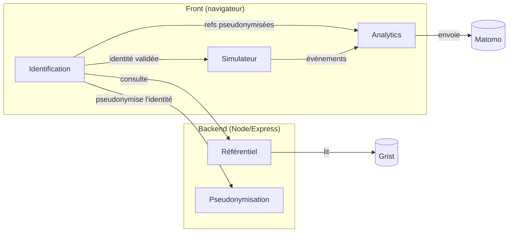

# Simulateur d'éligibilité aux transports sanitaires

Aide un **prescripteur hospitalier** à déterminer, via un questionnaire guidé, si le
transport d'un patient est **pris en charge par l'Assurance Maladie**, et ce qu'il doit
faire en conséquence : **document à établir** (prescription médicale de transport, série
de transports, accord préalable…) et **mode de transport** justifié. Les règles
d'éligibilité encodent la réglementation en vigueur ; le parcours débute par une
**identification du prescripteur obligatoire**.

## Fonctionnement



## Commandes

- `npm run dev:front` — front de dev (port **5173**), proxifie `/api` → `:3000`
- `npm run dev:server` — backend de dev (port **3000**, `--watch`, charge `.env` si présent)
- `npm test` — vitest (le smoke Grist est ignoré sans `GRIST_API_KEY`)
- `npm run build` — typecheck front + serveur, puis build Vite (`dist/`)
- `npm start` — serveur de production (`node server/server.ts`, Node 24)

Depuis la racine : `mise run dev-simulateur` lance front + backend en parallèle.

## Configuration

Copier `.env.example` → `.env` (gitignoré). Les variables `VITE_*` sont lues au **build**
(bundlées dans le front) ; les autres sont détenues par le **serveur** (jamais exposées au
front).

| Variable | Portée | Requis | Défaut / si absente | Usage |
| --- | --- | --- | --- | --- |
| `GRIST_API_KEY` | serveur | prod | référentiel **snapshot factice** (dev/CI) | Clé API Grist source du référentiel (établissements/services/prescripteurs). Jamais exposée au front. |
| `GRIST_DOC_URL` | serveur | non | doc Grist du projet | Base API du doc Grist (`server/referentiel.ts`). |
| `PSEUDONYMISATION_SECRET` | serveur | prod | secret de dev **non sécurisé** | Secret HMAC pseudonymisant le contexte prescripteur envoyé à Matomo. **Dédié** (≠ `GRIST_API_KEY`). Générer : `openssl rand -hex 32`. |
| `PSEUDONYMISATION_EN_CLAIR` | serveur | non | HMAC (pseudonymisé) | Debug : renvoie les refs prescripteur **en clair** (préfixées) au lieu du HMAC, pour les lire dans Matomo. ⚠️ Révèle nom/prénom bruts — **jamais en production**. |
| `VITE_MATOMO_ENABLED` | front | non | `false` (traceur no-op) | Active le tracking Matomo. Actif d'office en build de prod ; à mettre à `true` pour tester en local. |
| `VITE_MATOMO_URL` | front | non | instance mutualisée beta.gouv | URL de l'instance Matomo. |
| `VITE_MATOMO_SITE_ID` | front | non | `275` | Identifiant du site Matomo. |

## Structure (feature-first)

Trois racines de *runtime* — `front/` (front, bundlé par Vite), `server/` (backend Node,
détient la clé Grist + le secret), `shared/` (contrat commun) — chacune organisée **par
feature** :

```
shared/                  contrat front ⇄ back (source unique)
  identite-pseudonymisee.ts  type IdentitePseudonymisee + VERSION + estIdentitePseudonymisee
  referentiel.ts         interface Referentiel + types + snapshot factice
  identite-saisie.ts     type IdentiteSaisie + saisieComplete
server/                  backend (barrière de sécurité : secrets ici, jamais bundlés)
  server.ts app.ts       bootstrap + composition (monte les routers, sert le front)
  identification/        LA feature backend
    routes.ts            /api/etablissements|services|prescripteurs + /api/identite-pseudonymisee
    referentiel-grist.ts  referentiel-source.ts  pseudonymisation.ts
front/                   front (bundlé par Vite)
  app/                   main.tsx  App.tsx (écran-porte)
  identification/        Identification.tsx  referentiel-http.ts
  identite/              pseudonymisation-http.ts (pseudonymiserViaApi)  session.ts
  simulateur/            Simulateur.tsx  FormField.tsx  Resultats.tsx  engine.ts
  analytics/             analytics.ts
```

