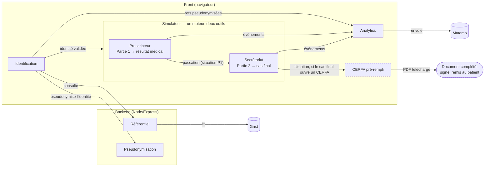

# Simulateur d'éligibilité aux transports sanitaires

Aide un prescripteur hospitalier à déterminer, par un questionnaire guidé, si le
transport d'un patient est pris en charge par l'Assurance Maladie, et ce qu'il doit faire
en conséquence : quel document établir — prescription médicale de transport, série de
transports, accord préalable — et quel mode de transport est justifié. Les règles
d'éligibilité encodent la réglementation en vigueur. Le parcours débute par une
identification du prescripteur, qui est obligatoire.

## Fonctionnement


```mermaid
flowchart LR
    subgraph front["Front (navigateur)"]
        Ident["Identification"]
        subgraph simu["Simulateur — un moteur, deux outils"]
            Presc["Prescripteur<br/>Partie 1 → résultat médical"]
            Secr["Secrétariat<br/>Partie 2 → cas final"]
        end
        Cerfa["CERFA pré-rempli"]
        Analytics["Analytics"]
    end

    subgraph back["Backend (Node/Express)"]
        Ref["Référentiel"]
        Pseudo["Pseudonymisation"]
    end

    Grist[("Grist")]
    Matomo[("Matomo")]
    Patient(["Document complété,<br/>signé, remis au patient"])

    Ident -->|"consulte"| Ref
    Ident -->|"pseudonymise l'identité"| Pseudo
    Ident -->|"identité validée"| simu
    Ident -->|"refs pseudonymisées"| Analytics
    Presc -->|"passation (situation P1)"| Secr
    Presc -->|"événements"| Analytics
    Secr -->|"événements"| Analytics
    Secr -->|"situation, si le cas final ouvre un CERFA"| Cerfa
    Cerfa -->|"PDF téléchargé"| Patient
    Ref -->|"lit"| Grist
    Analytics -->|"envoie"| Matomo

    classDef nominatif stroke-dasharray:4
    class Cerfa,Patient nominatif
```

Le CERFA n'a aucune flèche vers le backend, et c'est structurel. Le prescripteur y
complète des données de santé nominatives, qui ne doivent jamais quitter le navigateur ;
ce sont les traits tiretés ci-dessus. Son téléchargement est par ailleurs réservé au
service produit, et le gabarit comme `pdf-lib` ne sont chargés qu'au clic. Deux
formulaires en sortent, selon le cas final : la prescription médicale de transport
(n° 11574\*07) et la demande d'accord préalable (n° 11575\*08).

## Commandes

| Commande | Ce qu'elle fait |
| --- | --- |
| `pnpm verifier` | **La vérification complète** : lint, typecheck, knip, validation des règles, tests, build et sa vérification de bundle. C'est la commande que lance la CI, telle quelle : ce qui passe ici passe là-bas. |
| `pnpm dev:front` | Le front de dev, sur le port 5173, qui proxifie `/api` vers `:3000` |
| `pnpm dev:server` | Le backend de dev, sur le port 3000, en `--watch`, qui charge `.env` s'il est présent |
| `pnpm test` | Vitest. Le smoke Grist est ignoré sans `GRIST_API_KEY`. |
| `pnpm lint` | Biome : format, tri des imports et lint. `lint:fix` applique les corrections sûres. Le socle est commun aux trois apps, dans `biome.base.jsonc` à la racine. |
| `pnpm knip` | Les exports, fichiers et dépendances que plus personne n'atteint |
| `pnpm typecheck` | `tsc -b` sur les quatre projets : front, node, serveur et tests |
| `pnpm valider-regles` | Compile `regles/*.publicodes` et signale les erreurs |
| `pnpm build` | Typecheck puis build Vite dans `dist/`, suivi de `verifier-bundle`. `pdf-lib` et le catalogue de seeds doivent rester hors du chunk d'entrée, sans quoi chaque prescripteur télécharge 1,2 Mo qu'il ne verra jamais. |
| `pnpm start` | Le serveur de production (`node server/server.ts`, Node 24) |

Les règles d'écriture et les invariants ne sont pas de la prose, ils sont exécutables.
On les trouve dans `tests/architecture.test.ts`, pour les frontières et les limites de 30
et 300 lignes, et dans `tests/lisibilite.test.ts`, pour la forme des fichiers, les noms
et les extensions d'import. Lis leur message d'échec : chacun dit ce que sa règle
protège. Ce qu'on attend d'un contributeur est écrit dans [AGENTS.md](AGENTS.md).

Depuis la racine, `mise run dev-simulateur` lance le front et le backend en parallèle, et
`mise run verifier` passe la vérification sur les trois apps.

## Configuration

Copier `.env.example` vers `.env`, qui est gitignoré. Les variables `VITE_*` sont lues au
build et bundlées dans le front ; les autres sont détenues par le serveur et ne sont
jamais exposées au front.

| Variable | Portée | Requis | Défaut / si absente | Usage |
| --- | --- | --- | --- | --- |
| `GRIST_API_KEY` | serveur | **prod** | référentiel **snapshot factice** (dev/CI) | Clé API Grist source du référentiel (établissements/services/prescripteurs). Jamais exposée au front. |
| `GRIST_DOC_URL` | serveur | non | doc Grist du projet | Base API du doc Grist (`server/referentiel.ts`). |
| `PSEUDONYMISATION_SECRET` | serveur | **prod** | secret de dev **non sécurisé** | Secret HMAC pseudonymisant le contexte prescripteur envoyé à Matomo. **Dédié** (≠ `GRIST_API_KEY`). Générer : `openssl rand -hex 32`. |
| `PSEUDONYMISATION_EN_CLAIR` | serveur | non | HMAC (pseudonymisé) | Debug : renvoie les refs prescripteur **en clair** (préfixées) au lieu du HMAC, pour les lire dans Matomo. ⚠️ Révèle nom/prénom bruts — **jamais en production**. |
| `VITE_MATOMO_ENABLED` | front | non | `false` (traceur no-op) | Active le tracking Matomo. Actif d'office en build de prod ; à mettre à `true` pour tester en local. |
| `VITE_MATOMO_URL` | front | non | instance mutualisée beta.gouv | URL de l'instance Matomo. |
| `VITE_MATOMO_SITE_ID` | front | non | `275` | Identifiant du site Matomo. |

Les deux variables marquées **prod** n'ont pas de valeur par défaut : leur repli est un
référentiel inventé et un secret que tout le monde peut lire, ce qui n'a de sens que sur
un poste de développement. En production — `NODE_ENV=production`, ce que pose Scalingo —
`server/configuration.ts` refuse donc de rendre une configuration incomplète : le serveur
s'arrête au démarrage, avant d'ouvrir son port, sur la liste de ce qui cloche.

```
[simulateur] Démarrage impossible — configuration invalide :
  - GRIST_API_KEY : sans valeur par défaut, elle doit être posée en production
  - PSEUDONYMISATION_SECRET : sans valeur par défaut, elle doit être posée en production
```

La règle est portée par un schéma **zod** : un socle de variables à défaut, et une variante
de production où ces deux-là sont exigées. Le schéma valide aussi la forme de ce qui est
posé — `PORT=quatre-mille` ou une `GRIST_DOC_URL` qui n'est pas une URL arrêtent le
démarrage de la même manière, plutôt que d'échouer plus tard et ailleurs. Une variable
posée mais vide (`GRIST_API_KEY=` dans un `.env` recopié) compte pour absente. Les autres
variables ont un défaut documenté ci-dessus : elles ne bloquent jamais le démarrage.
*Gardé par* [`tests/serveur/configuration.test.ts`](tests/serveur/configuration.test.ts).

## Structure (feature-first)

Il y a trois racines de *runtime* : `front/`, le front bundlé par Vite, `server/`, le
backend Node qui détient la clé Grist et le secret, et `shared/`, le contrat commun.
Chacune est organisée par feature.

```
shared/                  le contrat front ⇄ back, source unique des types partagés
server/                  le backend Node, barrière de sécurité : les secrets vivent ici
                         et ne sont jamais bundlés. Bootstrap, composition,
                         configuration lue une fois et refusée si elle manque en prod.
  identification/        LA feature backend : les routes `/api`, la source Grist du
                         référentiel, la pseudonymisation
front/                   le front, bundlé par Vite
  app/                   l'amorçage, l'écran-porte, le choix de l'outil
  identification/        LA feature de l'écran-porte, miroir de server/identification/ :
                         le formulaire à révélation progressive, les deux clients de
                         l'API, l'identité en mémoire de session (ADR-4)
  simulateur/            LES deux outils, sur un socle commun. La racine ne porte que le
                         socle non-visuel : le contrat de règles, le moteur publicodes
                         et ses lectures typées, la couture entre les deux parties.
    questionnaire/       le parcours et son état : la pagination (une question par page,
                         sauf les adresses), l'avancement automatique du contrat 2.0.0,
                         les champs et les mosaïques, ce qui part vers l'analytics
    resultat/            ce qui entoure un résultat : la vulgarisation vers le patient,
                         l'information à lui donner, la trace de débogage (outil
                         produit : cf. AGENTS.md § Les outils produit)
    prescripteur/        Partie 1 puis Résultat 1
    secretariat/         Partie 2 puis Résultat 2 : l'assemblage de ses trois blocs et
                         la charge de l'établissement (article 80)
  outils-produit/        LA feature réservée au service produit. Elle se greffe sur le
                         simulateur, jamais l'inverse : c'est App.tsx qui compose. Le
                         déverrouillage est la garde commune à tout le dossier.
    labo/                le test d'un fichier de règles par le produit lui-même
    seeds/               le catalogue des situations de référence, sa galerie et ses
                         écrans d'atterrissage
    beta/                ce qui est gardé le temps d'être éprouvé, pas par nature
      cerfa/             les CERFA pré-remplis, générés dans le navigateur : quel
                         formulaire ouvre quel cas final, ce que le remplissage lit du
                         modèle, l'écriture dans le PDF et ses pièges
        pmt/             prescription médicale de transport (n° 11574*07)
        dap/             demande d'accord préalable (n° 11575*08)
                         un sous-dossier par formulaire, gabarit compris, chacun avec
                         son tableau : un champ du PDF, une ligne, comment il se
                         remplit ou qui le remplira
  analytics/             le vocabulaire mesuré, seul import du reste, et son transport
                         vers Matomo
```

## Le modèle de règles

`regles/regles.publicodes` est livré de l'extérieur et intégré par recopie. C'est
aujourd'hui la v9.5.1, qui compte 188 règles et 42 cibles. Le fichier livré ne porte pas
sa version : c'est `regles/VERSION` qui la porte à côté de lui, et c'est elle que le pied
de page affiche. Une recopie met les deux à jour, sans quoi l'application annonce une
version qu'elle n'exécute pas.

Le paquet apporte aussi un contrat d'interface (`*.ui.yaml`, schéma 2.1.0) et une matrice
de tests. Tous deux sont réencodés ici plutôt que chargés : le contrat se lit dans les
composants, la matrice dans quatre fichiers de `tests/simulateur/`, un par sujet. Ces
tests gardent les identifiants du livrable (`ALD-002`, `SERIE-001`, `ARTICLE80-003` et les
autres) pour qu'un désaccord remonte au fournisseur sous son nom.

Trois coutures tiennent le modèle et le code ensemble, et il faut les trois :

| Ce qui est vérifié | Par quoi |
| --- | --- |
| Le code ne nomme que des règles existantes | `contrat-regles-publicodes.ts` (TypeScript) **et** `tests/regles-front.test.ts` (les noms existent dans le modèle) |
| Le code ne compare qu'à des **valeurs** existantes | `tests/regles-front.test.ts › valeurs comparées aux sorties du moteur`, seule garde contre une reformulation en amont, que le typage ne voit pas |
| Chaque cas final est traité par les trois blocs de la Page Résultat 2 | `tests/regles-front.test.ts › exhaustivité de la Page Résultat 2` |

### Deux comportements que le modèle ne porte pas

Le moteur calcule les cibles, mais ne pilote ni les écrans ni ce qui reste modifiable. Le
contrat d'interface 2.0.0 décrit deux règles qu'il ne peut donc pas appliquer seul.

- **L'avancement automatique.** Une page qui n'est faite que de choix uniques avance seule
  200 ms après avoir été répondue, sans bouton « Suivant ». Au retour sur une page déjà
  répondue, le bouton reprend la main, sans quoi « Précédent » renverrait aussitôt d'où
  l'on vient. Tout est dans `questionnaire/avancement-automatique.ts`.
- **Le verrouillage de la décision médicale.** Au Résultat 1, « Précédent » rouvre le
  questionnaire sur sa dernière page, réponses intactes. C'est l'action principale qui
  verrouille, et elle est irréversible. La Partie 2 ne repose aucune question de Partie 1,
  et seule une nouvelle simulation remet tout à zéro.

## Déployer

Scalingo construit et sert cette app, et déploie depuis `main`.

1. **Passer la vérification.** `pnpm verifier` doit être vert, comme en CI.
2. **Pousser sur `main`.** Scalingo part de là, sans action manuelle.
3. **Laisser construire depuis la racine du dépôt**, et non depuis
   `apps/simulateur-eligibilite/`. C'est ce qu'impose le workspace pnpm : le
   `pnpm-lock.yaml` et le `pnpm-workspace.yaml` vivent à la racine, et une construction
   lancée dans le sous-dossier n'y aurait accès à aucun des deux. Elle installerait des
   versions non verrouillées. Le réglage à tenir côté Scalingo est `PROJECT_DIR`, qui doit
   rester *vide*.
4. **Tenir les deux variables de production**, `GRIST_API_KEY` et
   `PSEUDONYMISATION_SECRET`. Elles n'ont pas de défaut, et le serveur refuse de démarrer
   sans elles (cf. [Configuration](#configuration)).
5. **Relire le pied de page en production.** Il annonce la version de l'app, le sha du
   commit livré et la version des règles.

Trois fichiers de la racine portent ce déploiement :

| Fichier | Ce qu'il donne à Scalingo |
| --- | --- |
| `package.json` | `packageManager` (la version de pnpm), `engines.node`, et deux scripts d'aiguillage : `build` et `start`, qui délèguent tous deux à cette app par `--filter` |
| `Procfile` | `web: pnpm --filter simulateur-eligibilite run start` |
| `pnpm-lock.yaml` | les versions exactes des trois apps |

Le build installe donc aussi les dépendances de `data-analyzer` et de `glossaire-notion`.
C'est le prix du lock unique, et il se compte en secondes.
