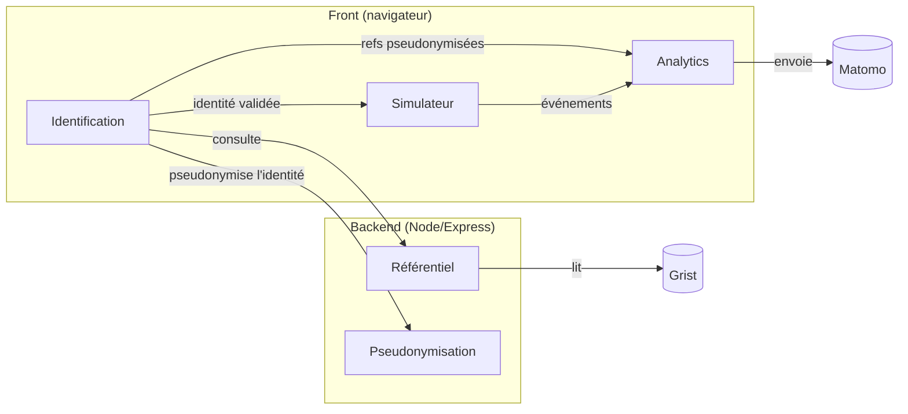

# Simulateur d'éligibilité aux transports sanitaires

Aide un **prescripteur hospitalier** à déterminer, via un questionnaire guidé, si le
transport d'un patient est **pris en charge par l'Assurance Maladie**, et ce qu'il doit
faire en conséquence : **document à établir** (prescription médicale de transport, série
de transports, accord préalable…) et **mode de transport** justifié. Les règles
d'éligibilité encodent la réglementation en vigueur ; le parcours débute par une
**identification du prescripteur obligatoire**.

## Fonctionnement


```mermaid
flowchart LR
    subgraph front["Front (navigateur)"]
        Ident["Identification"]
        Simu["Simulateur"]
        Analytics["Analytics"]
    end

    subgraph back["Backend (Node/Express)"]
        Ref["Référentiel"]
        Pseudo["Pseudonymisation"]
    end

    Grist[("Grist")]
    Matomo[("Matomo")]

    Ident -->|"consulte"| Ref
    Ident -->|"pseudonymise l'identité"| Pseudo
    Ident -->|"identité validée"| Simu
    Ident -->|"refs pseudonymisées"| Analytics
    Simu -->|"événements"| Analytics
    Ref -->|"lit"| Grist
    Analytics -->|"envoie"| Matomo
```

## Commandes

- `npm run dev:front` — front de dev (port **5173**), proxifie `/api` → `:3000`
- `npm run dev:server` — backend de dev (port **3000**, `--watch`, charge `.env` si présent)
- `npm test` — vitest (le smoke Grist est ignoré sans `GRIST_API_KEY`)
- `npm run build` — typecheck front + serveur, puis build Vite (`dist/`)
- `npm start` — serveur de production (`node server/server.ts`, Node 24)

Depuis la racine : `mise run dev-simulateur` lance front + backend en parallèle.

## Configuration

Copier `.env.example` → `.env` (gitignoré). Les variables `VITE_*` sont lues au **build**
(bundlées dans le front) ; les autres sont détenues par le **serveur** (jamais exposées au
front).

| Variable | Portée | Requis | Défaut / si absente | Usage |
| --- | --- | --- | --- | --- |
| `GRIST_API_KEY` | serveur | prod | référentiel **snapshot factice** (dev/CI) | Clé API Grist source du référentiel (établissements/services/prescripteurs). Jamais exposée au front. |
| `GRIST_DOC_URL` | serveur | non | doc Grist du projet | Base API du doc Grist (`server/referentiel.ts`). |
| `PSEUDONYMISATION_SECRET` | serveur | prod | secret de dev **non sécurisé** | Secret HMAC pseudonymisant le contexte prescripteur envoyé à Matomo. **Dédié** (≠ `GRIST_API_KEY`). Générer : `openssl rand -hex 32`. |
| `PSEUDONYMISATION_EN_CLAIR` | serveur | non | HMAC (pseudonymisé) | Debug : renvoie les refs prescripteur **en clair** (préfixées) au lieu du HMAC, pour les lire dans Matomo. ⚠️ Révèle nom/prénom bruts — **jamais en production**. |
| `VITE_MATOMO_ENABLED` | front | non | `false` (traceur no-op) | Active le tracking Matomo. Actif d'office en build de prod ; à mettre à `true` pour tester en local. |
| `VITE_MATOMO_URL` | front | non | instance mutualisée beta.gouv | URL de l'instance Matomo. |
| `VITE_MATOMO_SITE_ID` | front | non | `275` | Identifiant du site Matomo. |

## Mode test des règles (labo)

Permet au **produit** de tester en autonomie une nouvelle version du fichier de règles
(`.publicodes`) sans passer par un développeur ni un déploiement. Le test est **local au
navigateur** (`localStorage`) : il n'affecte ni la production ni les autres utilisateurs.

Parcours PM :

| Étape | Action |
| --- | --- |
| 1 | S'identifier en choisissant le service **« Transport Sanitaire »** (garde d'accès, service Grist `Id2 = 4`) |
| 2 | Cliquer **« Mode test des règles »** (n'apparaît que pour ce service) |
| 3 | Déposer le fichier `.publicodes` → validation immédiate (erreurs YAML/publicodes affichées inline) |
| 4 | **« Activer et tester »** → l'app recharge et le simulateur tourne sur les nouvelles règles |
| 5 | Un **bandeau permanent** rappelle le mode test ; **« Revenir aux règles officielles »** le quitte |

Les versions chargées sont conservées en historique local (rebascule en un clic).
Implémentation : `front/labo/` (`labo.ts` état + validation, `Labo.tsx`, `BandeauLabo.tsx`) ;
le moteur consomme les règles labo au boot (`front/simulateur/engine.ts`). Les règles
**officielles** restent embarquées dans le build (`regles/*.publicodes`) — publier une
version reste un geste explicite (commit + déploiement).

## Structure (feature-first)

Trois racines de *runtime* — `front/` (front, bundlé par Vite), `server/` (backend Node,
détient la clé Grist + le secret), `shared/` (contrat commun) — chacune organisée **par
feature** :

```
shared/                  contrat front ⇄ back (source unique)
  identite-pseudonymisee.ts  type IdentitePseudonymisee + VERSION + estIdentitePseudonymisee
  referentiel.ts         interface Referentiel + types + snapshot factice
  identite-saisie.ts     type IdentiteSaisie + saisieComplete
server/                  backend (barrière de sécurité : secrets ici, jamais bundlés)
  server.ts app.ts       bootstrap + composition (monte les routers, sert le front)
  identification/        LA feature backend
    routes.ts            /api/etablissements|services|prescripteurs + /api/identite-pseudonymisee
    referentiel-grist.ts  referentiel-source.ts  pseudonymisation.ts
front/                   front (bundlé par Vite)
  app/                   main.tsx  App.tsx (écran-porte)
  identification/        Identification.tsx  referentiel-http.ts
  identite/              pseudonymisation-http.ts (pseudonymiserViaApi)  session.ts
  simulateur/            Simulateur.tsx  FormField.tsx  Resultats.tsx  engine.ts
  labo/                  Labo.tsx  BandeauLabo.tsx  labo.ts (test de règles par le produit)
  analytics/             analytics.ts
experiments/             expérimentations, hors chemin de production
  cerfa-pmt/             pré-remplissage du CERFA de prescription (cf. ci-dessous)
```

## Pré-remplissage du CERFA (expérimentation)

> **Statut : expérimentation.** `experiments/cerfa-pmt/` n'est branché sur aucun écran.
> Le code est validé par `tests/cerfa-pmt/` et par `demo.ts` ; l'intégration produit
> reste à cadrer (voir *Questions ouvertes*).

Objet : produire une **prescription médicale de transport** (CERFA n° 11574\*07, réf.
S3138g) pré-remplie à partir des réponses données au simulateur.

### Le gabarit

Les deux candidats évalués (`pmt.pdf`, `pmt_interactif.pdf`) sont **le même fichier**
(MD5 identique). Il n'y avait donc pas d'arbitrage à faire : le CERFA officiel est un
**AcroForm** de 4 pages (notice p1–p2, Volet 1 p3, Volet 2 p4) portant **53 champs
nommés**, tous inscriptibles. Il est versionné sous `gabarit/cerfa-11574-07.pdf` —
document public, aucune donnée personnelle.

L'écriture se fait avec **`pdf-lib`**, qui tourne à l'identique dans Node et dans le
navigateur.

| Propriété | Conséquence |
| --- | --- |
| 46 champs sur 53 portent un widget sur **chaque volet** | Écrire une fois remplit les deux volets ; ils ne peuvent pas diverger. |
| `comm évent` (éléments d'ordre médical) n'existe **que** sur le Volet 1 | La donnée médicale ne part pas à l'organisme de remboursement : le formulaire porte déjà la séparation. |
| Le bloc transporteur n'existe que sur le Volet 2 | Rempli à la main par le transporteur — le simulateur n'y écrit rien. |
| Les champs restent éditables après remplissage | Le prescripteur corrige ce qu'il veut (option `verrouiller` disponible, non retenue par défaut). |

### Trois pièges du gabarit

Relevés par introspection, chacun produisant un document silencieusement faux :

1. **`ALD exo`, `oui1`, `oui2` sont des radios déguisés en case à cocher.** Un même
   champ porte 4 widgets (2 par volet), d'états d'export `/OUI` et `/NON`. Le
   `check()` de `pdf-lib` retient le premier état venu et coche donc la mauvaise
   moitié une fois sur deux. `remplir-cerfa.ts` impose l'état explicitement.
2. **L'état d'export n'est pas la sémantique.** Cocher « entrée ou sortie
   d'hospitalisation » s'écrit `/NON`. Ne jamais inférer le sens du nom ou de l'état.
3. **Certains champs déclarés multilignes n'affichent qu'une ligne** (`adresse`) :
   un `\n` y rogne le reste à l'impression. Ces champs sont aplatis.

Par ailleurs, une valeur dépassant le `maxLength` d'un champ lève une erreur au lieu
d'être tronquée — un NIR tronqué sur un document opposable est pire qu'un échec.

### Ce que le simulateur sait déduire

| Rubrique CERFA | Source | Couverture |
| --- | --- | --- |
| ❶ Situation (hospitalisation, AT/MP) | `p1_motif_*` | déduite |
| ❶ ALD **exonérante** vs non exonérante | — | **non modélisé**, à saisir |
| ❷ Mode de transport + justifications | `cible_transport_sanitaire_prescrit`, `p1_critere_*` | déduite |
| ❷ Véhicule personnel *vs* transports en commun | — | le simulateur fusionne les deux, le CERFA les sépare |
| Trajet : aller-retour, départ/arrivée « domicile » | `p2_trajet_*` | déduite (type de lieu seulement) |
| Trajet : adresses et noms de structures | — | **à saisir** |
| Urgence, accident causé par un tiers, nb de transports | `p2_transport_urgence`, `p2_accident_cause_par_tiers`, `p2_nombre_transports_prevus` | déduite |
| Identité du patient / de l'assuré (9 champs) | — | **à saisir** — voir ci-dessous |
| Identité du prescripteur (6 champs) | — | **à saisir** — le référentiel ne porte que des libellés |
| Éléments d'ordre médical, ticket modérateur, pension militaire | — | rédaction / décision du prescripteur |

`saisiesDepuisSituation` ne rend **que** ce que les règles justifient : aucune valeur
inventée, aucun défaut arbitraire. Elle refuse par ailleurs de produire ce CERFA quand
`cible_cas_final` conclut à autre chose — un accord préalable relève du formulaire
S3139, une prise en charge par l'établissement ne donne lieu à aucun CERFA.

### Questions ouvertes

- **Où faire tourner le remplissage.** Le CERFA exige nom, NIR, date de naissance et
  adresse du patient — des données de santé nominatives, qu'aucune partie de l'app ne
  manipule aujourd'hui (le simulateur est anonyme, l'identification prescripteur est
  pseudonymisée par HMAC côté serveur). `pdf-lib` fonctionnant dans le navigateur,
  générer le PDF **entièrement côté front** garde ces données sur le poste : rien à
  transmettre, à journaliser ni à héberger. C'est la seule option qui n'introduit pas
  de traitement de données de santé dans le backend.
- **Étendre ou non le référentiel d'identification.** Pré-remplir le bloc prescripteur
  suppose d'y ajouter RPPS, FINESS/SIRET et adresse de structure, aujourd'hui absents
  (`shared/referentiel.ts` ne porte que `{ id, libelle }`).
- **Où placer l'étape** dans le parcours prescripteur → secrétariat.

### Commandes

```
npx vitest run tests/cerfa-pmt          # 10 tests : gabarit, remplissage, mapping
node --experimental-strip-types experiments/cerfa-pmt/demo.ts [sortie.pdf]
```

`demo.ts` produit un CERFA rempli depuis une situation d'exemple (ambulance,
aller-retour depuis le domicile) : le médical est renseigné, les blocs d'identité
restent visiblement vierges.

