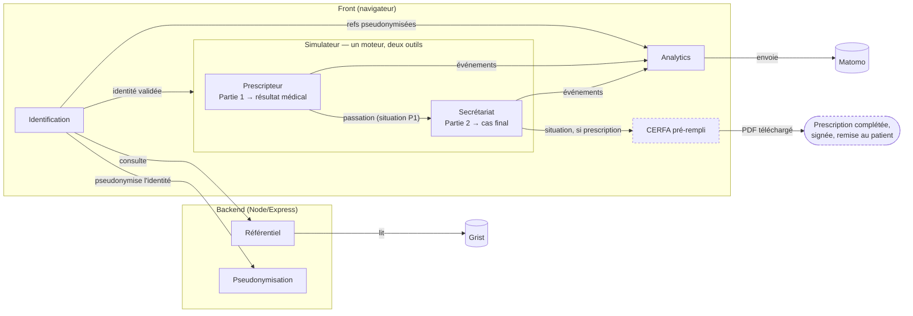

# Simulateur d'éligibilité aux transports sanitaires

Aide un **prescripteur hospitalier** à déterminer, via un questionnaire guidé, si le
transport d'un patient est **pris en charge par l'Assurance Maladie**, et ce qu'il doit
faire en conséquence : **document à établir** (prescription médicale de transport, série
de transports, accord préalable…) et **mode de transport** justifié. Les règles
d'éligibilité encodent la réglementation en vigueur ; le parcours débute par une
**identification du prescripteur obligatoire**.

## Fonctionnement


```mermaid
flowchart LR
    subgraph front["Front (navigateur)"]
        Ident["Identification"]
        subgraph simu["Simulateur — un moteur, deux outils"]
            Presc["Prescripteur<br/>Partie 1 → résultat médical"]
            Secr["Secrétariat<br/>Partie 2 → cas final"]
        end
        Cerfa["CERFA pré-rempli"]
        Analytics["Analytics"]
    end

    subgraph back["Backend (Node/Express)"]
        Ref["Référentiel"]
        Pseudo["Pseudonymisation"]
    end

    Grist[("Grist")]
    Matomo[("Matomo")]
    Patient(["Prescription complétée,<br/>signée, remise au patient"])

    Ident -->|"consulte"| Ref
    Ident -->|"pseudonymise l'identité"| Pseudo
    Ident -->|"identité validée"| simu
    Ident -->|"refs pseudonymisées"| Analytics
    Presc -->|"passation (situation P1)"| Secr
    Presc -->|"événements"| Analytics
    Secr -->|"événements"| Analytics
    Secr -->|"situation, si prescription"| Cerfa
    Cerfa -->|"PDF téléchargé"| Patient
    Ref -->|"lit"| Grist
    Analytics -->|"envoie"| Matomo

    classDef nominatif stroke-dasharray:4
    class Cerfa,Patient nominatif
```

Le **CERFA** n'a aucune flèche vers le backend, et c'est structurel : le prescripteur
y complète des données de santé nominatives, qui ne doivent jamais quitter le
navigateur (traits tiretés ci-dessus). Le gabarit et `pdf-lib` sont chargés au clic —
cf. [Prescription pré-remplie (CERFA)](#prescription-pré-remplie-cerfa).

## Commandes

- `npm run dev:front` — front de dev (port **5173**), proxifie `/api` → `:3000`
- `npm run dev:server` — backend de dev (port **3000**, `--watch`, charge `.env` si présent)
- `npm test` — vitest (le smoke Grist est ignoré sans `GRIST_API_KEY`)
- `npm run build` — typecheck front + serveur, puis build Vite (`dist/`)
- `npm start` — serveur de production (`node server/server.ts`, Node 24)

Depuis la racine : `mise run dev-simulateur` lance front + backend en parallèle.

## Configuration

Copier `.env.example` → `.env` (gitignoré). Les variables `VITE_*` sont lues au **build**
(bundlées dans le front) ; les autres sont détenues par le **serveur** (jamais exposées au
front).

| Variable | Portée | Requis | Défaut / si absente | Usage |
| --- | --- | --- | --- | --- |
| `GRIST_API_KEY` | serveur | prod | référentiel **snapshot factice** (dev/CI) | Clé API Grist source du référentiel (établissements/services/prescripteurs). Jamais exposée au front. |
| `GRIST_DOC_URL` | serveur | non | doc Grist du projet | Base API du doc Grist (`server/referentiel.ts`). |
| `PSEUDONYMISATION_SECRET` | serveur | prod | secret de dev **non sécurisé** | Secret HMAC pseudonymisant le contexte prescripteur envoyé à Matomo. **Dédié** (≠ `GRIST_API_KEY`). Générer : `openssl rand -hex 32`. |
| `PSEUDONYMISATION_EN_CLAIR` | serveur | non | HMAC (pseudonymisé) | Debug : renvoie les refs prescripteur **en clair** (préfixées) au lieu du HMAC, pour les lire dans Matomo. ⚠️ Révèle nom/prénom bruts — **jamais en production**. |
| `VITE_MATOMO_ENABLED` | front | non | `false` (traceur no-op) | Active le tracking Matomo. Actif d'office en build de prod ; à mettre à `true` pour tester en local. |
| `VITE_MATOMO_URL` | front | non | instance mutualisée beta.gouv | URL de l'instance Matomo. |
| `VITE_MATOMO_SITE_ID` | front | non | `275` | Identifiant du site Matomo. |

## Outils produit

Deux outils sont réservés au **produit** : le **mode test des règles** (labo) et la
**galerie de seeds**. Ils partagent la même garde d'accès et le même encadré
**« Outils produit »**, présent sur l'écran-porte d'identification et au début du
parcours prescripteur.

| | |
| --- | --- |
| **Où** | Encadré « Outils produit », à part des actions nominales (`front/outils-produit/OutilsProduit.tsx`) |
| **Qui** | Le service **« Transport Sanitaire »** du référentiel (service Grist `Id2 = 4`, cf. `front/outils-produit/acces.ts`) |
| **Quand** | Sur **tous les environnements**, production comprise — c'est le service qui garde l'accès, pas le build |
| **Comment** | Après l'identification : les boutons restent désactivés tant qu'elle est incomplète (ADR-1 vaut pour toutes les destinations) |

Ce service n'ayant pas de prescripteur dans le référentiel snapshot, on y entre par
« Je ne suis pas dans la liste » puis nom / prénom.

### Mode test des règles (labo)

Permet au produit de tester en autonomie une nouvelle version du fichier de règles
(`.publicodes`) sans passer par un développeur ni un déploiement. Le test est **local au
navigateur** (`localStorage`) : il n'affecte ni la production ni les autres utilisateurs.

Parcours PM :

| Étape | Action |
| --- | --- |
| 1 | S'identifier en choisissant le service **« Transport Sanitaire »**, puis compléter l'identification |
| 2 | Cliquer **« Mode test des règles »** dans l'encadré « Outils produit » |
| 3 | Déposer le fichier `.publicodes` → validation immédiate (erreurs YAML/publicodes affichées inline) |
| 4 | **« Activer et tester »** → l'app recharge et le simulateur tourne sur les nouvelles règles |
| 5 | Un **bandeau permanent** rappelle le mode test ; **« Revenir aux règles officielles »** le quitte |

Les versions chargées sont conservées en historique local (rebascule en un clic).
Implémentation : `front/outils-produit/labo/` (`labo.ts` état + validation, `Labo.tsx`,
`BandeauLabo.tsx`) ;
le moteur consomme les règles labo au boot (`front/simulateur/engine.ts`). Les règles
**officielles** restent embarquées dans le build (`regles/*.publicodes`) — publier une
version reste un geste explicite (commit + déploiement).

## Seeds (situations de référence)

`front/outils-produit/seeds/` est la **source unique** des situations de référence du
simulateur. Une seed
est une situation nommée **avec ses attendus** :

```ts
{
  id: "secretariat-accord-prealable-distance",
  libelle: "Secrétariat — accord préalable (plus de 150 km)",
  description: "…",
  outil: "secretariat",              // écran de résultat sur lequel on atterrit
  entrees: { p2_distance_aller_superieure_150km: "oui", … },
  attendu: { cible_cas_final: "demande accord préalable", … },
}
```

Trois consommateurs, une seule définition :

| Consommateur | Ce qu'il en fait |
| --- | --- |
| `tests/simulateur/scenarios.test.ts` | rejoue tout le catalogue : matrice de non-régression métier, couverture des 9 cas finaux et des 5 régimes de financement |
| **Galerie de seeds** (dev) | affiche le catalogue et ouvre la page de résultat d'une seed |
| `npm run apercu-cerfa` | tire le CERFA pré-rempli d'une seed, sans navigateur |

Ajouter une situation au catalogue la rend donc du même geste **testée** et
**consultable à l'écran** — c'est ce qui empêche les deux listes de diverger.

```
front/outils-produit/seeds/
  base-neutre.ts    BASE_NEUTRE : le questionnaire répondu « tout à non »
  seed.ts           type Seed, situationDe(), evaluerSeed() (valeurs, manquantes, écarts)
  catalogue.ts      SEEDS + seedParId() — le catalogue lui-même
  GalerieSeeds.tsx  l'écran qui l'affiche (cf. plus bas)
```

Ces trois fichiers ne dépendent que de `publicodes` : ils sont lisibles par Node
(`npm run apercu-cerfa`) autant que par le bundle. Seul `GalerieSeeds.tsx` est du front.

Une seed ne déclare que **ce qui la distingue** (`entrees`), surchargé sur `BASE_NEUTRE` :
l'ajout d'une question au modèle ne se paie qu'une fois, dans la base. Cette base garantit
aussi qu'aucune cible ne reste indécise (`manquantes` vide). Elle ne doit rien affirmer :
`p1_situation_permission_sans_motif_medical` y vaut `Non concerné` (aucune permission en
jeu) et non `Non`, qui signifierait qu'une permission **est** en jeu, avec motif médical —
et ferait basculer l'Article 80 sur tous les cas à la charge de l'établissement.

### Non-conformités

Toute seed déclare `cible_regime_financement` — **qui paie**, en un mot. C'est l'axe sur
lequel se lit une non-conformité : un transport dont le régime n'est pas
`assurance maladie` ne doit pas lui être facturé. Les 5 régimes du modèle sont couverts :

| Régime | Seeds |
| --- | --- |
| `assurance maladie` | prescription, accord préalable (distance, série, avion/bateau, CAMSP/CMPP, maternité, SAMSAH, tiers), convocation, détenu retournant en établissement pénitentiaire |
| `établissement prescripteur` | hospitalisé hors exception, détenu inter-établissements, détenu UHSA/UHSI, permission de sortie thérapeutique |
| `patient` | bariatrique seul, permission sans motif médical, prestation non prise en charge |
| `urgence spécifique` | SMUR |
| `à qualifier` | transport non justifié, ALD sans lien, ALD sans incapacité, détenu à qualifier |

Trois seeds concluent à une charge de l'établissement pour **trois raisons différentes** :
`cible_article_80_situation_specifique` (détenu inter-établissements, UHSA/UHSI) et
`cible_article_80_permission_sortie_therapeutique` les distinguent — sans ces drapeaux,
elles seraient indiscernables (mêmes cas final, mode et document).

Ces seeds restent **conformes** au moteur : le badge de la galerie reste vert. C'est la
situation qui n'ouvre pas droit, pas la seed qui se trompe.

### La galerie

**« Galerie de seeds »**, dans l'encadré « Outils produit » (cf. plus haut) — sur
l'écran-porte **et** au début du parcours prescripteur. Elle liste tout le catalogue,
séparé par écran d'atterrissage :

- **Page Résultat 1** — situations tranchées en Partie 1 (le parcours reste franchissable
  jusqu'au résultat final) ;
- **Page Résultat 2** — situations complètes (P1 + P2), ouvertes directement sur le cas
  final ; celles marquées **CERFA** proposent le document pré-rempli.

Chaque ligne rejoue sa seed dans le moteur **du navigateur**, affiche `conforme` ou
`écart`, et donne en colonne **« Qui paie »** le régime de financement — un régime autre
qu'`assurance maladie` signale une non-conformité. En **mode labo**, la galerie dit donc immédiatement quelles situations de
référence les règles en cours de test font diverger — avant même d'ouvrir un parcours.

L'écran (`GalerieSeeds.tsx`) est chargé par **import dynamique** : ni lui ni le
catalogue n'entrent dans le bundle initial, que seul le service produit fait charger.

Une seed ouvre une situation **fabriquée** : un prescripteur ordinaire ne peut donc pas
court-circuiter son parcours. Le service produit, lui, le peut — CERFA compris, ce qui
est précisément l'usage de la seed `secretariat-prescription` ; le document sort vierge
de toute identité et n'est pas signable en l'état.

## Structure (feature-first)

Trois racines de *runtime* — `front/` (front, bundlé par Vite), `server/` (backend Node,
détient la clé Grist + le secret), `shared/` (contrat commun) — chacune organisée **par
feature** :

```
shared/                  contrat front ⇄ back (source unique)
  identite-pseudonymisee.ts  type IdentitePseudonymisee + VERSION + estIdentitePseudonymisee
  referentiel.ts         interface Referentiel + types + snapshot factice
  identite-saisie.ts     type IdentiteSaisie + saisieComplete
server/                  backend (barrière de sécurité : secrets ici, jamais bundlés)
  server.ts app.ts       bootstrap + composition (monte les routers, sert le front)
  identification/        LA feature backend
    routes.ts            /api/etablissements|services|prescripteurs + /api/identite-pseudonymisee
    referentiel-grist.ts  referentiel-source.ts  pseudonymisation.ts
front/                   front (bundlé par Vite)
  app/                   Main.tsx  App.tsx (écran-porte)  outil.ts
  identification/        LA feature de l'écran-porte — miroir de server/identification/
    Identification.tsx   le formulaire à révélation progressive
    referentiel-http.ts  pseudonymisation-http.ts   les deux clients de l'API
    session.ts           l'identité pseudonymisée, en mémoire de session (ADR-4)
  simulateur/            LES deux outils, sur un socle commun — la racine ne porte
                         que le socle non-visuel, tout composant est rangé
    engine.ts            moteur publicodes (règles officielles ou labo)
    passation.ts         la couture prescripteur → secrétariat
    questionnaire/       Parcours.tsx (stepper + FormBuilder)  FormField.tsx
                         Mosaique.tsx  mosaique.ts
    resultat/            Vulgarisation.tsx (dictionnaire patient)
                         InformationPatient.tsx  TraceDebug.tsx
    prescripteur/        Prescripteur.tsx  ResultatMedical.tsx (Partie 1 → Résultat 1)
    secretariat/         Secretariat.tsx (Partie 2 → Résultat 2)
                         ResultatFinal.tsx  l'assemblage des trois blocs
                         Bloc1Resultat.tsx  Bloc2Etapes.tsx  Bloc3CasRetenu.tsx
                         Article80.tsx  la charge établissement, ses deux rendus
  outils-produit/        LA feature réservée au service n° 4 (cf. plus haut)
    acces.ts             estServiceProduit — la garde commune aux deux outils
    OutilsProduit.tsx    l'encadré partagé par l'écran-porte et le parcours
    labo/                Labo.tsx  BandeauLabo.tsx  labo.ts (test de règles par le produit)
    seeds/               le catalogue de situations + GalerieSeeds.tsx (cf. ci-dessus)
  analytics/             analytics.ts
  cerfa/                 prescription CERFA pré-remplie (cf. ci-dessous)
```

## Prescription pré-remplie (CERFA)

En fin de parcours secrétariat, la Page Résultat 2 propose de télécharger le CERFA
n° 11574\*07 (*Prescription médicale de transport*, réf. S3138g) **pré-rempli à partir
de la simulation**. Le bouton n'apparaît que si `cible_cas_final` vaut
`prescription médicale de transport` : un accord préalable relève du formulaire S3139,
une prise en charge par l'établissement ne donne lieu à aucun CERFA.

### Génération entièrement côté navigateur

Le formulaire réclame des données de santé nominatives (nom, NIR, date de naissance,
adresse du patient). Le simulateur n'en connaît aucune, et **les blocs d'identité
sortent volontairement vierges** — le prescripteur les complète dans son lecteur PDF,
les champs restant éditables. Générer dans le navigateur garantit qu'aucun document
nominatif ne pourra, demain, transiter par le backend ou s'échouer dans un log.

L'invariant d'identification est intact : passé l'écran-porte, l'identité du
prescripteur n'existe qu'en pseudonyme HMAC. Le bloc prescripteur du CERFA reste donc
vierge lui aussi.

`pdf-lib` (421 ko) et le gabarit (767 ko) ne sont chargés **qu'au clic**, par import
dynamique et `fetch` de l'asset : le bundle initial n'augmente que de ~3 ko.

### Le gabarit

Le CERFA officiel est un **AcroForm** de 4 pages (notice p1–p2, Volet 1 p3, Volet 2 p4)
portant **53 champs nommés**, tous inscriptibles. Il est versionné sous
`front/cerfa/gabarit/` — document public, aucune donnée personnelle.

| Propriété | Conséquence |
| --- | --- |
| 46 champs sur 53 portent un widget sur **chaque volet** | Écrire une fois remplit les deux volets ; ils ne peuvent pas diverger. |
| `comm évent` (éléments d'ordre médical) n'existe que sur le Volet 1 | La donnée médicale ne part pas à l'organisme de remboursement : le formulaire porte déjà la séparation. |
| Le bloc transporteur n'existe que sur le Volet 2 | Rempli à la main par le transporteur — on n'y écrit rien. |

### Trois pièges du gabarit

Relevés par introspection, chacun produisant un document silencieusement faux :

1. **`ALD exo`, `oui1`, `oui2` sont des radios déguisés en case à cocher.** Un même
   champ porte 4 widgets (2 par volet), d'états d'export `/OUI` et `/NON`. Le
   `check()` de `pdf-lib` retient le premier état venu et coche donc la mauvaise
   moitié une fois sur deux. `remplir-cerfa.ts` impose l'état explicitement.
2. **L'état d'export n'est pas la sémantique.** Cocher « entrée ou sortie
   d'hospitalisation » s'écrit `/NON`. Ne jamais inférer le sens du nom ou de l'état.
3. **Certains champs déclarés multilignes n'affichent qu'une ligne** (`adresse`) :
   un `\n` y rogne le reste à l'impression. Ces champs sont aplatis.

Par ailleurs, une valeur dépassant le `maxLength` d'un champ lève une erreur au lieu
d'être tronquée — un NIR tronqué sur un document opposable est pire qu'un échec.

### Ce qui est pré-rempli

| Rubrique CERFA | Source | Couverture |
| --- | --- | --- |
| ❶ Situation (hospitalisation, séances, AT/MP) | `p1_motif_*` | déduite |
| ❶ ALD **exonérante** vs non exonérante | — | non modélisé, à cocher |
| ❷ Mode de transport + justifications | `cible_transport_sanitaire_prescrit`, `p1_critere_*` | déduite |
| ❷ Véhicule personnel *vs* transports en commun | — | le simulateur fusionne les deux, le CERFA les sépare |
| Trajet : aller-retour, départ/arrivée « domicile » | `p2_trajet_*` | déduite (type de lieu seulement) |
| Trajet : adresses et noms de structures | — | à saisir |
| Urgence, accident causé par un tiers | `p2_transport_urgence`, `p2_accident_cause_par_tiers` | déduite |
| Nombre de transports itératifs | `p2_nombre_transports_prevus` | déduite **hors transport en série** — la notice réserve la rubrique à ce cas |
| Identité du patient et de l'assuré (9 champs) | — | à saisir (cf. ci-dessus) |
| Identité du prescripteur (6 champs) | — | à saisir (cf. ci-dessus) |
| Éléments d'ordre médical, ticket modérateur, pension militaire | — | rédaction / décision du prescripteur |

`saisiesDepuisSituation` ne rend **que** ce que les règles justifient : aucune valeur
inventée, aucun défaut arbitraire.

### Modules

```
front/cerfa/
  BoutonCerfa.tsx      action de fin de parcours (état, erreur, libellés)
  cerfa.ts             orchestration : chargement du gabarit, génération, téléchargement
  depuis-simulateur.ts situation publicodes → saisies CERFA (+ RESTE_A_SAISIR)
  remplir-cerfa.ts     écriture pdf-lib (aucun import node:* — doit rester front)
  champs-cerfa.ts      inventaire typé des 53 champs et de leurs pièges
  gabarit/             CERFA officiel, servi en asset
```

Un échec de génération affiche une alerte sans masquer le résultat déjà affiché : le
parcours reste exploitable sans le PDF.

### Y accéder rapidement

La **galerie de seeds** (cf. plus haut) marque d'un badge **CERFA** toute seed dont le
cas final est une prescription médicale de transport. Celle à ouvrir pour regarder le
document est `secretariat-prescription`.

Cette situation est volontairement **chargée** — deux motifs ouvrant droit, les cinq
justifications d'ambulance, aller-retour depuis le domicile, urgence SAMU, accident
causé par un tiers, transport répété : **12 champs déduits**, pour voir d'un coup
d'œil l'étendue du pré-remplissage et, par contraste, ce qui reste vierge. Elle évite
en revanche les déclencheurs d'accord préalable et le transport en série, qui
relèvent d'un autre formulaire.

### Commandes

```
npx vitest run tests/cerfa       # gabarit, remplissage, mapping, UI, accès dev
npm run apercu-cerfa             # écrit apercu-cerfa.pdf sans passer par le navigateur
npm run apercu-cerfa -- <seed-id> [sortie.pdf]
```

`apercu-cerfa` rejoue une **seed** — par défaut `secretariat-prescription`, celle
ci-dessus : le script et la galerie produisent le même document, et il n'y a qu'une
situation à faire évoluer.
