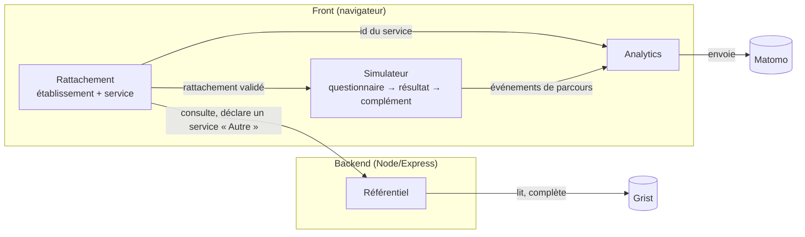

# Simulateur d'éligibilité aux transports sanitaires

Aide un prescripteur hospitalier à déterminer, par un questionnaire guidé, si le
transport d'un patient est pris en charge par l'Assurance Maladie, et ce qu'il doit faire
en conséquence. Le parcours débute par un rattachement obligatoire à un établissement et
à un service, sans identifier la personne.

> **L'app est entre deux modèles.** Le modèle d'éligibilité v9 et tout ce qui en
> dépendait ont été retirés, et la v10 n'est pas encore intégrée. Le simulateur déroule
> un **parcours factice** de trois questions, qui ne décide rien. Voir
> [« Entre deux modèles »](#entre-deux-modèles).

## Fonctionnement


```mermaid
flowchart LR
    subgraph front["Front (navigateur)"]
        Ident["Rattachement<br/>établissement + service"]
        Simu["Simulateur<br/>questionnaire → résultat → complément"]
        Analytics["Analytics"]
    end

    subgraph back["Backend (Node/Express)"]
        Ref["Référentiel"]
    end

    Grist[("Grist")]
    Matomo[("Matomo")]

    Ident -->|"consulte, déclare un service « Autre »"| Ref
    Ident -->|"rattachement validé"| Simu
    Ident -->|"id du service"| Analytics
    Simu -->|"événements de parcours"| Analytics
    Ref -->|"lit, complète"| Grist
    Analytics -->|"envoie"| Matomo
```

Aucune réponse du questionnaire ne quitte le navigateur. Le backend ne sert que le
front et le référentiel de rattachement.

## Commandes

| Commande | Ce qu'elle fait |
| --- | --- |
| `pnpm verifier` | **La vérification complète** : lint, typecheck, knip, tests, build et sa vérification de bundle. C'est la commande que lance la CI, telle quelle : ce qui passe ici passe là-bas. |
| `pnpm dev:front` | Le front de dev, sur le port 5173, qui proxifie `/api` vers `:3000` |
| `pnpm dev:server` | Le backend de dev, sur le port 3000, en `--watch`, qui charge `.env` s'il est présent |
| `pnpm test` | Vitest. Le smoke Grist est ignoré sans `GRIST_API_KEY`. |
| `pnpm lint` | Biome : format, tri des imports et lint. `lint:fix` applique les corrections sûres. Le socle est commun aux trois apps, dans `biome.base.jsonc` à la racine. |
| `pnpm knip` | Les exports, fichiers et dépendances que plus personne n'atteint |
| `pnpm typecheck` | `tsc -b` sur les quatre projets : front, node, serveur et tests |
| `pnpm build` | Typecheck puis build Vite dans `dist/`, suivi de `verifier-bundle`. `pdf-lib` et le catalogue de seeds doivent rester hors du chunk d'entrée, sans quoi chaque prescripteur télécharge ce qu'il ne verra jamais. |
| `pnpm start` | Le serveur de production (`node server/server.ts`, Node 24) |

Les règles d'écriture et les invariants ne sont pas de la prose, ils sont exécutables.
On les trouve dans `tests/architecture.test.ts`, pour les frontières et les limites de 30
et 300 lignes, et dans `tests/lisibilite.test.ts`, pour la forme des fichiers, les noms
et les extensions d'import. Lis leur message d'échec : chacun dit ce que sa règle
protège. Ce qu'on attend d'un contributeur est écrit dans [AGENTS.md](AGENTS.md).

Depuis la racine, `mise run dev-simulateur` lance le front et le backend en parallèle, et
`mise run verifier` passe la vérification sur les trois apps.

## Configuration

Copier `.env.example` vers `.env`, qui est gitignoré. Les variables `VITE_*` sont lues au
build et bundlées dans le front ; les autres sont détenues par le serveur et ne sont
jamais exposées au front.

| Variable | Portée | Requis | Défaut / si absente | Usage |
| --- | --- | --- | --- | --- |
| `GRIST_API_KEY` | serveur | **prod** | référentiel **snapshot factice** (dev/CI) | Clé API Grist source du référentiel (établissements/services). Jamais exposée au front. |
| `GRIST_DOC_URL` | serveur | non | doc Grist du projet | Base API du doc Grist (`server/referentiel.ts`). |
| `VITE_MATOMO_ENABLED` | front | non | `false` (traceur no-op) | Active le tracking Matomo. Actif d'office en build de prod ; à mettre à `true` pour tester en local. |
| `VITE_MATOMO_URL` | front | non | instance mutualisée beta.gouv | URL de l'instance Matomo. |
| `VITE_MATOMO_SITE_ID` | front | non | `275` | Identifiant du site Matomo. |

La variable marquée **prod** n'a pas de valeur par défaut : son repli est un
référentiel inventé, ce qui n'a de sens que sur un poste de développement. En production — `NODE_ENV=production`, ce que pose Scalingo —
`server/configuration.ts` refuse donc de rendre une configuration incomplète : le serveur
s'arrête au démarrage, avant d'ouvrir son port, sur la liste de ce qui cloche.

```
[simulateur] Démarrage impossible — configuration invalide :
  - GRIST_API_KEY : sans valeur par défaut, elle doit être posée en production
```

La règle est portée par un schéma **zod** : un socle de variables à défaut, et une variante
de production où la clé Grist est exigée. Le schéma valide aussi la forme de ce qui est
posé — `PORT=quatre-mille` ou une `GRIST_DOC_URL` qui n'est pas une URL arrêtent le
démarrage de la même manière, plutôt que d'échouer plus tard et ailleurs. Une variable
posée mais vide (`GRIST_API_KEY=` dans un `.env` recopié) compte pour absente. Les autres
variables ont un défaut documenté ci-dessus : elles ne bloquent jamais le démarrage.
*Gardé par* [`tests/serveur/configuration.test.ts`](tests/serveur/configuration.test.ts).

## Structure (feature-first)

Il y a trois racines de *runtime* : `front/`, le front bundlé par Vite, `server/`, le
backend Node qui détient la clé Grist, et `shared/`, le contrat commun.
Chacune est organisée par feature. À côté, `cms/` porte le script que le CMS exécute
sur ses propres pages : il n'est ni bundlé ni servi par l'app.

```
shared/                  le contrat front ⇄ back, source unique des types partagés
server/                  le backend Node, barrière de sécurité : les secrets vivent ici
                         et ne sont jamais bundlés. Bootstrap, composition,
                         configuration lue une fois et refusée si elle manque en prod.
  rattachement/          LA feature backend : les routes `/api` et la source Grist du
                         référentiel, qu'elle lit et complète
front/                   le front, bundlé par Vite
  Main.tsx               le point d'entrée du navigateur : monte l'app, amorce le traceur
  app/                   l'écran-porte, la navigation entre les écrans, le pied de page
  rattachement/          LA feature de l'écran-porte, miroir de server/rattachement/ :
                         le formulaire à révélation progressive, les deux clients de
                         l'API, le rattachement en mémoire de session (ADR-4)
  simulateur/            le montage du parcours (questionnaire, résultat, verrou,
                         complément) et le parcours factice qu'il déroule
    questionnaire/       ce qu'est une question et une page, l'état d'un parcours et
                         son brouillon, l'invalidation des réponses dépendantes,
                         l'avancement automatique, les champs, ce qui part vers
                         l'analytics, la trace de parcours
    resultat/            la trace de debug d'une page de résultat (developer tool :
                         cf. AGENTS.md § Les developer tools)
  developerTools/        ce qui est réservé au service produit : son encadré et le
                         déverrouillage, garde commune à la galerie et aux traces
  seeds/                 ce qu'est une seed, le catalogue (vide), sa galerie. Elles se
                         greffent sur le simulateur, jamais l'inverse : c'est App.tsx
                         qui compose.
  cerfa/                 le socle de remplissage d'un PDF : l'écriture dans un
                         AcroForm et ses pièges, la mesure d'un texte dans son champ,
                         la forme d'un tableau de remplissage. Aucun gabarit.
  analytics/             le vocabulaire mesuré, seul import du reste, son transport
                         vers Matomo, et le choix de l'utilisateur transmis par le CMS
cms/                     le script à coller dans Sites Conformes : l'opt-out du pied de
                         page, qui répond au traceur de l'iframe (voir « Intégrer dans
                         Sites Conformes »)
```

## Entre deux modèles

La v10 du modèle change trop de comportements pour être portée par-dessus la v9. L'app
a donc été vidée de ce qui dépendait de la v9, sur la branche `v10`.

| Retiré | Conservé |
| --- | --- |
| les règles publicodes, leur validation, la version du modèle au pied de page | l'interface DSFR |
| le questionnaire engendré par `@publicodes/forms` | l'écran-porte de rattachement et son backend |
| les parcours prescripteur et secrétariat, leurs pages de résultat | la mesure d'audience Matomo, réduite aux événements de parcours |
| les tests métier et la recette du livrable | le comportement de navigation, sur un parcours factice |
| le contenu du catalogue de seeds | ce qu'est une seed, la galerie, les traces de debug |
| les trois CERFA : gabarits, tableaux de remplissage, téléchargement | le socle de remplissage d'un PDF |
| le mode test des règles (labo) | |

Le questionnaire n'est plus déduit d'un moteur de règles : il est **déclaré par
l'application**. Une page liste ses questions, une question dit quand elle se pose
(`poseeSi`) et de quelles réponses elle dépend (`dependDe`).

Le parcours factice (`front/simulateur/parcours-factice.ts`) pose trois questions sans
rapport avec le transport sanitaire. Il sert à tenir en vie, et sous test, ce que le
parcours réel reprendra :

| Comportement | Ce qu'il fait | Où |
| --- | --- | --- |
| Avancement automatique | Une page faite de choix uniques avance seule 200 ms après la réponse, sans bouton « Suivant ». Au retour, le bouton reprend la main ; changer la réponse avance aussitôt. | `questionnaire/avancement-automatique.ts` |
| Brouillon | Une saisie ne compte qu'une fois la page validée. « Précédent » abandonne le brouillon. | `questionnaire/passation.ts` |
| Invalidation | Une réponse changée efface les réponses qui en dépendent, et elles seules. | `questionnaire/invalidation.ts` |
| Verrou | Au résultat, « Précédent » rouvre le questionnaire. L'action principale verrouille : le complément est un second parcours, qui ne repose aucune question d'avant et n'a pas de « Précédent » sur sa première page. | `Simulateur.tsx` |
| Étapeur | Il compte des parties, jamais des pages. | `questionnaire/Parcours.tsx` |

*Gardé par* `tests/simulateur/`.

## Déployer

Scalingo construit et sert cette app, et déploie depuis `main`.

1. **Passer la vérification.** `pnpm verifier` doit être vert, comme en CI.
2. **Pousser sur `main`.** Scalingo part de là, sans action manuelle.
3. **Laisser construire depuis la racine du dépôt**, et non depuis
   `apps/simulateur-eligibilite/`. C'est ce qu'impose le workspace pnpm : le
   `pnpm-lock.yaml` et le `pnpm-workspace.yaml` vivent à la racine, et une construction
   lancée dans le sous-dossier n'y aurait accès à aucun des deux. Elle installerait des
   versions non verrouillées. Le réglage à tenir côté Scalingo est `PROJECT_DIR`, qui doit
   rester *vide*.
4. **Tenir la variable de production**, `GRIST_API_KEY`. Elle n'a pas de défaut, et le
   serveur refuse de démarrer sans elle (cf. [Configuration](#configuration)).
5. **Relire le pied de page en production.** Il annonce la version de l'app et le sha du
   commit livré.

Trois fichiers de la racine portent ce déploiement :

| Fichier | Ce qu'il donne à Scalingo |
| --- | --- |
| `package.json` | `packageManager` (la version de pnpm), `engines.node`, et deux scripts d'aiguillage : `build` et `start`, qui délèguent tous deux à cette app par `--filter` |
| `Procfile` | `web: pnpm --filter simulateur-eligibilite run start` |
| `pnpm-lock.yaml` | les versions exactes des trois apps |

Le build installe donc aussi les dépendances de `data-analyzer` et de `glossaire-notion`.
C'est le prix du lock unique, et il se compte en secondes.

## Intégrer dans Sites Conformes

Le simulateur est embarqué en iframe dans une page Sites Conformes, qui tient aussi
l'opt-out de la mesure d'audience dans son pied de page (voir
[analytics.md](docs/knowledge/adr/analytics.md), ADR-5). Tout se règle dans
l'administration du CMS :

1. **Embarquer l'app.** Dans la page, un bloc « Iframe » (syntaxe experte) dont l'URL
   est celle du simulateur. Laisser le champ « Paramètres » vide : un `sandbox` y
   casserait l'opt-out et l'API.
2. **Installer l'opt-out.** Dans Paramètres → Scripts personnalisés → « Scripts dans
   la section `<body>` », coller le contenu de
   [`cms/statistiques-simulateur.js`](cms/statistiques-simulateur.js) entre
   `<script type="module">` et `</script>`, après avoir remplacé
   `ORIGINE_SIMULATEUR` par l'origine réelle du simulateur (`https://domaine`, sans
   chemin ni barre finale).
3. **Informer.** La politique de confidentialité du site décrit la mesure par service
   et renvoie au bouton du pied de page (R-12 d'analytics.md).
4. **Recetter.** Le bouton « Désactiver la mesure d'audience du simulateur » apparaît
   à la fin du pied de page. Après un clic, plus aucune requête ne part vers
   `stats.beta.gouv.fr` depuis l'iframe, même après rechargement.

Le script vit dans les réglages du CMS, hors de tout déploiement : toute modification
du fichier se recolle à la main. Il ajoute son bouton dans la liste DSFR du pied de
page ; une montée de version de Sites Conformes qui la changerait le ferait
disparaître sans erreur, d'où l'étape de recette.
