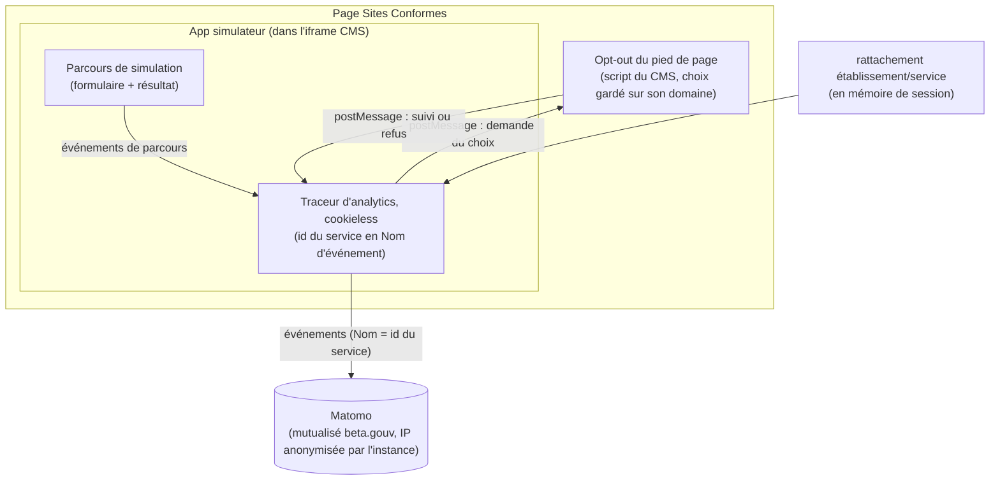

# Architecture : Analytics de parcours

> Statut : **décidé (release officielle)** · Dernière mise à jour : 2026-10-06
>
> Suivi analytique du parcours dans le simulateur d'éligibilité.
> Repose sur le rattachement établissement/service fourni par l'écran-porte :
> voir [identification.md](./identification.md).
>
> **Mise à jour 2026-10-06, vidage avant la v10.** Les événements de résultat et de
> téléchargement de CERFA sont retirés avec le modèle v9 qui les définissait, et les
> noms d'action perdent leur préfixe d'outil (`prescripteur:`, `secretariat:`) : il
> n'y a plus qu'un parcours. Il reste les quatre événements de parcours (§4). Les
> séries Matomo antérieures portent les anciens noms et ne se raccordent pas aux
> nouvelles. Les événements de résultat reviendront avec la v10.
>
> **Mise à jour 2026-09-30, opt-out dans le pied de page du CMS.** L'exemption CNIL
> demande d'informer l'utilisateur et de le laisser s'opposer à la mesure. L'opt-out
> vit dans le pied de page de Sites Conformes, hors de notre iframe, et le choix est
> transmis au simulateur par `postMessage` (ADR-5). Le traceur attend ce choix avant
> de mesurer, et ne suit plus les liens sortants. Le texte d'information reste à
> publier sur le CMS (R-12).
>
> **Mise à jour 2026-09-29, mesure par service, sans bandeau.** Le Nom d'événement
> porte désormais l'id Grist du service, en clair, et non plus le `prescripteurRef`
> pseudonymisé, retiré avec l'identification individuelle. Cela **révise** l'ADR-2 (découpage par service) et
> l'ADR-3 (plus de drapeau de consentement), et **lève** la réserve RGPD R-4 : la mesure
> redevient une mesure d'audience agrégée, dans l'exemption de consentement CNIL. Le
> risque R-7 devient sans objet. Deux points restent à tenir : l'anonymisation de l'IP,
> qui se règle sur l'instance Matomo et non dans le code (R-10), et les très petits
> services, où un id de service peut désigner une ou deux personnes (R-11).

## 1. Contexte & objectifs

On veut suivre le parcours de simulation :

- qui démarre le formulaire ;
- qui l'achève ;
- qui l'abandonne, et à quelle étape ;
- le nombre de résultats éligibles et non éligibles par service.
  ~~par prescripteur~~ (jusqu'au 2026-09-29).

Le découpage par service s'appuie sur l'id du service dans le référentiel Grist,
fourni par l'étape de rattachement et gardé en mémoire de session (cf.
[identification.md, ADR-4](./identification.md)). Le simulateur a un backend, pour le
rattachement, mais l'analytics part directement du navigateur vers Matomo. Aucun
backend applicatif ne collecte les événements.

**Invariant** : aucune donnée patient, aucune PII et aucune réponse détaillée du
formulaire ne part vers l'analytics. Seuls transitent l'id d'un service du référentiel
et des compteurs d'événements. Le service libre saisi sous « Autre » n'en fait pas
partie.

## 2. Décisions (ADR)

### ADR-1 - Matomo mutualisé hébergé par beta.gouv.fr

**Décision.** Utiliser l'instance Matomo mutualisée que beta.gouv.fr héberge pour
les produits publics, un service fourni par la communauté beta.gouv et la DINUM,
plutôt qu'une instance auto-hébergée, un backend de collecte maison ou un outil
tiers non souverain.

**Pourquoi.** Matomo couvre le suivi d'événements, les funnels et la segmentation
sans qu'on ait à construire de stockage ni de reporting. L'instance beta.gouv est
hébergée en France et gérée par l'infra publique, ce qui répond à la souveraineté
et à la conformité attendues d'un service public, cohérent avec le DSFR, et ne nous
laisse aucune opération à assurer.

**Conséquences.** Il faut demander la création d'un site dans le Matomo beta.gouv
et récupérer le `siteId` et l'URL du tracker. Les fonctionnalités disponibles
(Funnels, Custom Dimensions) et les quotas dépendent de la configuration de cette
instance mutualisée, qui reste à confirmer (voir R-8). Les réglages de
confidentialité de l'instance, dont l'anonymisation de l'IP, ne sont pas entre nos
mains (voir R-10).

### ADR-2 - Découpage par service via propriété d'événement (~~par prescripteur~~)

**Décision (révisée 2026-09-29).** L'id Grist du service est porté en propriété
d'événement Matomo : chaque `trackEvent` l'a pour Nom, avec `simulateur` en catégorie
et le type d'événement en action. Un service saisi sous « Autre » donne l'id de
l'entrée « Autre » de son établissement, et le rattachement dégradé, quand le
référentiel ne répond pas, donne `autre` (voir
[identification.md, ADR-4 et §4](./identification.md)). Le reporting utilise le
rapport Événements, en Catégorie puis Action puis Nom, et la segmentation
`eventName == <id du service>`. ~~Le Nom portait le `prescripteurRef`, un
`HMAC-SHA256` calculé côté backend sur l'identité d'un prescripteur nommé.~~

**Pourquoi.** L'instance mutualisée beta.gouv n'expose pas les custom dimensions,
le plugin ou les droits n'étant pas disponibles (R-8). Les propriétés d'événement
donnent le découpage entre éligibles et non éligibles par service, sans
configuration admin ni backend de croisement. L'établissement n'est pas transmis : il
se déduit du service via le référentiel. Le service suffit au pilotage du produit, et
ne désigne pas une personne. Il part en clair : sans personne à masquer, un
pseudonyme n'apportait plus rien (voir [identification.md, ADR-4](./identification.md)).

**Conséquences.** Le nom d'un service se lit dans Grist à partir de son id, sans
secret. Qui a accès au Matomo mutualisé peut, avec le référentiel, savoir quels
établissements utilisent l'outil. Si les custom
dimensions deviennent disponibles, on pourra les ajouter sans changer le transport
actuel. Les données collectées avant le 2026-09-29 portent encore un
`prescripteurRef` en Nom et ne se raccordent pas aux nouvelles ; leur purge relève de
la gouvernance des données, hors de ce document.

### ADR-3 - Mesure sans bandeau de consentement (~~initialisation derrière un flag de consentement~~)

**Décision (révisée 2026-09-29).** Le traceur s'initialise sans demander de
consentement : il est actif en build de production, ou en local sur demande, et
rien d'autre ne le conditionne. ~~L'initialisation du tracking est conditionnée par
un composant de gestion du consentement, donné par défaut et sans bandeau en phase
expérimentale.~~ Le drapeau de consentement, jamais branché, est retiré du code. S'il
fallait un jour un bandeau, on le rajouterait à ce moment-là.

**Pourquoi.** La recommandation CNIL exempte de consentement la mesure d'audience
qui reste agrégée, sans suivi individuel ni recoupement entre sites. Le suivi par
prescripteur sortait de ce cadre : il était quasi nominatif. Le suivi par service y
revient, pourvu que les conditions techniques tiennent :

| Condition d'exemption | Comment elle tient |
|---|---|
| Pas de traceur persistant sur le terminal | Traceur cookieless (`disableCookies`), rien en `localStorage` |
| Finalité de mesure d'audience seule | Événements de parcours et compteurs, aucune réponse détaillée |
| Pas de suivi individuel | Nom d'événement = service, jamais une personne (voir R-11) |
| Pas de recoupement avec d'autres traitements | Instance Matomo dédiée aux produits beta.gouv, aucun export croisé |
| Adresse IP anonymisée | Réglage de l'instance Matomo, à vérifier (R-10) |
| Information et droit d'opposition | Opt-out dans le pied de page du CMS (ADR-5) ; texte d'information à publier (R-12) |

**Conséquences.** Plus de bandeau, et la couverture de la mesure est complète. La
réserve R-4 est levée, à la condition R-10 près. ~~Tant que le sujet RGPD n'est pas
tranché, la collecte individuelle sans bandeau est une réserve de conformité
explicite.~~

### ADR-4 - Référentiel figé des noms d'évènement, jamais composés

**Décision.** Le nom de chaque évènement Matomo est une valeur fixe d'un
référentiel unique (`front/analytics/evenements.ts`, `NomEvenement`), jamais
composé à la volée par concaténation de chaîne. Ce module n'interprète aucune
donnée métier — ni l'outil, ni le statut d'un résultat, ni le formulaire d'un
CERFA : c'est l'appelant qui choisit l'entrée à émettre, via
`trackEvenement(nom)`. Un nom qui n'est pas une valeur exacte du référentiel
ne compile pas.

**Pourquoi.** Composer un nom à l'exécution (`${outil}:${action}`,
`resultat:${statut}`) rend le vocabulaire ingrepable — aucun symbole ne
correspond au nom réellement envoyé à Matomo — et ne protège d'aucune valeur
incohérente. `cible_cas_final` et `cible_resultat_medical`, deux cibles
publicodes dont la valeur est une phrase d'affichage (jusqu'à 152 caractères
pour l'une d'elles, VSL/TPMR), aggravaient le problème : les utiliser telles
quelles comme nom d'évènement aurait rendu les rapports Matomo dépendants du
phrasé exact du modèle, livré par l'éditeur et sujet à reformulation sans
changement de sens.

**Conséquences.** `outil` (`prescripteur`/`secretariat`) et, pour un résultat,
un **slug court** font désormais partie du nom lui-même — voir §4 pour la
liste complète. Le slug est traduit depuis la phrase publicodes par
l'appelant, pas par le référentiel (`SLUG_CAS_FINAL` dans `Secretariat.tsx`,
`SLUG_RESULTAT_MEDICAL` dans `Prescripteur.tsx`) ; une phrase absente de la
table (montée de version du modèle) retombe sur le slug `indetermine` plutôt
que de faire échouer le parcours pour un souci d'analytics. Les CERFA suivent
le même principe : `formulaire` (typé `Formulaire`, réutilisé par
`DocumentCerfa.fichier`) fait partie du nom, un par document produit.

### ADR-5 - Opt-out tenu par le CMS, transmis à l'iframe par `postMessage`

**Décision (2026-09-30).** L'opt-out est un bouton du pied de page de Sites Conformes,
ajouté par un script que le CMS exécute sur toutes ses pages. Ce script garde le
choix sur le domaine du CMS et le transmet au simulateur par `postMessage` : quand
l'iframe le demande au démarrage, puis à chaque changement. Le traceur n'émet rien et
ne charge pas matomo.js tant que le choix n'est pas connu. Sur refus, il ne charge
rien ; sur un refus en cours de session, il cesse d'émettre. Sans réponse de la page
parente dans un court délai (app ouverte hors du CMS, script absent), la mesure suit
son cours. Le script du CMS est versionné dans ce dépôt et testé comme le reste.

**Pourquoi.** L'opt-out se place dans le pied de page du CMS pour l'UX : c'est là que
l'utilisateur cherche ce réglage, et le simulateur n'a pas de pied de page propre
dans l'iframe. Or le navigateur isole le stockage de chaque origine, et range à part
celui d'une iframe tierce : aucun des opt-out natifs de Matomo (cookie posé par la
page du CMS, cookie tiers sur le domaine de Matomo) n'atteint notre traceur. Seul un
message entre les deux fenêtres franchit cette frontière. Le code de Sites Conformes
le permet : ses réglages « Scripts personnalisés » injectent un script sur chaque
page, sa CSP se limite à `frame-ancestors`, et son bloc iframe n'impose pas de
`sandbox` (voir [identification.md](./identification.md), R-1). Seule la page
parente est écoutée, sans vérifier son origine : le message ne porte aucune donnée
et ne fait qu'arrêter ou reprendre notre propre mesure.

**Conséquences.** La page vue part avec un décalage d'au plus une seconde, le temps de
la réponse. Le suivi automatique des liens sortants est retiré : il aurait continué
après un refus en cours de session, `optUserOut` reposant sur un cookie que le
traceur n'écrit pas. Le bouton est inséré dans la liste du pied de page DSFR : si
Sites Conformes change cette structure, il disparaît sans erreur, et la recette doit
le vérifier après chaque montée de version du CMS. Le script vit dans les réglages du
CMS, hors de tout déploiement : sa mise à jour se fait à la main, depuis le fichier du
dépôt. Le refus est mémorisé dans le stockage du CMS, ce que l'exemption autorise pour
retenir une opposition.

## 3. Architecture cible



~~Un composant de gestion du consentement autorisait l'initialisation du traceur.~~
Retiré le 2026-09-29 (ADR-3).

Depuis la fusion, tout le parcours, rattachement et simulation, tourne dans
l'iframe du CMS. C'est un contexte tiers, où les cookies sont bloqués. Le traceur
est donc cookieless (`_paq.push(["disableCookies"])`) : les événements partent sans
cookie, ce qui convient à une mesure d'audience sans bandeau. L'API JavaScript de
Matomo n'a pas de commande pour anonymiser l'IP : c'est un réglage de l'instance.

## 4. Spécification des événements

Événements `trackEvent` émis par le traceur, en catégorie `simulateur`, portant l'id
Grist du service en Nom, ou `autre` pour un rattachement dégradé. ~~Ce nom était absent
si le parcours avait démarré sans rattachement pseudonymisé (API indisponible).~~ Le nom d'action est une valeur fixe du référentiel
`NomEvenement` (`front/analytics/evenements.ts`, ADR-4) — jamais composé à
l'exécution.

**Parcours** (~~un jeu par outil, `prescripteur:…` / `secretariat:…`~~, un seul
jeu depuis le 2026-10-06) :

| Action | Valeur | Moment du parcours |
|---|---|---|
| `simulation_start` | — | ouverture du simulateur, début du formulaire |
| `simulation_step` | `stepIndex` | passage à la page suivante |
| `simulation_complete` | — | affichage de la page de résultat |
| `simulation_abandon` | `lastStep` | départ (onglet quitté) sans avoir atteint le résultat |

Le complément posé après le verrou du résultat n'émet rien.

~~**Résultat** (`secretariat:resultat:<slug>`), un slug par valeur de
`cible_cas_final`.~~ Retiré le 2026-10-06 avec le modèle v9.

~~**Résultat** (`prescripteur:resultat:<slug>`), un slug par valeur de
`cible_resultat_medical`.~~ Retiré le 2026-10-06 avec le modèle v9.

~~**CERFA** (`secretariat:cerfa_telecharge:<formulaire>`), un par document.~~
Retiré le 2026-10-06 avec le téléchargement des trois CERFA.

- **Interdits** : les réponses détaillées du formulaire, toute PII, toute donnée
  patient.
- **Reporting** : le rapport Événements (Catégorie, Action, Nom) et la segmentation
  `eventName == <id du service>` donnent les éligibles et non éligibles par service,
  ainsi que le taux d'abandon par étape.

## 5. RGPD & consentement

- **Depuis le 2026-09-29** : la mesure est agrégée par service, cookieless, sans
  réponse détaillée. Elle entre dans l'exemption de consentement CNIL et se passe de
  bandeau (ADR-3), sous deux réserves : l'IP doit être anonymisée par l'instance
  Matomo (R-10), et les très petits services restent un cas limite (R-11).
- **Depuis le 2026-09-30** : l'utilisateur peut s'opposer à la mesure depuis le pied
  de page du CMS (ADR-5). Reste à l'en informer dans la politique de confidentialité
  (R-12).
- ~~Le suivi par prescripteur est quasi nominatif, donc hors de l'exemption de
  consentement CNIL. En conformité stricte, il demande un bandeau.~~
- ~~Choix du porteur en phase expérimentale : démarrer sans bandeau, avec suivi
  individuel, et instruire le sujet en parallèle.~~
- ~~Repli conforme si le bandeau devient nécessaire : une mesure d'audience anonyme
  et agrégée, sans `prescripteurRef`.~~ C'est ce repli, par service, qui est devenu la
  règle.

## 6. Découpage en incréments (analytics)

1. **Matomo funnel.** ✅ **Fait** (`front/analytics/`, site 275,
   `https://stats.beta.gouv.fr/`). Le traceur est instrumenté dans le simulateur,
   avec le référentiel d'événements de l'ADR-4. Il est amorcé au boot en cookieless
   (`disableCookies`), et lit le service en session à l'émission de chaque
   événement, ce service étant renseigné après le rattachement. Il est gardé par
   un gating dev/prod : actif en build de prod, ou en local avec
   `VITE_MATOMO_ENABLED=true`, et sans effet sinon. Reste à configurer les Funnels
   côté Matomo si nécessaire.
2. **Mesure par service, sans bandeau.** ✅ **Fait (2026-09-29)**. Le Nom d'événement
   porte l'id Grist du service, en clair, le drapeau de consentement est retiré. *Reste : vérifier
   l'anonymisation de l'IP sur l'instance (R-10).*
3. **Opt-out dans le pied de page du CMS.** ✅ **Fait côté simulateur (2026-09-30)** :
   le traceur attend le choix du CMS (ADR-5), et le script du CMS est versionné et
   testé. *Reste : coller le script dans Sites Conformes avec l'origine réelle du
   simulateur, publier le texte d'information (R-12).*

Prérequis : l'écran-porte fournit le service (cf.
[identification.md](./identification.md), incréments 1–2 et 6).

## 7. Risques & validations en attente

| Réf | Risque / à valider | Portée |
|---|---|---|
| ~~**R-4**~~ | ~~**RGPD** : le suivi par prescripteur sans bandeau n'est pas conforme CNIL en l'état.~~ **Levé (2026-09-29)** : le suivi porte sur le service, dans l'exemption (ADR-3), sous réserve de R-10. | résolu |
| ~~**R-7**~~ | ~~Couverture partielle du KPI par prescripteur si un bandeau devient nécessaire.~~ **Sans objet (2026-09-29)** : plus de bandeau, plus de KPI par prescripteur. | résolu |
| **R-8** | Instance mutualisée beta.gouv : les custom dimensions sont indisponibles, ce que l'ADR-2 contourne en passant par une propriété d'événement. Restent à confirmer la disponibilité des Funnels et les quotas. | partiellement tranché |
| **R-10** | **Anonymisation de l'IP** : l'exemption CNIL l'exige, et elle se règle sur l'instance Matomo (Administration → Confidentialité), pas dans le code. À confirmer auprès des admins de stats.beta.gouv.fr pour le site 275. | conformité, **à vérifier avant la release** |
| **R-11** | **Très petits services** : dans un service d'une ou deux personnes, l'id du service désigne de fait des individus. Réserve mineure, acceptée sans traitement dans le code. | conformité |
| **R-12** | **Information des utilisateurs** : l'exemption exige de dire ce qui est mesuré et comment s'y opposer. Le texte, dans la politique de confidentialité du CMS, doit décrire la mesure par service et renvoyer à l'opt-out du pied de page. | conformité, **à publier avant la release** |

## 8. Vérification

```bash
pnpm --filter simulateur-eligibilite exec vitest run tests/analytics tests/cms
```
