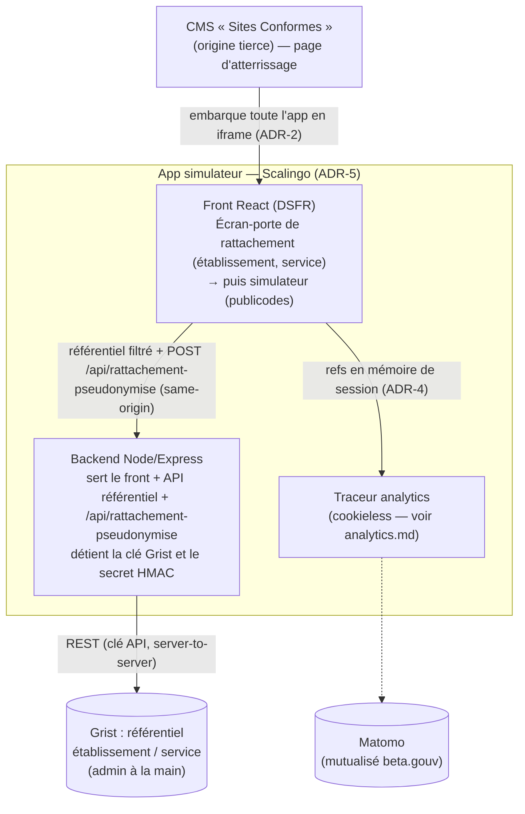
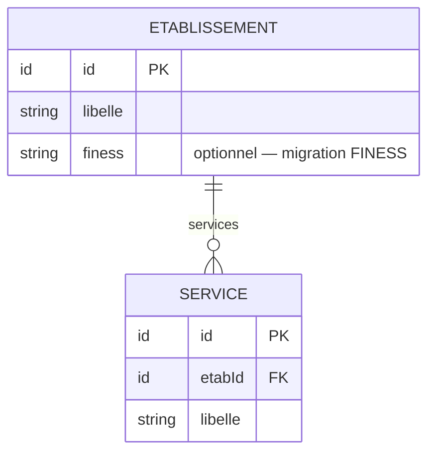

# Architecture : Rattachement à l'écran-porte (~~identification du prescripteur~~)

> Statut : **décidé (release officielle)** · Dernière mise à jour : 2026-09-29
>
> Étape de rattachement **intégrée** au simulateur d'éligibilité, **préalable
> obligatoire** à toute simulation : l'utilisateur déclare son établissement et son
> service. Le suivi analytique du parcours fait l'objet d'un document séparé :
> [analytics.md](./analytics.md). Le vocabulaire est fixé dans
> [CONTEXT.md](../CONTEXT.md).
>
> **Mise à jour 2026-09-29, release officielle, rattachement sans identité.**
> L'écran-porte ne demande plus **qui** réalise la simulation : plus de liste de
> prescripteurs, plus de nom ni de prénom saisis. Il ne reste que l'établissement et
> le service. Cela **révise** l'ADR-3 (on ne déclare plus son identité), l'ADR-4 (les
> refs perdent `prescripteurRef`, le contrat passe en `v: 3`) et l'ADR-5 (le
> référentiel lu par l'app se limite aux établissements et aux services). La raison :
> le `prescripteurRef` rendait le suivi Matomo quasi nominatif, donc soumis à un
> bandeau de consentement, ce qui bloquait la release officielle (voir
> [analytics.md](./analytics.md), ADR-3). Le mot « identification » est réservé à une
> éventuelle authentification individuelle future ; l'étape actuelle s'appelle
> **rattachement**. Le nom de ce fichier est conservé, parce que tout le dépôt le cite.
> Les risques R-6 et R-9 deviennent sans objet.
>
> **Mise à jour 2026-07-08, fusion des apps.** L'identification et le simulateur ont un
> temps été conçus comme **deux apps séparées** : une SPA d'identification en iframe, une
> redirection top-level vers le simulateur statique, et le contexte passé en fragment
> `#ctx`. Ils sont désormais **une seule app**, où l'identification est un **écran-porte**
> en amont du simulateur. Cela **réverse** l'ADR-1 (app dédiée), l'ADR-4 (contexte en
> fragment d'URL) et l'invariant « simulateur 100 % statique » de l'ADR-5. Deux raisons :
> l'intégration Sites Conformes est plus simple avec **un seul iframe**, sans navigation
> top-level, et le passage de contexte devient trivial une fois l'**état en mémoire**,
> sans fragment. Les sections ci-dessous ont été mises à jour. Les décisions restées
> valables sont conservées : identification déclarative, PII hors bundle, moteur
> publicodes intouché.

## 1. Contexte & objectifs

Le simulateur d'éligibilité (React 19 + Vite + DSFR, moteur `publicodes`) est servi par
un **backend Node/Express**, en une seule app sur **Scalingo**. Le rattachement impose
en effet de détenir des secrets côté serveur, la clé Grist et le secret de
pseudonymisation. Le simulateur a donc quitté GitHub Pages.

On **rattache l'utilisateur en amont** du parcours, en une étape obligatoire : on ne
peut pas simuler sans avoir déclaré son **établissement** et son **service/unité**.
~~Elle se jouait en deux temps : l'établissement et le service, puis le **personnel de
santé** (prescripteur) qui réalise la simulation.~~ Le second temps est retiré depuis
le 2026-09-29.

Contraintes :

- L'utilisateur arrive via le CMS « Sites Conformes », un site tiers qu'on maîtrise peu.
- Le référentiel établissement/service est construit et maintenu à la main dans Grist,
  sans intégration aux référentiels du SI Sécurité sociale ou CNAM. Aucun FINESS
  officiel n'est branché à ce stade.
- On veut limiter l'empreinte serveur : **un seul** backend minimal, sur une plateforme
  managée (Scalingo), qui sert le front et l'API là où un serveur est incontournable,
  c'est-à-dire pour l'accès Grist et le secret de pseudonymisation (cf. ADR-5).

**Invariant** : le rattachement ne doit jamais entrer dans le moteur `publicodes`
(`regles/regles.publicodes`), qui ne contient que la logique métier d'éligibilité. Des
règles `identification . *` y avaient été mises à tort ; elles ont été retirées.

## 2. Décisions (ADR)

### ADR-1 - Rattachement intégré en écran-porte (~~app dédiée~~)

**Décision (révisée 2026-07-08).** Le rattachement est un **écran-porte** au sein de
l'app simulateur : tant que l'établissement et le service ne sont pas validés, le
formulaire n'est pas rendu. ~~Créer une SPA statique `apps/identification` dédiée.~~

**Pourquoi.** Une app séparée imposait un passage de contexte inter-app par fragment
d'URL et une navigation top-level hors iframe. Surtout, elle n'empêchait pas d'atteindre
le simulateur sans identification, son URL étant publique. Un écran-porte dans l'app rend
l'étape obligatoire pour de bon, et simplifie l'intégration : un seul iframe, un seul
déployable. Le rattachement reste isolé du moteur (ADR-6) et derrière l'interface
`Referentiel`, donc une migration FINESS reste possible sans toucher le simulateur.

**Conséquences.** Il n'y a plus de passage de contexte inter-app : la sélection est
convertie en refs par l'API (`POST /api/rattachement-pseudonymise`) et gardée en mémoire
(voir ADR-4). L'écran de rattachement et le formulaire du simulateur cohabitent dans la
même app, avec des steppers distincts.

### ADR-2 - Intégration par iframe dans le CMS

**Décision (révisée 2026-07-08).** L'app entière, rattachement et simulateur, est
**embarquée en iframe** dans une page Sites Conformes. ~~Le simulateur s'ouvrait en
plein écran top-level après identification.~~

**Pourquoi.** La fusion supprime la navigation top-level entre deux apps : tout le
parcours vit dans le même iframe, ce qui simplifie l'intégration puisqu'il n'y a qu'une
origine à autoriser et aucun saut de contexte. Le choix produit est conservé : garder le
parcours dans le site CMS.

**Conséquences.** On dépend toujours de la coopération du CMS, pour les attributs
`sandbox` et la CSP (`frame-ancestors`, `frame-src`) — voir §6 et le risque R-1. Le
suivi analytics ayant désormais lieu dans l'iframe, donc en contexte tiers, il est passé
en cookieless (voir [analytics.md](./analytics.md)). Le repli sans iframe, en ouvrant
l'app en top-level, reste possible si l'intégration iframe se révèle bloquée.

### ADR-3 - Rattachement déclaratif, sans identité (~~identification déclarative du prescripteur~~)

**Décision (révisée 2026-09-29).** L'utilisateur déclare son établissement et son
service, sans preuve et **sans dire qui il est**. ~~L'utilisateur déclare qui il est, en
sélectionnant son établissement, son service et son nom, sans preuve d'identité.~~

**Pourquoi.** Le produit a besoin de savoir d'où viennent les simulations, pas qui les
fait. Le nom du prescripteur n'a jamais servi qu'au suivi analytique individuel, qui
rendait la mesure quasi nominative et imposait un bandeau de consentement. Sans lui, la
mesure agrégée par service reste dans l'exemption CNIL (voir
[analytics.md](./analytics.md), ADR-3). La déclaration reste suffisante et simple.

**Conséquences.** L'usurpation déclarative d'un établissement ou d'un service reste
possible, et le contexte transmis n'a aucune valeur probante (voir ADR-4). Une
authentification individuelle (ProConnect, AgentConnect) reste possible plus tard ;
elle serait une étape **distincte** du rattachement, appelée identification, et non
une extension de celui-ci.

### ADR-4 - Rattachement pseudonymisé : refs, en mémoire (~~fragment d'URL~~)

**Décision (révisée 2026-09-29).** À la validation, le backend construit un
rattachement pseudonymisé (`v: 3`), fait des refs `{ etabRef, serviceRef }`.
~~Identité pseudonymisée `v: 2`, faite de `{ etabRef, serviceRef, prescripteurRef }`.~~
Chaque ref est un **`HMAC-SHA256(id, secret)`** tronqué à 128 bits et encodé en
base64url, calculé sur les identifiants opaques du référentiel. Aucun identifiant brut,
aucun nom, aucune donnée patient n'y figure. Le front envoie la sélection à
`POST /api/rattachement-pseudonymise` (~~`/api/identite-pseudonymisee`~~), le backend
renvoie l'objet refs en JSON, et le front le garde en mémoire de session. Le secret vit
côté serveur, dans une variable d'environnement dédiée `PSEUDONYMISATION_SECRET`,
distincte de la clé Grist. ~~Le contexte était transmis au simulateur via le fragment
d'URL `#ctx=<base64url>` ; la fusion l'a rendu inutile.~~

**Pourquoi.** Le suivi Matomo n'a besoin que d'un jeton stable et opaque par service.
Il n'a pas besoin de l'identifiant brut, énumérable et re-liable au référentiel. Un HMAC
à sens unique donne un pseudonyme non réversible et non forgeable sans le secret. Le
calculer côté serveur est indispensable : un keyed-hash côté client exposerait la clé
dans le bundle. Le rattachement pseudonymisé n'est pas signé, la déclaration n'ayant
pas de valeur probante (ADR-3) et une signature donnant alors une fausse garantie.

**Conséquences.** Les refs restent en mémoire, sans `localStorage` ni URL, et le
`serviceRef` est forwardé à Matomo (voir [analytics.md](./analytics.md)). Le front
n'inverse jamais le HMAC. La ré-identification d'un `serviceRef` vers son service se fait
hors Matomo, via le référentiel, de façon contrôlée. Faire tourner le secret
re-bucketise tous les services.

### ADR-5 - Référentiel dans Grist, lu par le backend de l'app fusionnée

**Décision (révisée 2026-09-29).** Le référentiel établissement/service est maintenu à
la main dans Grist. L'app simulateur, rattachement et simulation compris, est une app
unique servie par un backend Node/Express hébergé sur Scalingo. Ce backend sert le front
React construit par Vite et expose une API same-origin qui détient la clé Grist et le
secret de pseudonymisation : `/api/etablissements|services` pour le référentiel filtré,
et `POST /api/rattachement-pseudonymise` pour les refs pseudonymisées.
~~`/api/prescripteurs` exposait les prescripteurs d'un service.~~ La table des
prescripteurs reste dans Grist pour l'admin, mais l'app ne la lit ni ne l'écrit plus.
~~Ce backend appartenait à une app d'identification distincte ; le simulateur restait
statique sur GitHub Pages.~~

**Pourquoi.** L'accès direct du navigateur à Grist n'est pas viable : la clé est
toute-puissante et ne peut pas vivre dans une SPA, et Grist bloque le CORS. Il faut donc
un composant serveur qui détienne la clé. Scalingo ne propose pas de FaaS. Depuis la
fusion, c'est le backend du simulateur qui joue ce rôle : une seule app, tout en
same-origin donc sans CORS, des données fraîches puisque Grist est lu en direct, et un
seul déployable.

**Conséquences.** Le simulateur quitte GitHub Pages pour Scalingo et n'est plus
entièrement statique, puisqu'il a un backend. C'est le prix du rattachement
obligatoire. Le workflow GitHub Pages est supprimé. La clé Grist et
`PSEUDONYMISATION_SECRET` vivent en variables d'environnement Scalingo, et le serveur
refuse de démarrer sans elles en production : leur repli — référentiel factice, secret
public — n'est bon que pour un poste de développement, et le servir en production
donnerait un simulateur silencieusement faux. Le front et ses tests sont préservés :
l'interface `Referentiel` (§5) a un client HTTP same-origin et garde le snapshot factice
en défaut, pour le dev et les tests. Grist reste l'outil d'admin. Voir §5 pour le
modèle et §6 pour l'accès.

### ADR-6 - Le moteur publicodes reste hors périmètre rattachement

**Décision.** `apps/simulateur-eligibilite/regles/regles.publicodes` n'est pas modifié.
Le rattachement, comme l'analytics, vit en dehors du moteur.

## 3. Architecture cible



Composants :

| Composant | Nature | Statut |
|---|---|---|
| `apps/simulateur-eligibilite` | **App unique** : front React (rattachement + simulateur) + backend Node/Express, sur **Scalingo** | modifié (fusion, puis rattachement) |
| API référentiel + rattachement pseudonymisé | Endpoints du backend détenant la clé Grist + le secret HMAC | modifié (plus de prescripteurs) |
| Grist | Base managée, admin à la main | config |
| ~~`apps/identification`~~ | ~~app séparée~~ | **supprimé (fusionné)** |

## 4. Workflow de rattachement & refs pseudonymisées

Le workflow est linéaire, dans un formulaire à révélation progressive :

```
Établissement → Service ─┬─ (service du référentiel)
                         └─ « Autre » → nom du service / de l'unité réels
```

~~Après le service venait le prescripteur, choisi dans la liste ou déclaré « pas dans la
liste » avec son nom et son prénom.~~ Retiré le 2026-09-29.

Le service « Autre » est une entrée du référentiel, un service par établissement, qu'on
sélectionne comme n'importe quelle autre. Quand il est sélectionné, l'utilisateur doit
saisir son service ou son unité réels. Ce texte libre est alors écrit dans Grist, ce qui
crée le vrai service, pour qu'à la connexion suivante il apparaisse dans la liste (voir
la [spec enrichissement](../domain/enrichissement-referentiel-rattachement.md)). C'est
le seul texte libre du workflow.

Les prescripteurs sans établissement de rattachement, en libéral, à la CNAM ou à la CPAM,
sélectionnent l'établissement « Libéral / CNAM / CPAM / Autre » du référentiel et suivent
le même workflow. La branche « non rattaché » dédiée a été supprimée le 2026-07-21.

- **Transport** : la réponse JSON de `POST /api/rattachement-pseudonymise`, en
  same-origin. Il n'y a plus de fragment d'URL depuis la fusion.
- **Construction** : côté backend. Il reçoit la sélection
  (`{ etabId, serviceId, serviceEstAutre?, serviceLibre? }`), valide sa complétude avec
  une règle partagée entre front et back, et renvoie l'objet refs. Le secret HMAC ne
  quitte jamais le serveur.
- **Schéma** :
  ```json
  { "etabRef": "…", "serviceRef": "…", "v": 3 }
  ```
  Chaque ref vaut `base64url(HMAC-SHA256("<nature>:<valeur>", SECRET)[:16])`. La valeur
  est préfixée par sa nature (`etab:`, `service:`) pour éviter toute collision entre deux
  identifiants. `serviceRef` est toujours un id de référentiel, « Autre » compris.
  ~~Le texte libre nom/prénom était normalisé puis passé au HMAC sous la forme
  `identite:<nom>|<prenom>`, et `prescripteurRef` était toujours présent (`v: 2`).~~
- **Interdits** : l'identifiant brut du référentiel, tout nom de personne, tout
  identifiant patient et toute donnée de santé.
- **Cycle de vie** : les refs sont reçues à la validation, conservées en mémoire de
  session (sans `localStorage`) et lues par le traceur au moment d'émettre chaque
  événement.

## 5. Modèle du référentiel (Grist)



- ~~`PRESCRIPTEUR` (nom, prénom, `rpps?`, rattaché à un service).~~ La table existe
  toujours dans Grist, maintenue par l'admin, mais l'app ne la lit ni ne l'écrit plus
  depuis le 2026-09-29. La migration RPPS prévue n'a donc plus d'objet.
- Le champ `finess?` est prévu dès maintenant, en optionnel, pour la migration future
  vers le référentiel officiel.
- Le front n'accède au référentiel que via l'API du backend, en same-origin.
- L'accès au référentiel est masqué derrière une interface (`listerEtablissements()`,
  `listerServices(etabId)`) pour pouvoir substituer la source, de Grist vers FINESS,
  sans toucher les consommateurs.

## 6. Intégration iframe — points d'attention

Depuis la fusion, tout le parcours vit dans le même iframe, rattachement et simulation
compris. Il n'y a plus de navigation top-level entre deux apps, donc plus besoin
d'`allow-top-navigation-by-user-activation` ni d'un repli `postMessage`. Restent :

- **`sandbox`**, si le CMS l'applique : `allow-scripts` et `allow-forms` suffisent, pour
  les formulaires et le JS de l'app. C'est côté CMS.
- **CSP** : notre app doit servir `Content-Security-Policy: frame-ancestors
  https://<domaine-cms>`, et surtout pas `X-Frame-Options: DENY`. Le CMS doit autoriser
  notre origine dans son `frame-src`, ce qui est hors de notre contrôle.
- **Cookies tiers** : ils sont bloqués dans l'iframe, par ITP et par Chrome. Le tracking
  ayant désormais lieu dans l'iframe, le traceur est passé en cookieless
  (`disableCookies`) pour fonctionner sans eux (cf. [analytics.md](./analytics.md)).
- **Non-indexation** : l'app est destinée à être embarquée, la page canonique étant celle
  du CMS, donc l'URL brute ne doit pas être indexée. Le backend sert `X-Robots-Tag:
  noindex, nofollow` sur toutes les réponses et un `robots.txt` en `Disallow: /`, doublés
  d'un `<meta name="robots" content="noindex, nofollow">` dans `index.html`.

## 7. Découpage en incréments (rattachement)

1. **Front identification + identité pseudonymisée.** ✅ Fait, à l'origine dans
   `apps/identification`.
2. **Backend référentiel + Grist.** ✅ Fait : API référentiel et refs pseudonymisées en
   same-origin, `GRIST_API_KEY` en variable d'env.
3. **Fusion dans le simulateur.** ✅ **Fait (2026-07-08)**. L'identification est un
   écran-porte obligatoire dans `apps/simulateur-eligibilite`, le backend (référentiel et
   identité pseudonymisée) a été déplacé dans cette app, l'identité vit en mémoire et non
   plus dans un fragment, `apps/identification` est supprimée et le workflow GitHub Pages
   retiré. *Reste : le déploiement Scalingo effectif.*
4. **Durcissement iframe.** Les en-têtes CSP `frame-ancestors`, en attente du domaine CMS
   (R-1). Plus de repli `postMessage` nécessaire, tout étant dans l'iframe.
5. **(futur) Migration FINESS.** Une nouvelle implémentation derrière l'interface
   référentiel (§5). ~~Migration RPPS~~ : sans objet depuis le retrait du prescripteur.
6. **Retrait de l'identification individuelle.** ✅ **Fait (2026-09-29)**. L'écran-porte
   ne demande plus que l'établissement et le service, les refs passent en `v: 3` sans
   `prescripteurRef`, l'app ne lit ni n'écrit plus la table des prescripteurs, et le
   vocabulaire du code devient « rattachement ».

Le funnel analytics est un incrément traité dans [analytics.md](./analytics.md).

## 8. Risques & validations en attente

| Réf | Risque / à valider | Portée |
|---|---|---|
| **R-1** | **Coopération Sites Conformes** : le `sandbox` de l'iframe et la CSP `frame-src`. Sans cela, pas d'embarquement possible. **Bloquant.** | à valider avec l'éditeur **avant de coder l'intégration** |
| **R-2** | Choix d'hébergement Grist, entre grist.com et self-hosted. L'app fusionnée, front et backend, est sur Scalingo faute de FaaS (cf. ADR-5). | décision infra |
| **R-3** | Fraîcheur du référentiel : le backend lit Grist en direct, ce qui convient. Ne pas retomber sur un snapshot figé si le maintien à la main doit rester visible immédiatement. | conception backend |
| **R-5** | Le rattachement pseudonymisé n'est pas signé, donc l'usurpation déclarative d'un établissement ou d'un service reste possible. Acceptable tant que la mesure n'a pas de valeur probante. | sécurité |
| ~~**R-6**~~ | ~~PII de prescripteurs : jamais dans un bundle statique public ni dans un doc Grist public ; noms et prénoms saisis passés au HMAC côté serveur.~~ **Sans objet (2026-09-29)** : l'app ne manipule plus aucun nom de personne. | résolu |
| ~~**R-9**~~ | ~~Branche « autre service » sans identité.~~ **Résolu (2026-07-08)**, puis **sans objet (2026-09-29)** : plus aucune branche ne capture d'identité. | résolu |

## 9. Vérification

```bash
pnpm --filter simulateur-eligibilite exec vitest run tests/rattachement tests/app/Gate.test.tsx
```
