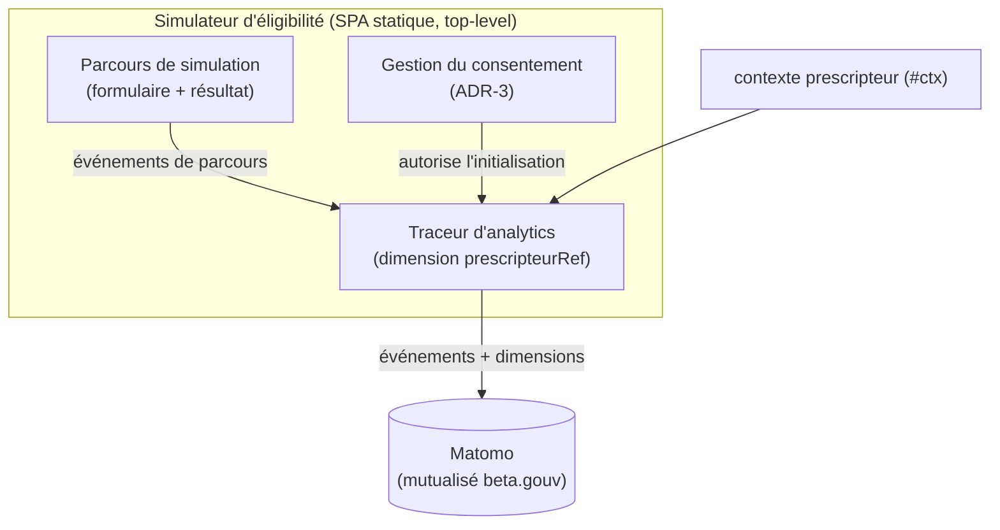

# Architecture — Analytics de parcours

> Statut : **décidé (phase expérimentale)** · Dernière mise à jour : 2026-07-03
>
> Suivi analytique du parcours dans le [simulateur d'éligibilité](../../apps/simulateur-transport).
> Repose sur le rattachement au prescripteur fourni par la couche d'identification :
> voir [identification.md](./identification.md).

## 1. Contexte & objectifs

On souhaite **suivre le parcours** de simulation :

- qui **démarre** le formulaire ;
- qui l'**achève** ;
- qui l'**abandonne**, et **à quelle étape** ;
- nombre de résultats **éligibles / non-éligibles par prescripteur**.

Le rattachement « par prescripteur » s'appuie sur le `prescripteurId` transmis par la
couche d'identification via le contexte `#ctx` (cf.
[identification.md — ADR-4](./identification.md)). Le simulateur reste une SPA
**statique** ; on ne veut **pas** opérer de backend applicatif dédié à la collecte.

**Invariant** : aucune donnée patient, aucune PII, aucune réponse détaillée du
formulaire ne doit être envoyée à l'analytics. Seuls des **identifiants opaques**
(`prescripteurRef`) et des **compteurs d'événements** transitent.

## 2. Décisions (ADR)

### ADR-1 — Matomo mutualisé hébergé par beta.gouv.fr
**Décision.** Utiliser l'instance **Matomo mutualisée hébergée par beta.gouv.fr**
(service d'analytics fourni aux produits publics par la communauté beta.gouv / DINUM),
plutôt qu'une instance auto-hébergée, un backend de collecte maison ou un outil tiers
non souverain.
**Pourquoi.** Matomo couvre nativement le tracking d'événements, les funnels et la
segmentation, sans que l'on construise de stockage/reporting. L'instance beta.gouv est
**hébergée en France/UE et gérée par l'infra publique** → souveraineté et conformité
(cohérent avec un service public / DSFR), **sans ops à notre charge** (pas d'instance à
héberger/maintenir nous-mêmes).
**Conséquences.** Il faut **demander la création d'un site dans le Matomo beta.gouv**
et récupérer le `siteId` + l'URL du tracker. Les fonctionnalités disponibles (Funnels,
Custom Dimensions) et les quotas dépendent de la configuration de cette instance
mutualisée — à confirmer (voir R-8).

### ADR-2 — Découpage par prescripteur via custom dimension
**Décision.** Chaque événement porte un **`prescripteurRef`** (l'`prescripteurId`
opaque du contexte `#ctx`) en **custom dimension** Matomo (+ `etabRef`, `serviceRef`).
Le reporting utilise les **Funnels** + la **segmentation** par cette dimension.
**Pourquoi.** Répond directement au besoin « éligibles / non-éligibles par
prescripteur » **sans backend** de croisement à nous.
**Conséquences.** `prescripteurRef` est **opaque** (jamais le nom, jamais de RPPS). La
ré-identification éventuelle se fait hors Matomo, via le référentiel, de façon
contrôlée.

### ADR-3 — Initialisation derrière un flag de consentement
**Décision.** L'initialisation du tracking Matomo est conditionnée par un composant de
**gestion du consentement** : le traceur d'analytics n'est activé que si le
consentement est accordé.
**Statut phase expérimentale (choix porteur) :** démarrage **sans bandeau** avec
**suivi individuel**, le sujet RGPD étant **instruit en parallèle** (voir §5 et R-4).
**Pourquoi.** Le suivi par prescripteur (quasi-nominatif) **sort de l'exemption de
consentement CNIL** et exige, en conformité stricte, un **bandeau de consentement**.
Concevoir l'init derrière un flag permet d'activer le bandeau ultérieurement **par
simple configuration**, sans réécriture.
**Conséquences.** Tant que le sujet RGPD n'est pas tranché, la collecte individuelle
sans bandeau constitue une **réserve de conformité** explicite (R-4).

## 3. Architecture cible

Le tracking a lieu **dans le simulateur en top-level** (pas dans l'iframe
d'identification) : les cookies ne sont donc **pas** en contexte tiers. Pour tracer
l'étape d'identification elle-même (optionnel), utiliser **Matomo cookieless**.

## 4. Spécification des événements

Événements émis par le traceur d'analytics, tous porteurs de la dimension
`prescripteurRef` (+ `etabRef`, `serviceRef`) :

| Événement | Moment du parcours |
|---|---|
| `simulation_start` | ouverture du simulateur / début du formulaire |
| `simulation_step` `{stepIndex}` | passage à l'étape suivante |
| `simulation_complete` | affichage de la page de résultat |
| `simulation_abandon` `{lastStep}` | départ sans avoir atteint le résultat |
| `resultat` `{statut}` | génération du résultat (éligible / non-éligible / …) |

- **Interdits** : réponses détaillées du formulaire, toute PII, toute donnée patient.
- **Reporting** : Funnels Matomo + segmentation par `prescripteurRef` → éligibles /
  non-éligibles par prescripteur, taux d'abandon par étape.

## 5. RGPD & consentement

- Le suivi **par prescripteur** est **quasi-nominatif** → **hors exemption de
  consentement CNIL**. En conformité stricte, il requiert un **bandeau de
  consentement**.
- **Choix phase expérimentale (porteur)** : démarrer **sans bandeau**, avec suivi
  individuel, et **instruire le sujet en parallèle** (base légale, information des
  prescripteurs, durée de conservation). L'init derrière flag (ADR-3) rend l'ajout du
  bandeau trivial.
- **Repli conforme** si le bandeau devient nécessaire et que l'utilisateur refuse :
  **mesure d'audience anonyme agrégée** (sans `prescripteurRef`), qui reste exemptée —
  mais on **perd alors le découpage par prescripteur** (couverture partielle).

## 6. Découpage en incréments (analytics)

1. **Matomo funnel.** Demander la création d'un site dans le **Matomo mutualisé
   beta.gouv** (récupérer `siteId` + URL tracker). Instrumenter le **traceur
   d'analytics** dans le simulateur (5 événements + dimension `prescripteurRef`)
   derrière la **gestion du consentement**, initialisé après lecture du contexte `#ctx`.

Prérequis : la couche d'identification fournit le `prescripteurRef` (cf.
[identification.md](./identification.md), incréments 1–2).

## 7. Risques & validations en attente

| Réf | Risque / à valider | Portée |
|---|---|---|
| **R-4** | **RGPD** : suivi par prescripteur sans bandeau = non conforme CNIL en l'état. Base légale, information des prescripteurs, durée de conservation. **Instruit côté porteur.** | conformité |
| **R-7** | Couverture : si un bandeau est finalement requis, le KPI par prescripteur n'est collecté que pour les consentants → couverture partielle à documenter. | mesure |
| **R-8** | Dépendance à l'instance Matomo mutualisée beta.gouv : disponibilité des **Funnels** et **Custom Dimensions**, quotas, éligibilité du produit, délai de création du site. | à confirmer avec beta.gouv |
