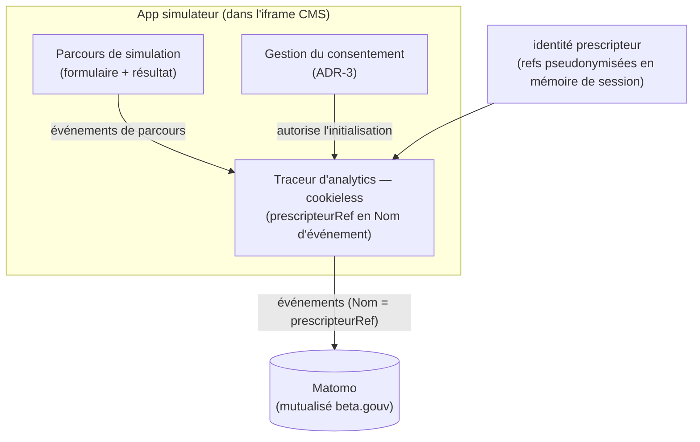

# Architecture — Analytics de parcours

> Statut : **décidé (phase expérimentale)** · Dernière mise à jour : 2026-07-08
>
> Suivi analytique du parcours dans le [simulateur d'éligibilité](../../apps/simulateur-eligibilite).
> Repose sur le rattachement au prescripteur fourni par la couche d'identification :
> voir [identification.md](./identification.md).

## 1. Contexte & objectifs

On souhaite **suivre le parcours** de simulation :

- qui **démarre** le formulaire ;
- qui l'**achève** ;
- qui l'**abandonne**, et **à quelle étape** ;
- nombre de résultats **éligibles / non-éligibles par prescripteur**.

Le rattachement « par prescripteur » s'appuie sur le `prescripteurRef` (pseudonyme HMAC)
fourni par l'étape d'identification **intégrée** et gardé **en mémoire de session** (cf.
[identification.md — ADR-4](./identification.md)). Le simulateur a désormais un backend
(pour l'identification), mais l'analytics part **directement du navigateur vers Matomo**
— **pas** de backend applicatif dédié à la collecte.

**Invariant** : aucune donnée patient, aucune PII, aucune réponse détaillée du
formulaire ne doit être envoyée à l'analytics. Seuls des **identifiants opaques**
(`prescripteurRef`) et des **compteurs d'événements** transitent.

## 2. Décisions (ADR)

### ADR-1 — Matomo mutualisé hébergé par beta.gouv.fr
**Décision.** Utiliser l'instance **Matomo mutualisée hébergée par beta.gouv.fr**
(service d'analytics fourni aux produits publics par la communauté beta.gouv / DINUM),
plutôt qu'une instance auto-hébergée, un backend de collecte maison ou un outil tiers
non souverain.
**Pourquoi.** Matomo couvre nativement le tracking d'événements, les funnels et la
segmentation, sans que l'on construise de stockage/reporting. L'instance beta.gouv est
**hébergée en France/UE et gérée par l'infra publique** → souveraineté et conformité
(cohérent avec un service public / DSFR), **sans ops à notre charge** (pas d'instance à
héberger/maintenir nous-mêmes).
**Conséquences.** Il faut **demander la création d'un site dans le Matomo beta.gouv**
et récupérer le `siteId` + l'URL du tracker. Les fonctionnalités disponibles (Funnels,
Custom Dimensions) et les quotas dépendent de la configuration de cette instance
mutualisée — à confirmer (voir R-8).

### ADR-2 — Découpage par prescripteur via propriété d'événement
**Décision.** Le **`prescripteurRef`** (pseudonyme HMAC —
`HMAC-SHA256(id, secret)` calculé côté backend, gardé en mémoire de session, jamais
l'identifiant brut ni le nom, voir [identification.md — ADR-4](./identification.md)) est
porté **en propriété d'événement Matomo** : chaque `trackEvent` a pour **Nom** ce `prescripteurRef`
(catégorie `simulateur`, action = type d'événement). Le reporting utilise le **rapport
Événements** (Catégorie → Action → **Nom**) et la **segmentation** `eventName == <ref>`.
**Pourquoi.** L'instance mutualisée beta.gouv **n'expose pas les custom dimensions**
(plugin/droits non disponibles — R-8). Les propriétés d'événement offrent le même
découpage « éligibles / non-éligibles par prescripteur » **sans configuration admin ni
backend** de croisement. `etabRef`/`serviceRef` ne sont **pas** transmis : ils sont
dérivables du prescripteur via le référentiel lors d'une ré-identification contrôlée.
**Conséquences.** `prescripteurRef` est **opaque et non réversible** sans le secret
(jamais le nom, jamais de RPPS). La ré-identification éventuelle se fait hors Matomo,
via le référentiel. **Pseudonyme ≠ anonyme** → la réserve RGPD (R-4) tient malgré la
pseudonymisation. Si les custom dimensions deviennent disponibles, on pourra les ajouter
sans changer le transport actuel.

### ADR-3 — Initialisation derrière un flag de consentement
**Décision.** L'initialisation du tracking Matomo est conditionnée par un composant de
**gestion du consentement** : le traceur d'analytics n'est activé que si le
consentement est accordé.
**Statut phase expérimentale (choix porteur) :** démarrage **sans bandeau** avec
**suivi individuel**, le sujet RGPD étant **instruit en parallèle** (voir §5 et R-4).
**Pourquoi.** Le suivi par prescripteur (quasi-nominatif) **sort de l'exemption de
consentement CNIL** et exige, en conformité stricte, un **bandeau de consentement**.
Concevoir l'init derrière un flag permet d'activer le bandeau ultérieurement **par
simple configuration**, sans réécriture.
**Conséquences.** Tant que le sujet RGPD n'est pas tranché, la collecte individuelle
sans bandeau constitue une **réserve de conformité** explicite (R-4).

## 3. Architecture cible

Depuis la fusion, tout le parcours (identification + simulation) tourne **dans l'iframe**
du CMS (contexte tiers) : les cookies y sont bloqués. Le traceur est donc **cookieless**
(`_paq.push(["disableCookies"])`) — les événements partent sans cookie, ce qui convient à
une mesure d'audience sans bandeau.

## 4. Spécification des événements

Événements `trackEvent` émis par le traceur, **catégorie `simulateur`**, portant le
`prescripteurRef` en **Nom** (absent si le parcours a démarré sans identité pseudonymisée) :

| Action | Valeur | Moment du parcours |
|---|---|---|
| `simulation_start` | — | ouverture du simulateur / début du formulaire |
| `simulation_step` | `stepIndex` | passage à l'étape suivante |
| `simulation_complete` | — | affichage de la page de résultat |
| `simulation_abandon` | `lastStep` | départ (onglet quitté) sans avoir atteint le résultat |
| `resultat:<statut>` | — | génération du résultat (le statut est encodé dans l'action) |

- **Interdits** : réponses détaillées du formulaire, toute PII, toute donnée patient.
- **Reporting** : rapport Événements (Catégorie → Action → Nom) + segmentation
  `eventName == <prescripteurRef>` → éligibles / non-éligibles par prescripteur, taux
  d'abandon par étape.

## 5. RGPD & consentement

- Le suivi **par prescripteur** est **quasi-nominatif** → **hors exemption de
  consentement CNIL**. En conformité stricte, il requiert un **bandeau de
  consentement**.
- **Choix phase expérimentale (porteur)** : démarrer **sans bandeau**, avec suivi
  individuel, et **instruire le sujet en parallèle** (base légale, information des
  prescripteurs, durée de conservation). L'init derrière flag (ADR-3) rend l'ajout du
  bandeau trivial.
- **Repli conforme** si le bandeau devient nécessaire et que l'utilisateur refuse :
  **mesure d'audience anonyme agrégée** (sans `prescripteurRef`), qui reste exemptée —
  mais on **perd alors le découpage par prescripteur** (couverture partielle).

## 6. Découpage en incréments (analytics)

1. **Matomo funnel.** ✅ **Fait** (`front/analytics/analytics.ts`, site 275,
   `https://stats.beta.gouv.fr/`). Traceur instrumenté dans le simulateur (5
   événements portant le `prescripteurRef` en Nom), **amorcé au boot en cookieless**
   (`disableCookies`), le `prescripteurRef` étant lu en session à l'émission de chaque
   événement (renseigné après l'identification), **derrière le consentement (ADR-3)** et
   un **gating dev/prod** : actif en build de prod uniquement, ou en local via
   `VITE_MATOMO_ENABLED=true` (sinon no-op). Reste à configurer les **Funnels** côté
   Matomo si nécessaire.

Prérequis : la couche d'identification fournit le `prescripteurRef` (cf.
[identification.md](./identification.md), incréments 1–2).

## 7. Risques & validations en attente

| Réf | Risque / à valider | Portée |
|---|---|---|
| **R-4** | **RGPD** : suivi par prescripteur sans bandeau = non conforme CNIL en l'état. Base légale, information des prescripteurs, durée de conservation. **Instruit côté porteur.** | conformité |
| **R-7** | Couverture : si un bandeau est finalement requis, le KPI par prescripteur n'est collecté que pour les consentants → couverture partielle à documenter. | mesure |
| **R-8** | Instance mutualisée beta.gouv : **custom dimensions indisponibles** → contourné par le transport en **propriété d'événement** (ADR-2). Reste à confirmer la disponibilité des **Funnels** et les quotas. | partiellement tranché |
