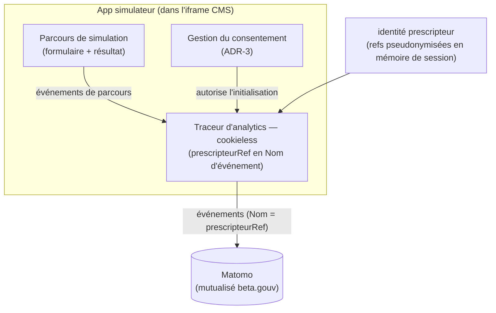

# Architecture — Analytics de parcours

> Statut : **décidé (phase expérimentale)** · Dernière mise à jour : 2026-07-08
>
> Suivi analytique du parcours dans le [simulateur d'éligibilité](../../apps/simulateur-eligibilite).
> Repose sur le rattachement au prescripteur fourni par la couche d'identification :
> voir [identification.md](./identification.md).

## 1. Contexte & objectifs

On veut suivre le parcours de simulation :

- qui démarre le formulaire ;
- qui l'achève ;
- qui l'abandonne, et à quelle étape ;
- le nombre de résultats éligibles et non éligibles par prescripteur.

Le rattachement par prescripteur s'appuie sur le `prescripteurRef`, un pseudonyme
HMAC fourni par l'étape d'identification intégrée et gardé en mémoire de session
(cf. [identification.md — ADR-4](./identification.md)). Le simulateur a un
backend, pour l'identification, mais l'analytics part directement du navigateur
vers Matomo. Aucun backend applicatif ne collecte les événements.

**Invariant** : aucune donnée patient, aucune PII et aucune réponse détaillée du
formulaire ne part vers l'analytics. Seuls transitent des identifiants opaques
(`prescripteurRef`) et des compteurs d'événements.

## 2. Décisions (ADR)

### ADR-1 — Matomo mutualisé hébergé par beta.gouv.fr

**Décision.** Utiliser l'instance Matomo mutualisée que beta.gouv.fr héberge pour
les produits publics, un service fourni par la communauté beta.gouv et la DINUM,
plutôt qu'une instance auto-hébergée, un backend de collecte maison ou un outil
tiers non souverain.

**Pourquoi.** Matomo couvre le suivi d'événements, les funnels et la segmentation
sans qu'on ait à construire de stockage ni de reporting. L'instance beta.gouv est
hébergée en France et gérée par l'infra publique, ce qui répond à la souveraineté
et à la conformité attendues d'un service public, cohérent avec le DSFR, et ne nous
laisse aucune opération à assurer.

**Conséquences.** Il faut demander la création d'un site dans le Matomo beta.gouv
et récupérer le `siteId` et l'URL du tracker. Les fonctionnalités disponibles
(Funnels, Custom Dimensions) et les quotas dépendent de la configuration de cette
instance mutualisée, qui reste à confirmer (voir R-8).

### ADR-2 — Découpage par prescripteur via propriété d'événement

**Décision.** Le `prescripteurRef` est porté en propriété d'événement Matomo :
chaque `trackEvent` a ce pseudonyme pour Nom, avec `simulateur` en catégorie et le
type d'événement en action. C'est un `HMAC-SHA256(id, secret)`,
calculé côté backend et gardé en mémoire de session ; ni l'identifiant brut ni le
nom ne circulent (voir [identification.md — ADR-4](./identification.md)). Le
reporting utilise le rapport Événements, en Catégorie puis Action puis Nom, et la
segmentation `eventName == <ref>`.

**Pourquoi.** L'instance mutualisée beta.gouv n'expose pas les custom dimensions,
le plugin ou les droits n'étant pas disponibles (R-8). Les propriétés d'événement
donnent le même découpage entre éligibles et non éligibles par prescripteur, sans
configuration admin ni backend de croisement. `etabRef` et `serviceRef` ne sont pas
transmis : on les dérive du prescripteur via le référentiel, lors d'une
ré-identification contrôlée.

**Conséquences.** `prescripteurRef` est opaque et non réversible sans le secret ;
il ne porte ni nom ni RPPS. Une ré-identification se fait hors Matomo, via le
référentiel. Un pseudonyme n'est pas un anonyme, donc la réserve RGPD (R-4) tient
malgré la pseudonymisation. Si les custom dimensions deviennent disponibles, on
pourra les ajouter sans changer le transport actuel.

### ADR-3 — Initialisation derrière un flag de consentement

**Décision.** L'initialisation du tracking Matomo est conditionnée par un composant
de gestion du consentement : le traceur ne s'active que si le consentement est
accordé.

**Statut en phase expérimentale**, choix du porteur : on démarre sans bandeau, avec
suivi individuel, le sujet RGPD étant instruit en parallèle (voir §5 et R-4).

**Pourquoi.** Le suivi par prescripteur est quasi nominatif, donc hors de
l'exemption de consentement CNIL : en conformité stricte, il demande un bandeau.
Concevoir l'initialisation derrière un flag permet d'activer ce bandeau plus tard
par configuration, sans réécriture.

**Conséquences.** Tant que le sujet RGPD n'est pas tranché, la collecte
individuelle sans bandeau est une réserve de conformité explicite (R-4).

## 3. Architecture cible

```mermaid
flowchart TB
    subgraph simu["App simulateur (dans l'iframe CMS)"]
        parcours["Parcours de simulation<br/>(formulaire + résultat)"]
        consent["Gestion du consentement<br/>(ADR-3)"]
        traceur["Traceur d'analytics — cookieless<br/>(prescripteurRef en Nom d'événement)"]
        parcours -->|"événements de parcours"| traceur
        consent -->|"autorise l'initialisation"| traceur
    end
    matomo[("Matomo<br/>(mutualisé beta.gouv)")]

    identite["identité prescripteur<br/>(refs pseudonymisées en mémoire de session)"] --> traceur
    traceur -->|"événements (Nom = prescripteurRef)"| matomo
```

Depuis la fusion, tout le parcours, identification et simulation, tourne dans
l'iframe du CMS. C'est un contexte tiers, où les cookies sont bloqués. Le traceur
est donc cookieless (`_paq.push(["disableCookies"])`) : les événements partent sans
cookie, ce qui convient à une mesure d'audience sans bandeau.

## 4. Spécification des événements

Événements `trackEvent` émis par le traceur, en catégorie `simulateur`, portant le
`prescripteurRef` en Nom. Ce nom est absent si le parcours a démarré sans identité
pseudonymisée.

| Action | Valeur | Moment du parcours |
|---|---|---|
| `simulation_start` | — | ouverture du simulateur, début du formulaire |
| `simulation_step` | `stepIndex` | passage à l'étape suivante |
| `simulation_complete` | — | affichage de la page de résultat |
| `simulation_abandon` | `lastStep` | départ (onglet quitté) sans avoir atteint le résultat |
| `resultat:<statut>` | — | génération du résultat, le statut étant encodé dans l'action |

- **Interdits** : les réponses détaillées du formulaire, toute PII, toute donnée
  patient.
- **Reporting** : le rapport Événements (Catégorie, Action, Nom) et la segmentation
  `eventName == <prescripteurRef>` donnent les éligibles et non éligibles par
  prescripteur, ainsi que le taux d'abandon par étape.

## 5. RGPD & consentement

- Le suivi par prescripteur est quasi nominatif, donc hors de l'exemption de
  consentement CNIL. En conformité stricte, il demande un bandeau.
- **Choix du porteur en phase expérimentale** : démarrer sans bandeau, avec suivi
  individuel, et instruire le sujet en parallèle — base légale, information des
  prescripteurs, durée de conservation. L'initialisation derrière un flag (ADR-3)
  rend l'ajout du bandeau immédiat.
- **Repli conforme** si le bandeau devient nécessaire et que l'utilisateur refuse :
  une mesure d'audience anonyme et agrégée, sans `prescripteurRef`, qui reste
  exemptée. On perd alors le découpage par prescripteur, donc la couverture devient
  partielle.

## 6. Découpage en incréments (analytics)

1. **Matomo funnel.** ✅ **Fait** (`front/analytics/`, site 275,
   `https://stats.beta.gouv.fr/`). Le traceur est instrumenté dans le simulateur,
   avec 5 événements portant le `prescripteurRef` en Nom. Il est amorcé au boot en
   cookieless (`disableCookies`), et lit le `prescripteurRef` en session à
   l'émission de chaque événement, ce pseudonyme étant renseigné après
   l'identification. Il est gardé par le consentement (ADR-3) et par un gating
   dev/prod : actif en build de prod, ou en local avec `VITE_MATOMO_ENABLED=true`,
   et sans effet sinon. Reste à configurer les Funnels côté Matomo si nécessaire.

Prérequis : la couche d'identification fournit le `prescripteurRef` (cf.
[identification.md](./identification.md), incréments 1–2).

## 7. Risques & validations en attente

| Réf | Risque / à valider | Portée |
|---|---|---|
| **R-4** | **RGPD** : le suivi par prescripteur sans bandeau n'est pas conforme CNIL en l'état. Restent à établir la base légale, l'information des prescripteurs et la durée de conservation. **Instruit côté porteur.** | conformité |
| **R-7** | Couverture : si un bandeau devient nécessaire, le KPI par prescripteur n'est collecté que chez les consentants. La couverture devient partielle, et c'est à documenter. | mesure |
| **R-8** | Instance mutualisée beta.gouv : les custom dimensions sont indisponibles, ce que l'ADR-2 contourne en passant par une propriété d'événement. Restent à confirmer la disponibilité des Funnels et les quotas. | partiellement tranché |
