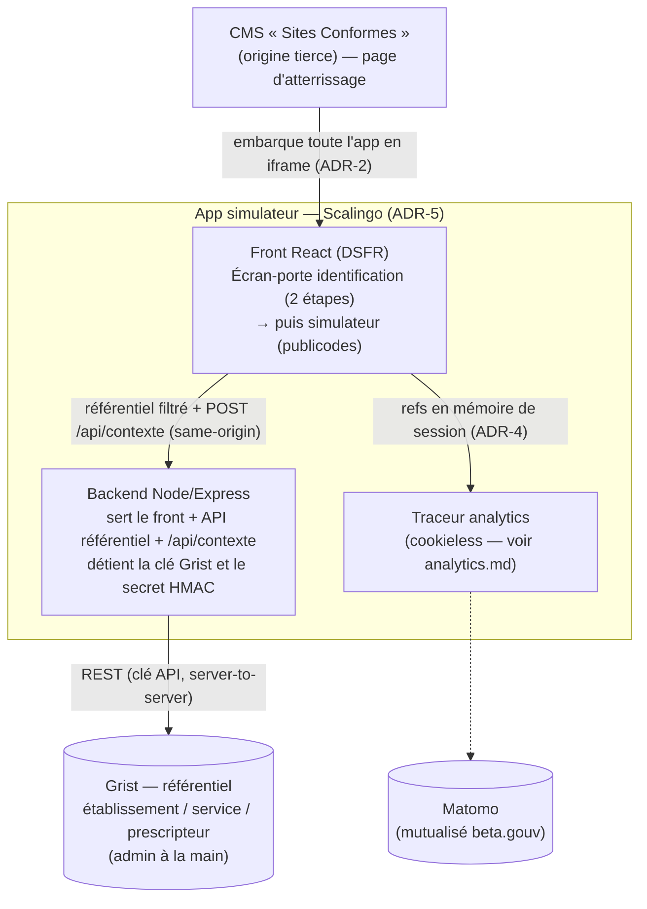
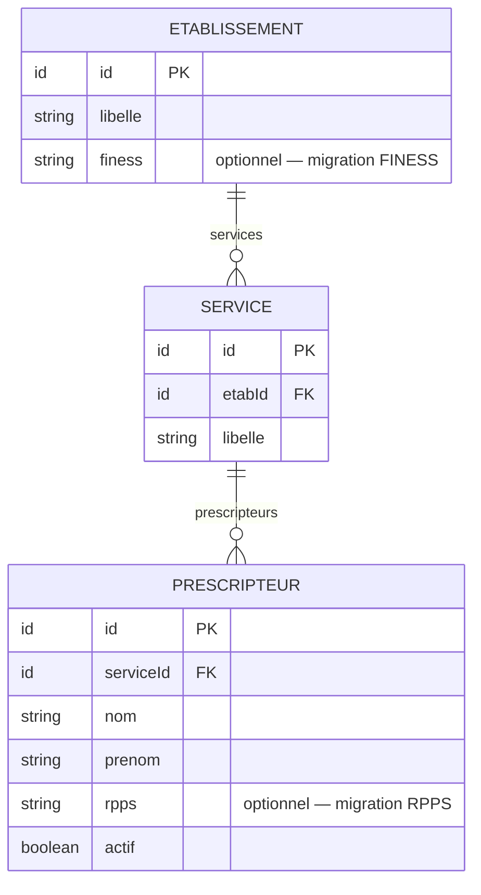

# Architecture — Identification du prescripteur

> Statut : **décidé (phase expérimentale)** · Dernière mise à jour : 2026-07-08
>
> Étape d'identification **intégrée** au [simulateur d'éligibilité](../../apps/simulateur-eligibilite),
> **préalable obligatoire** à toute simulation. Le suivi analytique du parcours fait
> l'objet d'un document séparé : [analytics.md](./analytics.md).
>
> **Mise à jour 2026-07-08 — fusion des apps.** L'identification et le simulateur, un
> temps conçus comme **deux apps séparées** (SPA d'identification en iframe → redirection
> top-level vers le simulateur statique, contexte en fragment `#ctx`), sont désormais
> **une seule app** : l'identification est un **écran-porte** en amont du simulateur.
> Cela **réverse** l'ADR-1 (app dédiée), l'ADR-4 (contexte en fragment d'URL) et
> l'invariant « simulateur 100 % statique » de l'ADR-5. Motivations : intégration Sites
> Conformes plus simple (**un seul iframe**, plus de navigation top-level) et passage de
> contexte trivial (**état en mémoire**, plus de fragment). Les sections ci-dessous ont
> été mises à jour ; les décisions restées valables (identification déclarative, PII hors
> bundle, moteur publicodes intouché) sont conservées.

## 1. Contexte & objectifs

Le simulateur d'éligibilité (React 19 + Vite + DSFR, moteur `publicodes`) est désormais
servi par un **backend Node/Express** (une seule app, sur **Scalingo**), car
l'identification impose de détenir des secrets côté serveur (clé Grist, secret de
pseudonymisation). Il a quitté GitHub Pages.

On **identifie l'utilisateur en amont** du parcours — **étape obligatoire**, impossible
de simuler sans s'identifier — en deux étapes :

1. l'**établissement** et le **service/unité** ;
2. le **personnel de santé** (prescripteur) qui réalise la simulation.

Contraintes :

- L'utilisateur **arrive via le CMS « Sites Conformes »** (site tiers, peu maîtrisé).
- Phase **expérimentale** : le référentiel établissement/service/prescripteur est
  **construit et maintenu à la main**, **non** intégré aux référentiels du SI
  Sécurité sociale / CNAM (pas de FINESS/RPPS officiels branchés à ce stade).
- Volonté de **limiter l'empreinte serveur** : **un seul** backend minimal, sur une
  **plateforme managée (Scalingo)**, qui sert le front **et** l'API là où un serveur est
  incontournable (accès Grist, secret de pseudonymisation — cf. ADR-5).

**Invariant** : l'identification ne doit **jamais** revenir dans le moteur
`publicodes` (`regles/regles.publicodes`), qui ne contient que la logique métier
d'éligibilité. Des règles `identification . *` y avaient été mises à tort ; elles
ont été retirées.

## 2. Décisions (ADR)

### ADR-1 — Identification intégrée en écran-porte (~~app dédiée~~)
**Décision (révisée 2026-07-08).** L'identification est un **écran-porte** au sein de
l'app simulateur (`front/identification/Identification.tsx`, monté par la racine
`front/app/App.tsx`) : tant que le prescripteur n'est pas validé, le formulaire n'est pas
rendu. ~~Créer une SPA statique `apps/identification` dédiée.~~
**Pourquoi.** Une app séparée imposait un passage de contexte inter-app (fragment
d'URL), une navigation top-level hors iframe et **n'empêchait pas** d'atteindre le
simulateur sans identification (son URL était publique). Un écran-porte dans l'app
**garantit** l'obligation d'identification et **simplifie l'intégration** (un seul
iframe, un seul déployable). L'identité reste isolée du moteur (ADR-6) et derrière
l'interface `Referentiel` : la migration FINESS/RPPS reste possible sans toucher le
simulateur.
**Conséquences.** Plus de passage de contexte inter-app : la sélection est convertie en
refs par l'API (`POST /api/contexte`) et gardée en mémoire (voir ADR-4). Le composant
d'identification (`Identification.tsx`) et le formulaire (`Simulateur.tsx`) cohabitent
dans la même app, avec des steppers distincts.

### ADR-2 — Intégration par iframe dans le CMS
**Décision (révisée 2026-07-08).** L'app **entière** (identification **et** simulateur)
est **embarquée en iframe** dans une page Sites Conformes. ~~Le simulateur s'ouvrait en
plein écran top-level après identification.~~
**Pourquoi.** La fusion supprime la navigation top-level entre deux apps : tout le
parcours vit dans le même iframe → intégration plus simple (une seule origine à
autoriser, pas de saut de contexte). Choix produit conservé : garder le parcours « dans »
le site CMS.
**Conséquences.** Dépend toujours de la coopération du CMS (attributs `sandbox`, CSP
`frame-ancestors` / `frame-src`) — voir §6 et risque R-1. Le suivi analytics ayant
désormais lieu **dans l'iframe** (contexte tiers), il est passé en **cookieless** (voir
[analytics.md](./analytics.md)). Le repli sans iframe (ouverture top-level directe de
l'app) reste possible si l'intégration iframe s'avère bloquée.

### ADR-3 — Identification déclarative (pas d'authentification)
**Décision.** L'utilisateur **déclare** qui il est (sélection établissement / service /
prescripteur) **sans preuve d'identité**.
**Pourquoi.** Suffisant pour la phase expérimentale ; simple.
**Conséquences.** Usurpation déclarative possible ; le contexte transmis n'a pas de
valeur probante (voir ADR-4). Migration future possible vers ProConnect/AgentConnect.

### ADR-4 — Contexte : refs pseudonymisées, en mémoire (~~fragment d'URL~~)
**Décision (révisée 2026-07-08).** À la validation, le **backend** construit un
**contexte `ctx`** (`v: 2`) = **refs pseudonymisées** `{ etabRef, serviceRef,
prescripteurRef }` = **`HMAC-SHA256(id, secret)`** (tronqué 128 bits, base64url) des
identifiants opaques du référentiel. **Aucun identifiant brut, aucun nom, aucun RPPS,
aucune donnée patient.** Le front envoie la sélection à `POST /api/contexte` ; le backend
renvoie **l'objet refs en JSON**, que le front garde **en mémoire de session**
(`front/contexte/session.ts`). Le **secret vit côté serveur** (variable d'env dédiée
`PSEUDONYMISATION_SECRET`, distincte de la clé Grist). ~~Le contexte était transmis au
simulateur via le fragment d'URL `#ctx=<base64url>` ; la fusion l'a rendu inutile.~~
**Pourquoi.** Le suivi Matomo n'a besoin que d'un **jeton stable et opaque** par
prescripteur, pas de l'identifiant brut (enum. / re-liable au référentiel) ni du nom
(PII). Un **HMAC à sens unique** donne un pseudonyme non réversible et non forgeable
sans le secret ; le calculer **côté serveur** est indispensable — un keyed-hash
client-side exposerait la clé dans le bundle. Le contexte n'est **pas signé**
(l'identification étant déclarative — ADR-3, signer donnerait une fausse garantie). Les
apps étant fusionnées, il n'y a **plus de transport inter-app** : plus de fragment
d'URL, plus d'enveloppe base64url à décoder.
**Conséquences.** Les refs restent **en mémoire** (pas de `localStorage`, pas d'URL) et
sont forwardées à Matomo (voir [analytics.md](./analytics.md)). Le front n'inverse jamais
le HMAC. La ré-identification `prescripteurRef → prescripteur` se fait **hors Matomo**,
via le référentiel, de façon contrôlée. **Pseudonyme ≠ anonyme** : la réserve RGPD (R-4
d'analytics.md) tient. La rotation du secret re-bucketise tous les prescripteurs.

### ADR-5 — Référentiel dans Grist, lu par le backend de l'app fusionnée
**Décision (révisée 2026-07-08).** Le référentiel établissement/service/prescripteur est
**maintenu à la main dans Grist**. L'app **simulateur** (identification + simulation) est
une **app unique servie par un backend** (Node/Express, hébergée sur **Scalingo**) qui
**sert le front React** (build Vite/DSFR) **et expose une API same-origin** détenant la
clé Grist et le secret de pseudonymisation : `/api/etablissements|services|prescripteurs`
(référentiel filtré) et `POST /api/contexte` (refs pseudonymisées). ~~Ce backend
appartenait à une app d'identification distincte ; le simulateur restait statique sur
GitHub Pages.~~
**Pourquoi.** L'accès **direct navigateur → Grist est non viable** (clé toute-puissante
impossible à exposer dans une SPA ; **CORS bloqué** par Grist), et un doc Grist public
exposerait les **noms de prescripteurs (PII)**. Un composant serveur détenant la clé et
filtrant la PII est donc requis. **Scalingo ne propose pas de FaaS.** Depuis la fusion,
c'est le **backend du simulateur** qui joue ce rôle : une seule app, tout en same-origin
(CORS éliminé), données **fraîches** (lecture Grist en direct), **un seul déployable**.
**Conséquences.** Le **simulateur quitte GitHub Pages** pour **Scalingo** et **n'est
plus 100 % statique** (il a un backend) — c'est le prix de l'identification obligatoire.
Le workflow GitHub Pages est supprimé. La clé Grist et `PSEUDONYMISATION_SECRET` vivent
en **variables d'environnement Scalingo**. Le **front et ses tests sont préservés** ;
l'interface `Referentiel` (§5) a un client HTTP same-origin (`http-referentiel.ts`) et
garde le snapshot factice en défaut (dev/tests). Grist reste l'outil d'admin. Voir §5
(modèle) et §6 (accès).

### ADR-6 — Le moteur publicodes reste hors périmètre identité
**Décision.** `apps/simulateur-eligibilite/regles/regles.publicodes` **n'est pas
modifié**. L'identification (comme l'analytics) vit en dehors du moteur.

## 3. Architecture cible



Composants :

| Composant | Nature | Statut |
|---|---|---|
| `apps/simulateur-eligibilite` | **App unique** : front React (identification + simulateur) + backend Node/Express, sur **Scalingo** | modifié (fusion) |
| API référentiel + contexte | Endpoints du backend détenant la clé Grist + le secret HMAC | déplacé (ex-identification) |
| Grist | Base managée, admin à la main | config |
| ~~`apps/identification`~~ | ~~app séparée~~ | **supprimé (fusionné)** |

## 4. Workflow d'identification & contexte `ctx`

**Workflow à branches** (formulaire à révélation progressive,
`front/identification/Identification.tsx`) :

```
Établissement ─┬─ (A/B/C réel) → Service ─┬─ (D/E/F réel) → Prescripteur ─┬─ (dans la liste)
               │                          │                              └─ « pas dans la liste » → Nom + Prénom
               │                          └─ « Autre » → nom de service libre
               └─ « non rattaché » → catégorie (libéral | CNAM) → Nom + Prénom
```

- **Transport** : réponse JSON de `POST /api/contexte` (same-origin). **Plus de fragment
  d'URL** depuis la fusion.
- **Construction** : **côté backend** (`server/identification/pseudonymisation.ts`, exposé
  par `server/identification/routes.ts`). Reçoit la `Selection`
  (`{ etabId, categorie?, serviceId?, serviceLibre?, prescripteurId?, nom?, prenom? }`,
  `shared/selection.ts`), valide sa complétude (`selectionComplete`, partagé front/back),
  renvoie l'objet refs. Le secret HMAC ne quitte jamais le serveur.
- **Schéma** (refs **optionnelles** selon la branche) :
  ```json
  { "etabRef": "…", "serviceRef": "…", "prescripteurRef": "…", "v": 2 }
  ```
  chaque ref = `base64url(HMAC-SHA256("<nature>:<valeur>", SECRET)[:16])`, la valeur
  étant **préfixée par sa nature** (`etab:`, `categorie:`, `service:`, `service-libre:`,
  `prescripteur:`, `identite:`) pour éviter toute collision id ↔ texte libre.
  - **Textes libres** (nom/prénom, nom de service) : **normalisés** (casse/espaces) puis
    **HMAC** — `identite:<nom>|<prenom>`. **Jamais le nom en clair** (invariant PII, R-6).
  - Refs absentes selon la branche : « non rattaché » n'a **pas** de `serviceRef` ;
    « autre service » n'a **pas** de `prescripteurRef` (⚠️ personne non identifiée dans
    cette branche — cf. R-9).
- **Interdits** : identifiant brut du référentiel, nom/prénom **en clair**, RPPS, tout
  identifiant patient, toute donnée de santé.
- **Cycle de vie** : reçu à la validation de l'identification, conservé **en mémoire de
  session** (`front/contexte/session.ts`, pas de `localStorage`), lu par le traceur au
  moment d'émettre chaque événement.

## 5. Modèle du référentiel (Grist)



- Les champs `finess?` / `rpps?` sont **prévus dès maintenant** (optionnels) pour la
  **migration future** vers les référentiels officiels.
- Le front n'accède au référentiel **que via l'API du backend** (same-origin), qui
  **filtre** (expose IDs + libellés ; les noms de prescripteurs ne sont renvoyés que
  pour le service sélectionné, jamais l'annuaire complet en clair public).
- L'accès référentiel est masqué derrière une **interface** (`getEtablissements()`,
  `getServices(etabId)`, `getPrescripteurs(serviceId)`) pour pouvoir **substituer la
  source** (Grist → FINESS/RPPS) sans toucher les consommateurs.

## 6. Intégration iframe — points d'attention

Depuis la fusion, **tout le parcours** (identification + simulation) vit dans le même
iframe : **plus de navigation top-level** entre deux apps, donc plus besoin de
`allow-top-navigation-by-user-activation` ni de repli `postMessage`. Il reste :

- **`sandbox`** (si le CMS l'applique) : **`allow-scripts` + `allow-forms`** suffisent
  (formulaires + JS de l'app) — **côté CMS**.
- **CSP** : notre app doit servir `Content-Security-Policy: frame-ancestors
  https://<domaine-cms>` (et **pas** `X-Frame-Options: DENY`). Le CMS doit autoriser
  notre origine dans son `frame-src` (**hors de notre contrôle**).
- **Cookies tiers** : bloqués dans l'iframe (ITP/Chrome). Le tracking ayant désormais
  lieu **dans l'iframe**, le traceur est passé en **cookieless** (`disableCookies`) pour
  fonctionner sans cookies (cf. [analytics.md](./analytics.md)).

## 7. Découpage en incréments (identification)

1. **Front identification + contexte `ctx`.** ✅ Fait (à l'origine dans `apps/identification`).
2. **Backend référentiel + Grist.** ✅ Fait — API référentiel + `POST /api/contexte`
   same-origin, `GRIST_API_KEY` en variable d'env.
3. **Fusion dans le simulateur.** ✅ **Fait (2026-07-08)** — identification en écran-porte
   obligatoire dans `apps/simulateur-eligibilite` ; backend (référentiel + contexte)
   déplacé dans cette app ; contexte en mémoire (plus de fragment) ; `apps/identification`
   supprimée ; workflow GitHub Pages retiré. *Reste : déploiement Scalingo effectif.*
4. **Durcissement iframe.** En-têtes CSP `frame-ancestors` (en attente du domaine CMS,
   R-1). Plus de repli `postMessage` nécessaire (tout est in-iframe).
5. **(futur) Migration FINESS/RPPS.** Nouvelle implémentation derrière l'interface
   référentiel (§5).

Le funnel analytics est un incrément traité dans [analytics.md](./analytics.md).

## 8. Risques & validations en attente

| Réf | Risque / à valider | Portée |
|---|---|---|
| **R-1** | **Coopération Sites Conformes** : `sandbox` de l'iframe + CSP `frame-src`. Sans cela, pas d'embarquement. **Bloquant.** | à valider avec l'éditeur **avant de coder l'intégration** |
| **R-2** | Choix d'hébergement Grist (grist.com vs self-hosted). L'app fusionnée (front + backend) est **sur Scalingo** (pas de FaaS — cf. ADR-5). | décision infra |
| **R-3** | Fraîcheur du référentiel : le backend lit Grist en direct → OK ; ne pas retomber sur un snapshot figé si le maintien « à la main » doit être visible immédiatement. | conception backend |
| **R-5** | Contexte non signé → usurpation déclarative possible. Acceptable en expérimental ; à revoir avant tout usage probant. | sécurité |
| **R-6** | PII de prescripteurs : jamais dans un bundle statique public ni un doc Grist public. Les noms/prénoms libres saisis au formulaire sont **HMAC côté serveur**, jamais transmis en clair à l'analytics. | RGPD/sécurité |
| **R-9** | Branche **« autre service »** : le workflow ne capture **aucune identité** (ni prescripteur, ni nom) → `prescripteurRef` absent, personne non suivie par prescripteur dans cette branche. À confirmer côté porteur (ajouter un nom/prénom ? bucket dédié ?). | produit / mesure |
