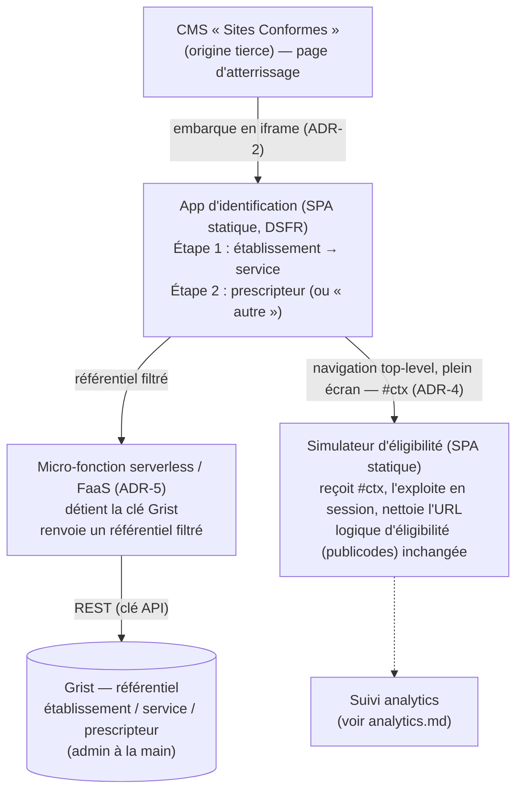
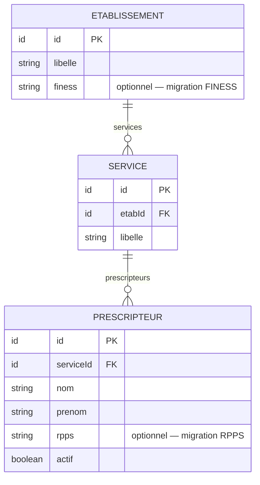

# Architecture — Identification du prescripteur

> Statut : **décidé (phase expérimentale)** · Dernière mise à jour : 2026-07-03
>
> Couche d'identification en amont du [simulateur d'éligibilité](../../apps/simulateur-transport).
> Le suivi analytique du parcours fait l'objet d'un document séparé :
> [analytics.md](./analytics.md).

## 1. Contexte & objectifs

Le simulateur d'éligibilité est une SPA **100 % statique** (React 19 + Vite + DSFR,
moteur `publicodes`), déployée sur **GitHub Pages**. Aucun backend, aucun stockage,
aucun secret.

On souhaite, **en amont** du simulateur, **identifier l'utilisateur** au début du
parcours, en deux étapes :

1. l'**établissement** et le **service/unité** ;
2. le **personnel de santé** (prescripteur) qui réalise la simulation.

Contraintes :

- L'utilisateur **arrive via le CMS « Sites Conformes »** (site tiers, peu maîtrisé).
- Phase **expérimentale** : le référentiel établissement/service/prescripteur est
  **construit et maintenu à la main**, **non** intégré aux référentiels du SI
  Sécurité sociale / CNAM (pas de FINESS/RPPS officiels branchés à ce stade).
- Volonté de **s'appuyer sur des services managés** plutôt que d'opérer un backend.

**Invariant** : l'identification ne doit **jamais** revenir dans le moteur
`publicodes` (`regles/regles.publicodes`), qui ne contient que la logique métier
d'éligibilité. Des règles `identification . *` y avaient été mises à tort ; elles
ont été retirées.

## 2. Décisions (ADR)

### ADR-1 — Application d'identification dédiée
**Décision.** Créer une **nouvelle SPA statique `apps/identification`** (stack DSFR/Vite
identique au simulateur), plutôt qu'un écran dans le simulateur ou un couplage au
moteur de règles.
**Pourquoi.** Sépare identité / métier / moteur ; réutilisable ; prépare une
migration future vers FINESS/RPPS sans toucher le simulateur.
**Conséquences.** Un passage de contexte inter-app est nécessaire (voir ADR-4).

### ADR-2 — Intégration par iframe dans le CMS
**Décision.** L'app d'identification est **embarquée en iframe** dans une page
Sites Conformes. Le **simulateur, lui, s'ouvre en plein écran** (top-level) après
identification.
**Pourquoi.** Choix produit : garder l'étape d'identification « dans » le site CMS.
**Conséquences.** Dépend de la coopération du CMS (attributs `sandbox`, CSP) — voir
§6 et risque R-1. Le repli sans iframe (redirection top-level directe) reste
documenté si l'intégration iframe s'avère bloquée.

### ADR-3 — Identification déclarative (pas d'authentification)
**Décision.** L'utilisateur **déclare** qui il est (sélection établissement / service /
prescripteur) **sans preuve d'identité**.
**Pourquoi.** Suffisant pour la phase expérimentale ; simple.
**Conséquences.** Usurpation déclarative possible ; le contexte transmis n'a pas de
valeur probante (voir ADR-4). Migration future possible vers ProConnect/AgentConnect.

### ADR-4 — Contexte inter-app : jeton non signé, sans patient, en fragment d'URL
**Décision.** À la validation, l'iframe transmet un **contexte `ctx`** au simulateur
via le **fragment d'URL** (`…/simulateur#ctx=<payload>`). Contenu : **identifiants
opaques** `{ etabId, serviceId, prescripteurId }` issus du référentiel. **Non signé.
Aucun nom, aucun RPPS, aucune donnée patient.**
**Pourquoi.** L'identification étant déclarative (ADR-3), signer donnerait une fausse
garantie ; ne pas signer évite d'introduire un secret serveur. Le fragment n'est ni
envoyé au serveur, ni journalisé, ni présent dans le `Referer`.
**Conséquences.** Le simulateur lit le fragment, le garde **en mémoire** (pas de
`localStorage`), puis nettoie l'URL (`history.replaceState`). Le contexte est
falsifiable — acceptable en expérimental, à re-trancher avant tout usage probant. Le
`prescripteurId` sert de clé de rattachement pour l'analytics (voir
[analytics.md](./analytics.md)).

### ADR-5 — Référentiel dans Grist, lu via une micro-fonction serverless
**Décision.** Le référentiel établissement/service/prescripteur est **maintenu à la
main dans Grist**. Il est **lu par une micro-fonction serverless** qui détient la clé
Grist et renvoie un **référentiel filtré** à l'app d'identification.
**Pourquoi.** L'accès **direct navigateur → Grist est non viable** :
- une clé API Grist porte **toutes les permissions du compte (lecture + écriture)** →
  impossible à exposer dans une SPA ;
- Grist **bloque le CORS** des appels navigateur (« API limitée aux non-navigateurs »).

Un doc Grist public exposerait en plus les **noms de prescripteurs (PII)**
publiquement. La micro-fonction protège **à la fois la clé et la PII**, tout en
gardant des données **fraîches**, sans opérer de serveur applicatif.
**Conséquences.** Introduit un composant serveur **managé (FaaS)** — assumé. Grist
reste l'outil d'admin. Voir §5 (modèle) et §6 (accès).

### ADR-6 — Le moteur publicodes reste hors périmètre identité
**Décision.** `apps/simulateur-transport/regles/regles.publicodes` **n'est pas
modifié**. L'identification (comme l'analytics) vit en dehors du moteur.

## 3. Architecture cible



Composants :

| Composant | Nature | Nouveau ? |
|---|---|---|
| `apps/identification` | SPA statique (GitHub Pages) | **nouveau** |
| Micro-fonction référentiel | FaaS (Cloudflare/Netlify/…) détenant la clé Grist | **nouveau** |
| Grist | Base managée, admin à la main | **nouveau (config)** |
| `apps/simulateur-transport` | SPA statique existante, lit le contexte `#ctx` | modifié |

## 4. Spécification du contexte `ctx`

- **Transport** : fragment d'URL `#ctx=<base64url(json)>`.
- **Schéma** (identifiants opaques uniquement) :
  ```json
  { "etabId": "e_xxx", "serviceId": "s_xxx", "prescripteurId": "p_xxx", "v": 1 }
  ```
- **Interdits** : nom/prénom, RPPS, tout identifiant patient, toute donnée de santé.
- **Cas « prescripteur autre »** (absent du référentiel) : un `prescripteurId`
  conventionnel (p. ex. `p_autre`) ; la saisie libre éventuelle reste **côté
  simulateur/identification**, hors `ctx`, et n'est pas transmise nominativement.
- **Cycle de vie** : lu au boot du simulateur, conservé **en mémoire de session**,
  fragment retiré de l'URL immédiatement.

## 5. Modèle du référentiel (Grist)



- Les champs `finess?` / `rpps?` sont **prévus dès maintenant** (optionnels) pour la
  **migration future** vers les référentiels officiels.
- L'app d'identification n'accède au référentiel **que via la micro-fonction**, qui
  **filtre** (expose IDs + libellés ; les noms de prescripteurs ne sont renvoyés que
  pour le service sélectionné, jamais l'annuaire complet en clair public).
- L'accès référentiel est masqué derrière une **interface** (`getEtablissements()`,
  `getServices(etabId)`, `getPrescripteurs(serviceId)`) pour pouvoir **substituer la
  source** (Grist → FINESS/RPPS) sans toucher les consommateurs.

## 6. Intégration iframe — points d'attention

- **Navigation top-level depuis l'iframe** : `window.top.location = …` cross-origin
  est autorisé **sous activation utilisateur** (clic). Si le CMS met l'iframe en
  `sandbox`, il faut **`allow-top-navigation-by-user-activation` + `allow-scripts` +
  `allow-forms`** dans l'attribut `sandbox` — **côté CMS**.
- **Repli** si navigation top bloquée : `postMessage(iframe → parent)` + un **snippet
  côté CMS** qui écoute (avec vérification `event.origin`) et redirige. Nécessite une
  intervention dans Sites Conformes.
- **CSP** : notre app doit servir `Content-Security-Policy: frame-ancestors
  https://<domaine-cms>` (et **pas** `X-Frame-Options: DENY`). Le CMS doit autoriser
  notre origine dans son `frame-src` (**hors de notre contrôle**).
- **Cookies tiers** : bloqués dans l'iframe (ITP/Chrome). Sans impact sur le funnel
  analytics car le tracking a lieu **dans le simulateur en top-level** (cf.
  [analytics.md](./analytics.md)).

## 7. Découpage en incréments (identification)

1. **App identification (statique) + contexte `ctx`.** `apps/identification` (DSFR,
   parcours 2 étapes avec **données factices/snapshot**), navigation top vers le
   simulateur avec `#ctx=`, lecture + nettoyage côté simulateur. Reste 100 % statique.
   *En parallèle : valider `sandbox`/CSP avec Sites Conformes (R-1).*
2. **Micro-fonction référentiel + Grist.** FaaS détenant `GRIST_API_KEY`, endpoints
   `getEtablissements`/`getServices`/`getPrescripteurs` filtrés + CORS ; branchement
   de l'app d'identification.
3. **Durcissement iframe.** Repli `postMessage` + snippet CMS ; en-têtes CSP.
4. **(futur) Migration FINESS/RPPS.** Nouvelle implémentation derrière l'interface
   référentiel (§5).

Le funnel analytics est un incrément traité dans [analytics.md](./analytics.md).

## 8. Risques & validations en attente

| Réf | Risque / à valider | Portée |
|---|---|---|
| **R-1** | **Coopération Sites Conformes** : `sandbox` de l'iframe + CSP `frame-src`. Sans cela, ni embarquement ni navigation top. **Bloquant.** | à valider avec l'éditeur **avant de coder l'intégration** |
| **R-2** | Choix d'hébergement : Grist (grist.com vs self-hosted) et FaaS (Cloudflare/Netlify/Scalingo). | décision infra |
| **R-3** | Fraîcheur du référentiel : la micro-fonction lit Grist en direct → OK ; ne pas retomber sur un snapshot figé si le maintien « à la main » doit être visible immédiatement. | conception FaaS |
| **R-5** | Contexte non signé → usurpation déclarative possible. Acceptable en expérimental ; à revoir avant tout usage probant. | sécurité |
| **R-6** | PII de prescripteurs : jamais dans un bundle statique public ni un doc Grist public. | RGPD/sécurité |
