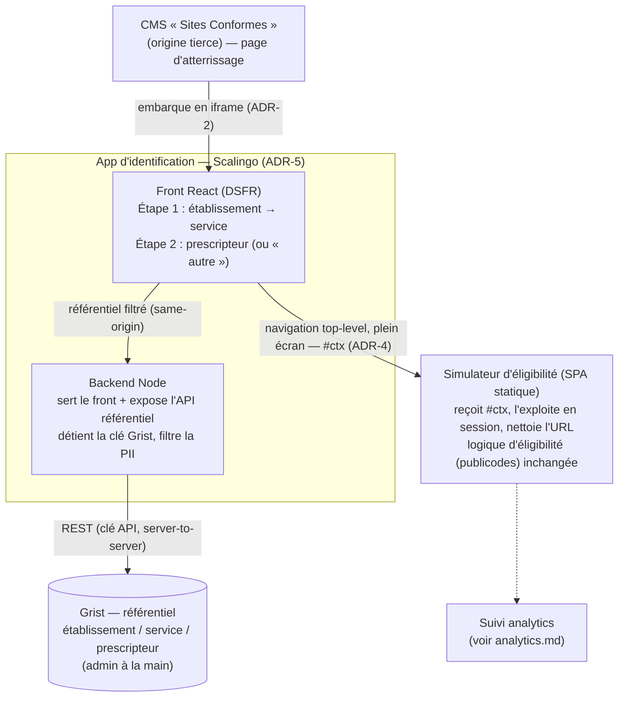
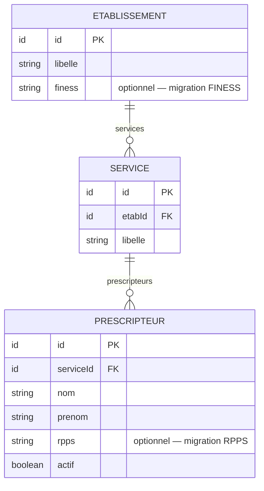

# Architecture — Identification du prescripteur

> Statut : **décidé (phase expérimentale)** · Dernière mise à jour : 2026-07-07
>
> Couche d'identification en amont du [simulateur d'éligibilité](../../apps/simulateur-eligibilite).
> Le suivi analytique du parcours fait l'objet d'un document séparé :
> [analytics.md](./analytics.md).

## 1. Contexte & objectifs

Le simulateur d'éligibilité est une SPA **100 % statique** (React 19 + Vite + DSFR,
moteur `publicodes`), déployée sur **GitHub Pages**. Aucun backend, aucun stockage,
aucun secret.

On souhaite, **en amont** du simulateur, **identifier l'utilisateur** au début du
parcours, en deux étapes :

1. l'**établissement** et le **service/unité** ;
2. le **personnel de santé** (prescripteur) qui réalise la simulation.

Contraintes :

- L'utilisateur **arrive via le CMS « Sites Conformes »** (site tiers, peu maîtrisé).
- Phase **expérimentale** : le référentiel établissement/service/prescripteur est
  **construit et maintenu à la main**, **non** intégré aux référentiels du SI
  Sécurité sociale / CNAM (pas de FINESS/RPPS officiels branchés à ce stade).
- Volonté de **limiter l'empreinte serveur** : rester statique là où c'est possible
  (le simulateur), et n'introduire qu'**un** backend minimal, sur une **plateforme
  managée (Scalingo)**, là où c'est incontournable (accès Grist — cf. ADR-5).

**Invariant** : l'identification ne doit **jamais** revenir dans le moteur
`publicodes` (`regles/regles.publicodes`), qui ne contient que la logique métier
d'éligibilité. Des règles `identification . *` y avaient été mises à tort ; elles
ont été retirées.

## 2. Décisions (ADR)

### ADR-1 — Application d'identification dédiée
**Décision.** Créer une **nouvelle SPA statique `apps/identification`** (stack DSFR/Vite
identique au simulateur), plutôt qu'un écran dans le simulateur ou un couplage au
moteur de règles.
**Pourquoi.** Sépare identité / métier / moteur ; réutilisable ; prépare une
migration future vers FINESS/RPPS sans toucher le simulateur.
**Conséquences.** Un passage de contexte inter-app est nécessaire (voir ADR-4).

### ADR-2 — Intégration par iframe dans le CMS
**Décision.** L'app d'identification est **embarquée en iframe** dans une page
Sites Conformes. Le **simulateur, lui, s'ouvre en plein écran** (top-level) après
identification.
**Pourquoi.** Choix produit : garder l'étape d'identification « dans » le site CMS.
**Conséquences.** Dépend de la coopération du CMS (attributs `sandbox`, CSP) — voir
§6 et risque R-1. Le repli sans iframe (redirection top-level directe) reste
documenté si l'intégration iframe s'avère bloquée.

### ADR-3 — Identification déclarative (pas d'authentification)
**Décision.** L'utilisateur **déclare** qui il est (sélection établissement / service /
prescripteur) **sans preuve d'identité**.
**Pourquoi.** Suffisant pour la phase expérimentale ; simple.
**Conséquences.** Usurpation déclarative possible ; le contexte transmis n'a pas de
valeur probante (voir ADR-4). Migration future possible vers ProConnect/AgentConnect.

### ADR-4 — Contexte inter-app : refs pseudonymisées, en fragment d'URL
**Décision.** À la validation, le **backend d'identification** construit un **contexte
`ctx`** (`v: 2`) transmis au simulateur via le **fragment d'URL**
(`…/simulateur#ctx=<payload>`, base64url d'un JSON). Contenu : **refs pseudonymisées**
`{ etabRef, serviceRef, prescripteurRef }` = **`HMAC-SHA256(id, secret)`** (tronqué
128 bits, base64url) des identifiants opaques du référentiel. **Aucun identifiant brut,
aucun nom, aucun RPPS, aucune donnée patient.** Le **secret vit côté serveur** (variable
d'env dédiée `PSEUDONYMISATION_SECRET`, distincte de la clé Grist) : le front envoie la
sélection à `POST /api/contexte`, le backend renvoie le fragment encodé.
**Pourquoi.** Le suivi Matomo n'a besoin que d'un **jeton stable et opaque** par
prescripteur, pas de l'identifiant brut (enum. / re-liable au référentiel) ni du nom
(PII). Un **HMAC à sens unique** donne un pseudonyme non réversible et non forgeable
sans le secret ; le calculer **côté serveur** est indispensable — un keyed-hash
client-side exposerait la clé dans le bundle et n'aurait aucune valeur. Le contexte
n'est **pas signé** (l'identification étant déclarative — ADR-3, signer donnerait une
fausse garantie). Le fragment n'est ni envoyé au serveur, ni journalisé, ni présent
dans le `Referer`.
**Conséquences.** Le simulateur lit le fragment, le garde **en mémoire** (pas de
`localStorage`), puis nettoie l'URL (`history.replaceState`) et forwarde les refs à
Matomo (voir [analytics.md](./analytics.md)). Le contexte reste **falsifiable** (on peut
injecter une ref arbitraire, mais pas fabriquer celle d'un prescripteur précis sans le
secret) — acceptable en expérimental, à re-trancher avant tout usage probant. La
ré-identification `prescripteurRef → prescripteur` se fait **hors Matomo**, via le
référentiel, de façon contrôlée. **Pseudonyme ≠ anonyme** : la réserve RGPD (R-4
d'analytics.md) tient. La rotation du secret re-bucketise tous les prescripteurs.

### ADR-5 — Référentiel dans Grist, lu par le backend de l'app d'identification
**Décision.** Le référentiel établissement/service/prescripteur est **maintenu à la
main dans Grist**. L'app d'identification n'est **plus une SPA statique** mais une
**app unique servie par un backend** (Node, hébergée sur **Scalingo**) qui **sert le
front React** (build Vite/DSFR inchangé) **et expose une API** détenant la clé Grist et
renvoyant un **référentiel filtré**. Le front consomme cette API en **same-origin**.
**Pourquoi.** L'accès **direct navigateur → Grist est non viable** (clé toute-puissante
impossible à exposer dans une SPA ; **CORS bloqué** par Grist), et un doc Grist public
exposerait les **noms de prescripteurs (PII)**. Un composant serveur détenant la clé et
filtrant la PII est donc requis. **Scalingo ne propose pas de FaaS**, et faire cohabiter
une SPA statique **et** une fonction dédiée complexifie l'infra inutilement : le backend
de l'app d'identification **est** ce composant. En same-origin, le **problème CORS
disparaît** (notre serveur parle à Grist en server-to-server) ; données **fraîches**
(lecture Grist en direct) ; **une seule app** à déployer.
**Conséquences.** L'app d'identification **quitte GitHub Pages** pour **Scalingo**. Le
**front React et ses tests sont préservés** : seule l'implémentation de l'interface
`Referentiel` (§5) passe du snapshot factice à un **client HTTP same-origin**. La clé
Grist vit en **variable d'environnement Scalingo**. Le **simulateur reste 100 %
statique sur GitHub Pages** (aucun backend). Grist reste l'outil d'admin. Voir §5
(modèle) et §6 (accès).

### ADR-6 — Le moteur publicodes reste hors périmètre identité
**Décision.** `apps/simulateur-eligibilite/regles/regles.publicodes` **n'est pas
modifié**. L'identification (comme l'analytics) vit en dehors du moteur.

## 3. Architecture cible



Composants :

| Composant | Nature | Nouveau ? |
|---|---|---|
| `apps/identification` | Front React + backend Node (une app, **Scalingo**) | **nouveau** |
| API référentiel | Endpoint du backend `apps/identification` détenant la clé Grist | **nouveau** |
| Grist | Base managée, admin à la main | **nouveau (config)** |
| `apps/simulateur-eligibilite` | SPA statique existante (GitHub Pages), lit le contexte `#ctx` | modifié |

## 4. Spécification du contexte `ctx`

- **Transport** : fragment d'URL `#ctx=<base64url(json)>`.
- **Construction** : **côté backend** (`POST /api/contexte` reçoit la sélection brute
  `{ etabId, serviceId, prescripteurId }`, renvoie le fragment encodé). Le secret HMAC
  ne quitte jamais le serveur.
- **Schéma** (refs pseudonymisées uniquement) :
  ```json
  { "etabRef": "…", "serviceRef": "…", "prescripteurRef": "…", "v": 2 }
  ```
  où chaque ref = `base64url(HMAC-SHA256(id, PSEUDONYMISATION_SECRET)[:16])`.
- **Interdits** : identifiant brut du référentiel, nom/prénom, RPPS, tout identifiant
  patient, toute donnée de santé.
- **Cas « prescripteur autre »** (absent du référentiel) : `prescripteurId` conventionnel
  (`p_autre`) → `prescripteurRef` = son HMAC (bucket « autre » stable dans Matomo). La
  saisie libre éventuelle reste **côté identification**, hors `ctx`.
- **Cycle de vie** : lu au boot du simulateur, conservé **en mémoire de session**,
  fragment retiré de l'URL immédiatement.

## 5. Modèle du référentiel (Grist)



- Les champs `finess?` / `rpps?` sont **prévus dès maintenant** (optionnels) pour la
  **migration future** vers les référentiels officiels.
- Le front n'accède au référentiel **que via l'API du backend** (same-origin), qui
  **filtre** (expose IDs + libellés ; les noms de prescripteurs ne sont renvoyés que
  pour le service sélectionné, jamais l'annuaire complet en clair public).
- L'accès référentiel est masqué derrière une **interface** (`getEtablissements()`,
  `getServices(etabId)`, `getPrescripteurs(serviceId)`) pour pouvoir **substituer la
  source** (Grist → FINESS/RPPS) sans toucher les consommateurs.

## 6. Intégration iframe — points d'attention

- **Navigation top-level depuis l'iframe** : `window.top.location = …` cross-origin
  est autorisé **sous activation utilisateur** (clic). Si le CMS met l'iframe en
  `sandbox`, il faut **`allow-top-navigation-by-user-activation` + `allow-scripts` +
  `allow-forms`** dans l'attribut `sandbox` — **côté CMS**.
- **Repli** si navigation top bloquée : `postMessage(iframe → parent)` + un **snippet
  côté CMS** qui écoute (avec vérification `event.origin`) et redirige. Nécessite une
  intervention dans Sites Conformes.
- **CSP** : notre app doit servir `Content-Security-Policy: frame-ancestors
  https://<domaine-cms>` (et **pas** `X-Frame-Options: DENY`). Le CMS doit autoriser
  notre origine dans son `frame-src` (**hors de notre contrôle**).
- **Cookies tiers** : bloqués dans l'iframe (ITP/Chrome). Sans impact sur le funnel
  analytics car le tracking a lieu **dans le simulateur en top-level** (cf.
  [analytics.md](./analytics.md)).

## 7. Découpage en incréments (identification)

1. **Front identification + contexte `ctx`.** `apps/identification` (front React DSFR,
   parcours 2 étapes avec **données factices/snapshot** via l'interface `Referentiel`),
   navigation top vers le simulateur avec `#ctx=`, lecture + nettoyage côté simulateur.
   *En parallèle : valider `sandbox`/CSP avec Sites Conformes (R-1).*
2. **Backend référentiel + Grist + déploiement Scalingo.** Backend Node de
   `apps/identification` : sert le front build **et** expose l'API référentiel
   (`getEtablissements`/`getServices`/`getPrescripteurs` filtrés) en **same-origin**,
   détenant `GRIST_API_KEY` (variable d'env Scalingo). Bascule de l'implémentation
   `Referentiel` snapshot → client HTTP same-origin ; déploiement sur Scalingo.
3. **Durcissement iframe.** Repli `postMessage` + snippet CMS ; en-têtes CSP.
4. **(futur) Migration FINESS/RPPS.** Nouvelle implémentation derrière l'interface
   référentiel (§5).

Le funnel analytics est un incrément traité dans [analytics.md](./analytics.md).

## 8. Risques & validations en attente

| Réf | Risque / à valider | Portée |
|---|---|---|
| **R-1** | **Coopération Sites Conformes** : `sandbox` de l'iframe + CSP `frame-src`. Sans cela, ni embarquement ni navigation top. **Bloquant.** | à valider avec l'éditeur **avant de coder l'intégration** |
| **R-2** | Choix d'hébergement Grist (grist.com vs self-hosted). L'app d'identification (front + backend) est **sur Scalingo** (pas de FaaS — cf. ADR-5). | décision infra |
| **R-3** | Fraîcheur du référentiel : le backend lit Grist en direct → OK ; ne pas retomber sur un snapshot figé si le maintien « à la main » doit être visible immédiatement. | conception backend |
| **R-5** | Contexte non signé → usurpation déclarative possible. Acceptable en expérimental ; à revoir avant tout usage probant. | sécurité |
| **R-6** | PII de prescripteurs : jamais dans un bundle statique public ni un doc Grist public. | RGPD/sécurité |
