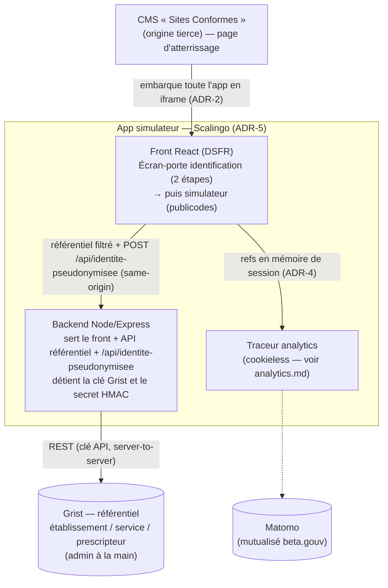
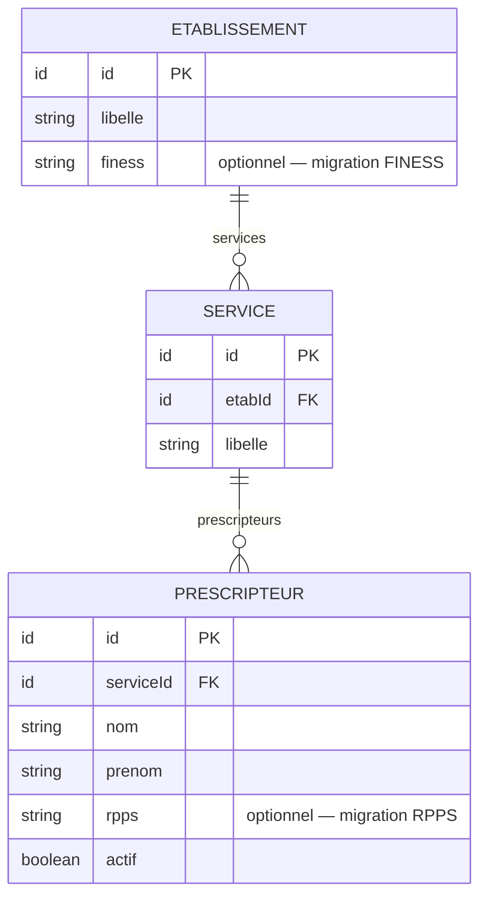

# Architecture — Identification du prescripteur

> Statut : **décidé (phase expérimentale)** · Dernière mise à jour : 2026-07-08
>
> Étape d'identification **intégrée** au [simulateur d'éligibilité](../../apps/simulateur-eligibilite),
> **préalable obligatoire** à toute simulation. Le suivi analytique du parcours fait
> l'objet d'un document séparé : [analytics.md](./analytics.md).
>
> **Mise à jour 2026-07-08 — fusion des apps.** L'identification et le simulateur ont un
> temps été conçus comme **deux apps séparées** : une SPA d'identification en iframe, une
> redirection top-level vers le simulateur statique, et le contexte passé en fragment
> `#ctx`. Ils sont désormais **une seule app**, où l'identification est un **écran-porte**
> en amont du simulateur. Cela **réverse** l'ADR-1 (app dédiée), l'ADR-4 (contexte en
> fragment d'URL) et l'invariant « simulateur 100 % statique » de l'ADR-5. Deux raisons :
> l'intégration Sites Conformes est plus simple avec **un seul iframe**, sans navigation
> top-level, et le passage de contexte devient trivial une fois l'**état en mémoire**,
> sans fragment. Les sections ci-dessous ont été mises à jour. Les décisions restées
> valables sont conservées : identification déclarative, PII hors bundle, moteur
> publicodes intouché.

## 1. Contexte & objectifs

Le simulateur d'éligibilité (React 19 + Vite + DSFR, moteur `publicodes`) est servi par
un **backend Node/Express**, en une seule app sur **Scalingo**. L'identification impose
en effet de détenir des secrets côté serveur, la clé Grist et le secret de
pseudonymisation. Le simulateur a donc quitté GitHub Pages.

On **identifie l'utilisateur en amont** du parcours, en une étape obligatoire : on ne
peut pas simuler sans s'identifier. Elle se joue en deux temps :

1. l'**établissement** et le **service/unité** ;
2. le **personnel de santé** (prescripteur) qui réalise la simulation.

Contraintes :

- L'utilisateur arrive via le CMS « Sites Conformes », un site tiers qu'on maîtrise peu.
- On est en phase **expérimentale** : le référentiel établissement/service/prescripteur
  est construit et maintenu à la main, sans intégration aux référentiels du SI Sécurité
  sociale ou CNAM. Aucun FINESS ni RPPS officiel n'est branché à ce stade.
- On veut limiter l'empreinte serveur : **un seul** backend minimal, sur une plateforme
  managée (Scalingo), qui sert le front et l'API là où un serveur est incontournable,
  c'est-à-dire pour l'accès Grist et le secret de pseudonymisation (cf. ADR-5).

**Invariant** : l'identification ne doit jamais revenir dans le moteur `publicodes`
(`regles/regles.publicodes`), qui ne contient que la logique métier d'éligibilité. Des
règles `identification . *` y avaient été mises à tort ; elles ont été retirées.

## 2. Décisions (ADR)

### ADR-1 — Identification intégrée en écran-porte (~~app dédiée~~)

**Décision (révisée 2026-07-08).** L'identification est un **écran-porte** au sein de
l'app simulateur (`front/identification/Identification.tsx`, monté par la racine
`front/app/App.tsx`) : tant que le prescripteur n'est pas validé, le formulaire n'est pas
rendu. ~~Créer une SPA statique `apps/identification` dédiée.~~

**Pourquoi.** Une app séparée imposait un passage de contexte inter-app par fragment
d'URL et une navigation top-level hors iframe. Surtout, elle n'empêchait pas d'atteindre
le simulateur sans identification, son URL étant publique. Un écran-porte dans l'app rend
l'identification obligatoire pour de bon, et simplifie l'intégration : un seul iframe, un
seul déployable. L'identité reste isolée du moteur (ADR-6) et derrière l'interface
`Referentiel`, donc la migration FINESS/RPPS reste possible sans toucher le simulateur.

**Conséquences.** Il n'y a plus de passage de contexte inter-app : la sélection est
convertie en refs par l'API (`POST /api/identite-pseudonymisee`) et gardée en mémoire
(voir ADR-4). Le composant d'identification (`Identification.tsx`) et le formulaire
(`Simulateur.tsx`) cohabitent dans la même app, avec des steppers distincts.

### ADR-2 — Intégration par iframe dans le CMS

**Décision (révisée 2026-07-08).** L'app entière, identification et simulateur, est
**embarquée en iframe** dans une page Sites Conformes. ~~Le simulateur s'ouvrait en
plein écran top-level après identification.~~

**Pourquoi.** La fusion supprime la navigation top-level entre deux apps : tout le
parcours vit dans le même iframe, ce qui simplifie l'intégration puisqu'il n'y a qu'une
origine à autoriser et aucun saut de contexte. Le choix produit est conservé : garder le
parcours dans le site CMS.

**Conséquences.** On dépend toujours de la coopération du CMS, pour les attributs
`sandbox` et la CSP (`frame-ancestors`, `frame-src`) — voir §6 et le risque R-1. Le
suivi analytics ayant désormais lieu dans l'iframe, donc en contexte tiers, il est passé
en cookieless (voir [analytics.md](./analytics.md)). Le repli sans iframe, en ouvrant
l'app en top-level, reste possible si l'intégration iframe se révèle bloquée.

### ADR-3 — Identification déclarative (pas d'authentification)

**Décision.** L'utilisateur déclare qui il est, en sélectionnant son établissement, son
service et son nom, sans preuve d'identité.

**Pourquoi.** C'est suffisant pour la phase expérimentale, et c'est simple.

**Conséquences.** L'usurpation déclarative est possible, et le contexte transmis n'a
aucune valeur probante (voir ADR-4). Une migration vers ProConnect ou AgentConnect reste
possible plus tard.

### ADR-4 — Identité pseudonymisée : refs, en mémoire (~~fragment d'URL~~)

**Décision (révisée 2026-07-08).** À la validation, le backend construit une identité
pseudonymisée (`v: 2`), faite des refs `{ etabRef, serviceRef, prescripteurRef }`. Chacune
est un **`HMAC-SHA256(id, secret)`** tronqué à 128 bits et encodé en base64url, calculé
sur les identifiants opaques du référentiel. Aucun identifiant brut, aucun nom, aucun
RPPS, aucune donnée patient n'y figure. Le front envoie l'identité saisie à
`POST /api/identite-pseudonymisee`, le backend renvoie l'objet refs en JSON, et le front
le garde en mémoire de session (`front/identification/session.ts`). Le secret vit côté
serveur, dans une variable d'environnement dédiée `PSEUDONYMISATION_SECRET`, distincte de
la clé Grist. ~~Le contexte était transmis au simulateur via le fragment d'URL
`#ctx=<base64url>` ; la fusion l'a rendu inutile.~~

**Pourquoi.** Le suivi Matomo n'a besoin que d'un jeton stable et opaque par prescripteur.
Il n'a besoin ni de l'identifiant brut, énumérable et re-liable au référentiel, ni du nom,
qui est une PII. Un HMAC à sens unique donne un pseudonyme non réversible et non
forgeable sans le secret. Le calculer côté serveur est indispensable : un keyed-hash
côté client exposerait la clé dans le bundle. L'identité pseudonymisée n'est pas signée,
l'identification étant déclarative (ADR-3) et une signature donnant alors une fausse
garantie. Les apps étant fusionnées, il n'y a plus de transport inter-app, donc plus de
fragment d'URL ni d'enveloppe base64url à décoder.

**Conséquences.** Les refs restent en mémoire, sans `localStorage` ni URL, et sont
forwardées à Matomo (voir [analytics.md](./analytics.md)). Le front n'inverse jamais le
HMAC. La ré-identification d'un `prescripteurRef` vers son prescripteur se fait hors
Matomo, via le référentiel, de façon contrôlée. Un pseudonyme n'est pas un anonyme, donc
la réserve RGPD (R-4 d'analytics.md) tient. Faire tourner le secret re-bucketise tous les
prescripteurs.

### ADR-5 — Référentiel dans Grist, lu par le backend de l'app fusionnée

**Décision (révisée 2026-07-08).** Le référentiel établissement/service/prescripteur est
maintenu à la main dans Grist. L'app simulateur, identification et simulation comprises,
est une app unique servie par un backend Node/Express hébergé sur Scalingo. Ce backend
sert le front React construit par Vite et expose une API same-origin qui détient la clé
Grist et le secret de pseudonymisation :
`/api/etablissements|services|prescripteurs` pour le référentiel filtré, et
`POST /api/identite-pseudonymisee` pour les refs pseudonymisées. ~~Ce backend
appartenait à une app d'identification distincte ; le simulateur restait statique sur
GitHub Pages.~~

**Pourquoi.** L'accès direct du navigateur à Grist n'est pas viable : la clé est
toute-puissante et ne peut pas vivre dans une SPA, et Grist bloque le CORS. Un doc Grist
public exposerait par ailleurs les noms de prescripteurs, qui sont des PII. Il faut donc
un composant serveur qui détienne la clé et filtre la PII. Scalingo ne propose pas de
FaaS. Depuis la fusion, c'est le backend du simulateur qui joue ce rôle : une seule app,
tout en same-origin donc sans CORS, des données fraîches puisque Grist est lu en direct,
et un seul déployable.

**Conséquences.** Le simulateur quitte GitHub Pages pour Scalingo et n'est plus
entièrement statique, puisqu'il a un backend. C'est le prix de l'identification
obligatoire. Le workflow GitHub Pages est supprimé. La clé Grist et
`PSEUDONYMISATION_SECRET` vivent en variables d'environnement Scalingo, et le serveur
refuse de démarrer sans elles en production : leur repli — référentiel factice, secret
public — n'est bon que pour un poste de développement, et le servir en production
donnerait un simulateur silencieusement faux (`server/configuration.ts`). Le front et ses
tests sont préservés : l'interface `Referentiel` (§5) a un client HTTP same-origin
(`http-referentiel.ts`) et garde le snapshot factice en défaut, pour le dev et les tests.
Grist reste l'outil d'admin. Voir §5 pour le modèle et §6 pour l'accès.

### ADR-6 — Le moteur publicodes reste hors périmètre identité

**Décision.** `apps/simulateur-eligibilite/regles/regles.publicodes` n'est pas modifié.
L'identification, comme l'analytics, vit en dehors du moteur.

## 3. Architecture cible


```mermaid
flowchart TB
    cms["CMS « Sites Conformes »<br/>(origine tierce) — page d'atterrissage"]
    subgraph scalingo["App simulateur — Scalingo (ADR-5)"]
        front["Front React (DSFR)<br/>Écran-porte identification (2 étapes)<br/>→ puis simulateur (publicodes)"]
        api["Backend Node/Express<br/>sert le front + API référentiel + /api/identite-pseudonymisee<br/>détient la clé Grist et le secret HMAC"]
        analytics["Traceur analytics<br/>(cookieless — voir analytics.md)"]
    end
    grist[("Grist — référentiel<br/>établissement / service / prescripteur<br/>(admin à la main)")]
    matomo[("Matomo<br/>(mutualisé beta.gouv)")]

    cms -->|"embarque toute l'app en iframe (ADR-2)"| front
    front -->|"référentiel filtré + POST /api/identite-pseudonymisee (same-origin)"| api
    api -->|"REST (clé API, server-to-server)"| grist
    front -->|"refs en mémoire de session (ADR-4)"| analytics
    analytics -.-> matomo
```

Composants :

| Composant | Nature | Statut |
|---|---|---|
| `apps/simulateur-eligibilite` | **App unique** : front React (identification + simulateur) + backend Node/Express, sur **Scalingo** | modifié (fusion) |
| API référentiel + identité pseudonymisée | Endpoints du backend détenant la clé Grist + le secret HMAC | déplacé (ex-identification) |
| Grist | Base managée, admin à la main | config |
| ~~`apps/identification`~~ | ~~app séparée~~ | **supprimé (fusionné)** |

## 4. Workflow d'identification & identité pseudonymisée

Le workflow est linéaire, dans un formulaire à révélation progressive
(`front/identification/Identification.tsx`) :

```
Établissement → Service → Prescripteur ─┬─ (dans la liste)
                                        └─ « pas dans la liste » → Nom + Prénom
```

Le service « Autre » est une entrée du référentiel, un service par établissement, qu'on
sélectionne comme n'importe quelle autre, avec ses propres prescripteurs et la même
option « pas dans la liste ». Il a une particularité : quand « Autre » est sélectionné,
le prescripteur doit saisir son service ou son unité réels. Ce texte libre est alors
écrit dans Grist, ce qui crée le vrai service et y rattache le prescripteur, pour qu'à la
connexion suivante il apparaisse sous ce service réel et non plus sous « Autre » (voir la
[spec enrichissement](../specs/enrichissement-referentiel-saisies-libres.md)). L'autre
texte libre du workflow est le nom et le prénom du prescripteur hors liste.

Les prescripteurs sans établissement de rattachement, en libéral, à la CNAM ou à la CPAM,
sélectionnent l'établissement « Libéral / CNAM / CPAM / Autre » du référentiel et suivent
le même workflow. La branche « non rattaché » dédiée a été supprimée le 2026-07-21.

- **Transport** : la réponse JSON de `POST /api/identite-pseudonymisee`, en same-origin.
  Il n'y a plus de fragment d'URL depuis la fusion.
- **Construction** : côté backend (`server/identification/pseudonymisation.ts`, exposé
  par `server/identification/routes.ts`). Il reçoit l'`IdentiteSaisie`
  (`{ etabId, serviceId?, prescripteurId?, nom?, prenom? }`,
  `shared/identite-saisie.ts`), valide sa complétude avec `saisieComplete`, partagé entre
  front et back, et renvoie l'objet refs. Le secret HMAC ne quitte jamais le serveur.
- **Schéma**, les refs étant optionnelles selon la branche :
  ```json
  { "etabRef": "…", "serviceRef": "…", "prescripteurRef": "…", "v": 2 }
  ```
  Chaque ref vaut `base64url(HMAC-SHA256("<nature>:<valeur>", SECRET)[:16])`. La valeur
  est préfixée par sa nature (`etab:`, `service:`, `prescripteur:`, `identite:`) pour
  éviter toute collision entre un id et un texte libre.
  - Le **texte libre**, c'est-à-dire le nom et le prénom d'un prescripteur hors liste, est
    normalisé en casse et en espaces, puis passé au HMAC sous la forme
    `identite:<nom>|<prenom>`. Le nom ne circule jamais en clair (invariant PII, R-6).
  - `serviceRef` est toujours un id de référentiel, « Autre » compris. Toute sélection
    capture une identité, donc `prescripteurRef` est toujours présent.
- **Interdits** : l'identifiant brut du référentiel, le nom ou le prénom en clair, le
  RPPS, tout identifiant patient et toute donnée de santé.
- **Cycle de vie** : les refs sont reçues à la validation de l'identification, conservées
  en mémoire de session (`front/identification/session.ts`, sans `localStorage`) et lues
  par le traceur au moment d'émettre chaque événement.

## 5. Modèle du référentiel (Grist)


```mermaid
erDiagram
    ETABLISSEMENT ||--o{ SERVICE : "services"
    SERVICE ||--o{ PRESCRIPTEUR : "prescripteurs"
    ETABLISSEMENT {
        id id PK
        string libelle
        string finess "optionnel — migration FINESS"
    }
    SERVICE {
        id id PK
        id etabId FK
        string libelle
    }
    PRESCRIPTEUR {
        id id PK
        id serviceId FK
        string nom
        string prenom
        string rpps "optionnel — migration RPPS"
        boolean actif
    }
```

- Les champs `finess?` et `rpps?` sont prévus dès maintenant, en optionnels, pour la
  migration future vers les référentiels officiels.
- Le front n'accède au référentiel que via l'API du backend, en same-origin. Celle-ci
  filtre : elle expose les ids et les libellés, et ne renvoie les noms de prescripteurs
  que pour le service sélectionné, jamais l'annuaire complet en clair.
- L'accès au référentiel est masqué derrière une interface (`getEtablissements()`,
  `getServices(etabId)`, `getPrescripteurs(serviceId)`) pour pouvoir substituer la source,
  de Grist vers FINESS/RPPS, sans toucher les consommateurs.

## 6. Intégration iframe — points d'attention

Depuis la fusion, tout le parcours vit dans le même iframe, identification et simulation
comprises. Il n'y a plus de navigation top-level entre deux apps, donc plus besoin
d'`allow-top-navigation-by-user-activation` ni d'un repli `postMessage`. Restent :

- **`sandbox`**, si le CMS l'applique : `allow-scripts` et `allow-forms` suffisent, pour
  les formulaires et le JS de l'app. C'est côté CMS.
- **CSP** : notre app doit servir `Content-Security-Policy: frame-ancestors
  https://<domaine-cms>`, et surtout pas `X-Frame-Options: DENY`. Le CMS doit autoriser
  notre origine dans son `frame-src`, ce qui est hors de notre contrôle.
- **Cookies tiers** : ils sont bloqués dans l'iframe, par ITP et par Chrome. Le tracking
  ayant désormais lieu dans l'iframe, le traceur est passé en cookieless
  (`disableCookies`) pour fonctionner sans eux (cf. [analytics.md](./analytics.md)).
- **Non-indexation** : l'app est destinée à être embarquée, la page canonique étant celle
  du CMS, donc l'URL brute ne doit pas être indexée. Le backend sert `X-Robots-Tag:
  noindex, nofollow` sur toutes les réponses et un `robots.txt` en `Disallow: /`, doublés
  d'un `<meta name="robots" content="noindex, nofollow">` dans `index.html`.

## 7. Découpage en incréments (identification)

1. **Front identification + identité pseudonymisée.** ✅ Fait, à l'origine dans
   `apps/identification`.
2. **Backend référentiel + Grist.** ✅ Fait : API référentiel et
   `POST /api/identite-pseudonymisee` en same-origin, `GRIST_API_KEY` en variable d'env.
3. **Fusion dans le simulateur.** ✅ **Fait (2026-07-08)**. L'identification est un
   écran-porte obligatoire dans `apps/simulateur-eligibilite`, le backend (référentiel et
   identité pseudonymisée) a été déplacé dans cette app, l'identité vit en mémoire et non
   plus dans un fragment, `apps/identification` est supprimée et le workflow GitHub Pages
   retiré. *Reste : le déploiement Scalingo effectif.*
4. **Durcissement iframe.** Les en-têtes CSP `frame-ancestors`, en attente du domaine CMS
   (R-1). Plus de repli `postMessage` nécessaire, tout étant dans l'iframe.
5. **(futur) Migration FINESS/RPPS.** Une nouvelle implémentation derrière l'interface
   référentiel (§5).

Le funnel analytics est un incrément traité dans [analytics.md](./analytics.md).

## 8. Risques & validations en attente

| Réf | Risque / à valider | Portée |
|---|---|---|
| **R-1** | **Coopération Sites Conformes** : le `sandbox` de l'iframe et la CSP `frame-src`. Sans cela, pas d'embarquement possible. **Bloquant.** | à valider avec l'éditeur **avant de coder l'intégration** |
| **R-2** | Choix d'hébergement Grist, entre grist.com et self-hosted. L'app fusionnée, front et backend, est sur Scalingo faute de FaaS (cf. ADR-5). | décision infra |
| **R-3** | Fraîcheur du référentiel : le backend lit Grist en direct, ce qui convient. Ne pas retomber sur un snapshot figé si le maintien à la main doit rester visible immédiatement. | conception backend |
| **R-5** | L'identité pseudonymisée n'est pas signée, donc l'usurpation déclarative reste possible. Acceptable en expérimental, à revoir avant tout usage probant. | sécurité |
| **R-6** | PII de prescripteurs : jamais dans un bundle statique public ni dans un doc Grist public. Les noms et prénoms saisis librement au formulaire passent au HMAC côté serveur, et ne sont jamais transmis en clair à l'analytics. | RGPD/sécurité |
| ~~**R-9**~~ | ~~Branche « autre service » sans identité.~~ **Résolu (2026-07-08)** : cette branche capture désormais Nom et Prénom, donc un `prescripteurRef` calculé par HMAC, comme les autres. | résolu |
