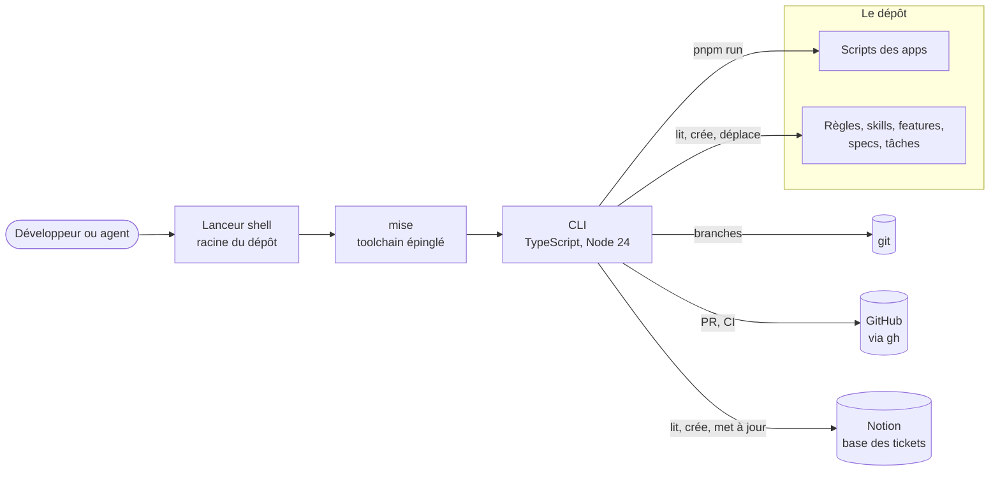

# Architecture : `tsp`, le point d'entrée du dépôt

> Statut : **décidé** · Dernière mise à jour : 2026-10-09

## 1. Contexte & objectifs

Piloter le dépôt demandait de retenir quatre outils (`mise`, `pnpm`, `git`,
`gh`), un tableau Notion et quatre trackers de specs. Les scripts différaient
d'une app à l'autre, et le travail en cours ne se lisait nulle part d'un seul
tenant.

`tsp` répond à deux lecteurs :

- **le développeur**, qui veut moins de choses à retenir ;
- **l'agent**, qui veut des gestes à appeler et des sorties à lire sans deviner.

Le vocabulaire (app, action, feature, recueil, spec, tâche, ticket) est dans
[`../CONTEXT.md`](../CONTEXT.md). Le mode d'emploi est dans le
[README de la CLI](../../../apps/cli/README.md).

## 2. Décisions (ADR)

### ADR-1 - Un lanceur shell adossé à `mise`

**Contexte.** `tsp` doit être le premier geste sur une machine neuve. Or il est
écrit pour Node, que `mise` installe : il ne peut pas s'amorcer lui-même.

**Décision.** Un script shell POSIX, versionné à la racine, sert de lanceur. Il
ne demande qu'un shell et `git`. Il exécute la CLI par `mise`, qui fournit le
Node épinglé. `setup` commence donc en shell : installer `mise`, puis le
toolchain. Tout le reste est en TypeScript.

Le lanceur agit sur le clone du répertoire courant. Hors de tout clone, il
retombe sur celui d'où il a été installé.

**Écarté.**

| Option | Pourquoi non |
|---|---|
| Un `bin` de paquet, résolu par pnpm | `tsp` n'existerait qu'après `pnpm install`, donc pas en premier |
| Un binaire compilé | une étape de build et un artefact par plateforme, pour une CLI interne |
| Le Node déjà présent sur la machine | sa version n'est pas garantie, et l'exécution directe de TypeScript en dépend |

**Conséquences.**

- `mise` devient un prérequis dur : sans lui, seul `setup` passe.
- Un agent dans un worktree exécute la CLI de ce worktree, donc la version qu'il
  modifie.
- La CLI n'a aucune dépendance d'exécution : elle doit démarrer avant que les
  dépendances soient installées.

### ADR-2 - Une action est un script du `package.json`

**Contexte.** Les apps ne savent pas faire les mêmes choses. Il faut que `tsp`
sache ce que chacune porte.

**Décision.** `tsp <action> <app>` lance le script du même nom. Une app porte
une action si le script existe. Il n'y a pas de manifeste dédié. Deux
exceptions : `install`, qui appelle `pnpm install`, et `features`, qui lit un
fichier.

**Écarté.** Un manifeste par app, qui aurait déclaré ses actions et ses
features. Il aurait doublé le `package.json`, et les deux auraient divergé.

**Conséquences.**

- Uniformiser une action revient à nommer un script : le simulateur et le
  glossaire ont gagné un script `dev`.
- `tsp` n'ajoute aucune porte. Le `verifier` d'une app reste son script, celui
  que lance la CI.

### ADR-3 - La CI et la production n'appellent pas `tsp`

**Décision.** La CI et le `Procfile` appellent `pnpm` en direct. `tsp` remplace
les tâches `mise`, qui n'étaient qu'un autre point d'entrée pour un humain.

**Conséquences.** Une panne de la CLI ne casse ni un déploiement ni une CI.
« La CI lance la même commande que localement » reste vrai, puisque `tsp`
délègue au même script.

### ADR-4 - La spec fait foi, Notion la suit

**Contexte.** L'équipe produit suit le travail dans Notion. Le cadrage
technique, lui, vit dans les specs du dépôt.

**Décision.** Une spec a au plus un ticket. La synchronisation est à sens
unique, de la spec vers Notion.

- Le corps du ticket est écrit à sa création, puis jamais réécrit.
- Un statut ne recule jamais. Les statuts qu'aucun état de spec ne produit se
  posent à la main.
- Le lien se garde des deux côtés : dans l'en-tête de la spec, et dans le
  ticket.

**Écarté.** Une synchronisation dans les deux sens. Elle aurait demandé de
trancher les conflits, pour un tableau dont l'équipe produit attend surtout
qu'on ne lui écrase rien.

**Conséquences.** Sans jeton, les commandes de lecture affichent le reste et le
disent. Seule la synchronisation s'arrête.

### ADR-5 - Pas de tests sur la CLI

**Décision.** Par choix du porteur, `apps/cli` n'a pas de tests. Son `verifier`
passe le lint, le typecheck et knip.

**Conséquences.**

- Une régression d'une commande se voit à l'usage, pas en CI.
- Les gardes de forme écrites en tests dans le simulateur ne couvrent pas la
  CLI. Seul Biome y garde les limites de taille.
- L'adresse de l'API Notion se remplace par l'environnement : c'est ce qui
  permet d'éprouver la synchronisation à la main, sur un serveur local.

## 3. Architecture cible



| Composant | Rôle |
|---|---|
| Lanceur shell | choisit le clone, amorce `setup`, passe la main à Node par `mise` |
| CLI | lit la ligne de commande, lance une commande, rend un code de sortie |
| Scripts des apps | ce qu'une action exécute réellement |
| Documentation du dépôt | la source de tout ce que les commandes de lecture affichent |
| `gh` | le seul accès à GitHub : PR ouvertes, création, état de la CI |
| API Notion | lecture des tickets par statut, création et mise à jour du ticket d'une spec |

## 4. Les commandes de lecture ne possèdent rien

Aucune commande de lecture ne tient de donnée à elle. Chacune affiche un
fichier que le dépôt tient déjà :

| Commande | Ce qu'elle lit |
|---|---|
| `features` | le `features.md` de chaque app |
| `rules` | les recueils de `docs/knowledge/contributing/` |
| `skills` | les skills du dépôt |
| `docs` | les dossiers `adr/` et `domain/` |
| `wip`, `next` | les trackers, `docs/tasks`, git, GitHub et Notion |

Corriger ce que `tsp` affiche, c'est donc corriger le fichier source. Seul
`features.md` a été créé pour la CLI : rien ne décrivait les features d'une app.
Il se tient à la main et rien ne le garde.

## 5. Découpage en incréments

- ✅ Le lanceur et `setup`
- ✅ Les actions par app, à la place des tâches `mise`
- ✅ Les commandes de lecture locales
- ✅ `wip` et `next`, avec GitHub et Notion
- ✅ La tenue des specs et leur ticket Notion
- ✅ Les branches et les PR

## 6. Risques & validations en attente

| Id | Risque | État |
|---|---|---|
| R-1 | La synchronisation Notion n'a été éprouvée que sur un serveur local qui joue l'API. Les noms de propriétés de la base réelle sont ceux relevés le 2026-10-09. | À valider avec un vrai jeton |
| R-2 | L'intégration Notion demande des droits d'écriture, à créer par un administrateur de l'espace | En attente |
| R-3 | `features.md` se périme sans garde | Assumé |
| R-4 | Sans tests, une régression ne se voit qu'à l'usage | Assumé (ADR-5) |
| R-5 | Le lanceur suppose `readlink -f`, absent des macOS antérieurs à 12.3 | Assumé |

## Vérification

```bash
./tsp setup          # rejouable : finit par le diagnostic
tsp doctor           # ce qui manque, et la commande qui le répare
tsp apps             # chaque app et les actions qu'elle porte
tsp verifier cli     # lint, typecheck, knip
tsp wip              # sans jeton : le reste, et « Notion : jeton absent »
```
